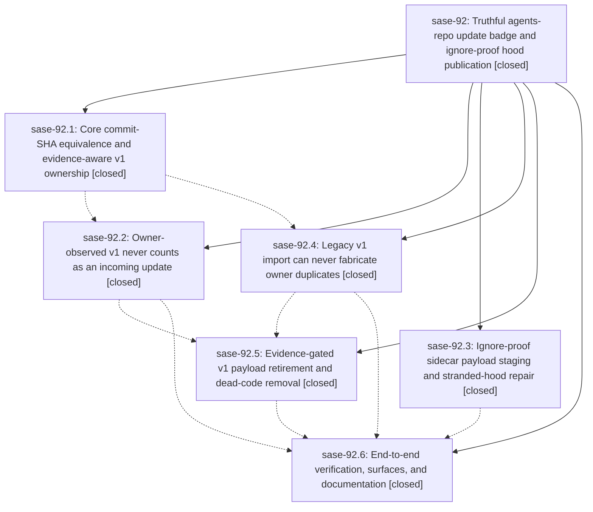

# Bead: sase-92 — Truthful agents-repo update badge and ignore-proof hood publication

[Bead Pages](../README.md) / sase-92

**Status:** ✓ closed · **Resolution:** (unrecorded) · **Type:** plan · **Tier:** epic
**Owner:** `bryanbugyi34@gmail.com` · **Assignee:** `sase-92.land`
**Created:** 2026-07-25 11:05:29 UTC · **Closed:** 2026-07-25 15:09:17 UTC
**Plan:** [202607/agents\_badge\_v1\_residue.md](https://github.com/sase-org/sase--plans/blob/main/202607/agents_badge_v1_residue.md)

## Description

The ACE agents-sync badge counts only genuinely incoming foreign work, this machine's own legacy-v1 sidecar residue can never be re-imported as duplicate agents, hood publication cannot be silenced by user gitignore rules, and the retired v1 payload is removed under explicit evidence-gated authorization.

## Notes

Land verification: all six phases confirmed in master (sase-92.1 d1353c635 core SHA/ownership decisions + released sase-core-rs 0.9.1, .2 aed7fa5ef detection, .3 5004fe81b force-staging, .4 596521653 import guard, .5 712a6b1f3 retirement + schema v4, .6 f17ccbf8f surfaces). Live athena state re-verified: status snapshot schema 4, gh_sase-org__sase pending_updates=0, validated_foreign=0, exact_owner=1309 (1071 v2 hoods + 238 owner-observed v1 groups), 0 cache objects, 0 receipts, gz/o quarantine diagnostics gone; sidecar HEAD == origin/main and contains agents/bbugyi200.athena.gz and agents/bbugyi200.athena.o. 'sase agent retire-v1 --json -p sase' dry run reports 338 entries, 339 payload paths, 0 uncovered hoods. Integration sweep over the 25 non-epic commits since 5004fe81b found only docs/Justfile file overlap and no code conflict; sase-93.7's sase-core-rs>=0.9.1 window does include the sase-92.1 bindings (b33243a is an ancestor of the v0.9.1 release). Land follow-up committed here: refreshed docs left stale by phase 5's unexported_agents removal, documented owner-observed v1 groups and 'sase agent retire-v1' in docs/agents_sidecar.md, and finished phase 5's dead v1 exporter removal (dropped the dead run_git/write_bundle/ExportCounts imports in bundles.py and moved the test-only write_bundle out of src into tests/agents_sync/bundle_fixtures.py). just fmt/lint/symvision clean; 21901 tests pass. just check still stops at 'init skills --check', which wants to overwrite five chezmoi sase_beads provider skill files - pre-existing drift from sase-8y.7 (07-24), unrelated to this epic and outside this workspace.

## Phases

| Bead | Title | Status | Size | Agents | Commits |
|---|---|---|---|---:|---:|
| [sase-92.1](sase-92.1.md) | Core commit-SHA equivalence and evidence-aware v1 ownership | ✓ closed | medium | 1 | 2 |
| [sase-92.2](sase-92.2.md) | Owner-observed v1 never counts as an incoming update | ✓ closed | medium | 1 | 1 |
| [sase-92.3](sase-92.3.md) | Ignore-proof sidecar payload staging and stranded-hood repair | ✓ closed | medium | 1 | 1 |
| [sase-92.4](sase-92.4.md) | Legacy v1 import can never fabricate owner duplicates | ✓ closed | medium | 1 | 1 |
| [sase-92.5](sase-92.5.md) | Evidence-gated v1 payload retirement and dead-code removal | ✓ closed | medium | 1 | 1 |
| [sase-92.6](sase-92.6.md) | End-to-end verification, surfaces, and documentation | ✓ closed | small | 1 | 1 |

## Lineage

## Agents

| Agent | Bead | Commits |
|---|---|---:|
| [bbugyi200.athena.sase-92.1](https://github.com/sase-org/sase--agents/blob/main/agents/bbugyi200.athena.sase-92.1/README.md) | [sase-92.1](sase-92.1.md) | 2 |
| [bbugyi200.athena.sase-92.2](https://github.com/sase-org/sase--agents/blob/main/agents/bbugyi200.athena.sase-92.2/README.md) | [sase-92.2](sase-92.2.md) | 1 |
| [bbugyi200.athena.sase-92.3](https://github.com/sase-org/sase--agents/blob/main/agents/bbugyi200.athena.sase-92.3/README.md) | [sase-92.3](sase-92.3.md) | 1 |
| [bbugyi200.athena.sase-92.4](https://github.com/sase-org/sase--agents/blob/main/agents/bbugyi200.athena.sase-92.4/README.md) | [sase-92.4](sase-92.4.md) | 1 |
| [bbugyi200.athena.sase-92.5](https://github.com/sase-org/sase--agents/blob/main/agents/bbugyi200.athena.sase-92.5/README.md) | [sase-92.5](sase-92.5.md) | 1 |
| [bbugyi200.athena.sase-92.6](https://github.com/sase-org/sase--agents/blob/main/agents/bbugyi200.athena.sase-92.6/README.md) | [sase-92.6](sase-92.6.md) | 1 |
| [bbugyi200.athena.sase-92.land](https://github.com/sase-org/sase--agents/blob/main/agents/bbugyi200.athena.sase-92.land/README.md) | [sase-92](README.md) | 2 |

## Commits

| Commit | Subject | Bead | Committed (UTC) |
|---|---|---|---|
| [`5004fe8`](https://github.com/sase-org/sase/commit/5004fe81ba42012fc7fc09a09bf7078709617c92) | fix(agents): force-stage ignored sidecar payloads (sase-92.3) | [sase-92.3](sase-92.3.md) | 2026-07-25 11:23:30 |
| [`sase-core@b33243a`](https://github.com/sase-org/sase-core/commit/b33243a0daf321e09bf5b37727769ec4cf73a420) | feat: add commit SHA and legacy ownership decisions (sase-92.1) | [sase-92.1](sase-92.1.md) | 2026-07-25 11:33:21 |
| [`d1353c6`](https://github.com/sase-org/sase/commit/d1353c635849625aaf25c20230bc55b762dc5aa4) | feat(core): add SHA and legacy ownership facades (sase-92.1) | [sase-92.1](sase-92.1.md) | 2026-07-25 12:02:00 |
| [`aed7fa5`](https://github.com/sase-org/sase/commit/aed7fa5efb68df509475ce1b3d1647b9b694f460) | fix(agents-sync): ignore owner-observed v1 updates (sase-92.2) | [sase-92.2](sase-92.2.md) | 2026-07-25 13:18:13 |
| [`5965216`](https://github.com/sase-org/sase/commit/596521653e220b29c3155b53aa464226b99a99ba) | fix(agents): prevent owner duplicate legacy imports (sase-92.4) | [sase-92.4](sase-92.4.md) | 2026-07-25 13:34:58 |
| [`712a6b1`](https://github.com/sase-org/sase/commit/712a6b1f3bb1c209e07919f4794acd4f4a0fc211) | feat(agents)!: retire legacy v1 sync payloads (sase-92.5) | [sase-92.5](sase-92.5.md) | 2026-07-25 14:08:03 |
| [`f17ccbf`](https://github.com/sase-org/sase/commit/f17ccbf8f5b365ff83d5fc77d180feeab7739ca1) | fix(ace): clarify cached agent hood update copy (sase-92.6) | [sase-92.6](sase-92.6.md) | 2026-07-25 14:44:49 |
| [`0e7e361`](https://github.com/sase-org/sase/commit/0e7e36185d851b2c42a12deb9b6553a27ad5b240) | refactor(agents-sync): finish v1 exporter removal and refresh docs (sase-92) | [sase-92](README.md) | 2026-07-25 15:11:24 |
| [`sase--plans@160bc3c`](https://github.com/sase-org/sase--plans/commit/160bc3cde5ba61eb573a6bdb59d5b69f9083c336) | docs(plans): mark agents badge v1 residue plan done (sase-92) | [sase-92](README.md) | 2026-07-25 15:12:13 |
