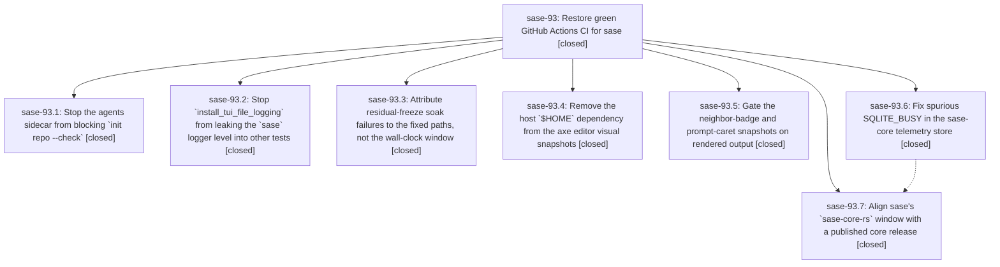

# Bead: sase-93 — Restore green GitHub Actions CI for sase

[Bead Pages](../README.md) / sase-93

**Status:** ✓ closed · **Resolution:** (unrecorded) · **Type:** plan · **Tier:** epic
**Owner:** `bryanbugyi34@gmail.com` · **Assignee:** `sase-93.land`
**Created:** 2026-07-25 11:27:05 UTC · **Closed:** 2026-07-26 13:55:45 UTC
**Plan:** [202607/restore\_green\_ci.md](https://github.com/sase-org/sase--plans/blob/main/202607/restore_green_ci.md)

## Description

Every job in the sase `CI` workflow (lint, test 3.12/3.13/3.14, visual-test, bead-backend, published-core-minimum-smoke) passes on master again, with each of the five independent root causes fixed at its source rather than muted.

## Phases

| Bead | Title | Status | Size | Agents | Commits |
|---|---|---|---|---:|---:|
| [sase-93.1](sase-93.1.md) | Stop the agents sidecar from blocking \`init repo --check\` | ✓ closed | small | 1 | 1 |
| [sase-93.2](sase-93.2.md) | Stop \`install\_tui\_file\_logging\` from leaking the \`sase\` logger level into other tests | ✓ closed | small | 1 | 1 |
| [sase-93.3](sase-93.3.md) | Attribute residual-freeze soak failures to the fixed paths, not the wall-clock window | ✓ closed | small | 1 | 1 |
| [sase-93.4](sase-93.4.md) | Remove the host \`$HOME\` dependency from the axe editor visual snapshots | ✓ closed | small | 1 | 1 |
| [sase-93.5](sase-93.5.md) | Gate the neighbor-badge and prompt-caret snapshots on rendered output | ✓ closed | medium | 1 | 1 |
| [sase-93.6](sase-93.6.md) | Fix spurious SQLITE\_BUSY in the sase-core telemetry store | ✓ closed | medium | 1 | 1 |
| [sase-93.7](sase-93.7.md) | Align sase's \`sase-core-rs\` window with a published core release | ✓ closed | medium | 1 | 1 |

## Lineage

## Agents

| Agent | Bead | Commits |
|---|---|---:|
| [bbugyi200.athena.sase-93.1](https://github.com/sase-org/sase--agents/blob/main/agents/bbugyi200.athena.sase-93.1/README.md) | [sase-93.1](sase-93.1.md) | 1 |
| [bbugyi200.athena.sase-93.2](https://github.com/sase-org/sase--agents/blob/main/agents/bbugyi200.athena.sase-93.2/README.md) | [sase-93.2](sase-93.2.md) | 1 |
| [bbugyi200.athena.sase-93.3](https://github.com/sase-org/sase--agents/blob/main/agents/bbugyi200.athena.sase-93.3/README.md) | [sase-93.3](sase-93.3.md) | 1 |
| [bbugyi200.athena.sase-93.4](https://github.com/sase-org/sase--agents/blob/main/agents/bbugyi200.athena.sase-93.4/README.md) | [sase-93.4](sase-93.4.md) | 1 |
| [bbugyi200.athena.sase-93.5](https://github.com/sase-org/sase--agents/blob/main/agents/bbugyi200.athena.sase-93.5/README.md) | [sase-93.5](sase-93.5.md) | 1 |
| [bbugyi200.athena.sase-93.6](https://github.com/sase-org/sase--agents/blob/main/agents/bbugyi200.athena.sase-93.6/README.md) | [sase-93.6](sase-93.6.md) | 1 |
| [bbugyi200.athena.sase-93.7](https://github.com/sase-org/sase--agents/blob/main/agents/bbugyi200.athena.sase-93.7/README.md) | [sase-93.7](sase-93.7.md) | 1 |

## Commits

| Commit | Subject | Bead | Committed (UTC) |
|---|---|---|---|
| [`50e3d73`](https://github.com/sase-org/sase/commit/50e3d73ecee0429ee5ed7d04130fbf08aa866245) | test: stop TUI log setup from leaking the \`sase\` logger level (sase-93.2) | [sase-93.2](sase-93.2.md) | 2026-07-25 11:37:14 |
| [`sase-core@949ec18`](https://github.com/sase-org/sase-core/commit/949ec188d602cbf80117afd9a79724315e86c796) | fix(telemetry): prevent SQLite writer lock races (sase-93.6) | [sase-93.6](sase-93.6.md) | 2026-07-25 11:49:33 |
| [`a908b57`](https://github.com/sase-org/sase/commit/a908b578f32f18e93a116f13ceb5c97eaf71e8d4) | test: harden residual-freeze soak attribution (sase-93.3) | [sase-93.3](sase-93.3.md) | 2026-07-25 12:18:29 |
| [`53d25b3`](https://github.com/sase-org/sase/commit/53d25b3173ae0df30909d3f4e256c9d4d52d08f6) | fix(init): warn instead of blocking when the agents sidecar has no project key (sase-93.1) | [sase-93.1](sase-93.1.md) | 2026-07-25 12:32:18 |
| [`8892204`](https://github.com/sase-org/sase/commit/8892204722d7e94df05a7fc5be9945406f0dc629) | test: gate visual snapshots on rendered state (sase-93.5) | [sase-93.5](sase-93.5.md) | 2026-07-25 12:44:02 |
| [`07e45d2`](https://github.com/sase-org/sase/commit/07e45d21e07961921fbcb95885c1b35cebffb203) | build(deps): align sase-core-rs with published release (sase-93.7) | [sase-93.7](sase-93.7.md) | 2026-07-25 13:05:41 |
| [`d58f7b0`](https://github.com/sase-org/sase/commit/d58f7b062094e42d4cf580626050cf74fcf39097) | test(visual): drop host home paths from visual fixtures (sase-93.4) | [sase-93.4](sase-93.4.md) | 2026-07-25 13:08:24 |
