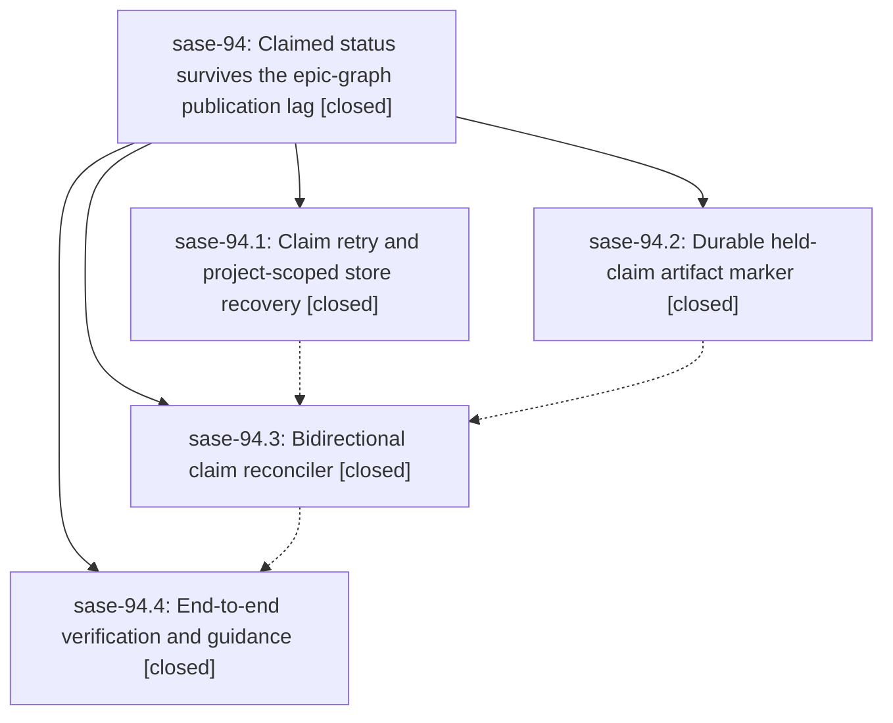

# Bead: sase-94 — Claimed status survives the epic-graph publication lag

[Bead Pages](../README.md) / sase-94

**Status:** ✓ closed · **Resolution:** (unrecorded) · **Type:** plan · **Tier:** epic
**Owner:** `bryanbugyi34@gmail.com` · **Assignee:** `sase-94.land`
**Created:** 2026-07-25 11:36:45 UTC · **Closed:** 2026-07-25 15:32:48 UTC
**Plan:** [202607/claimed\_bead\_publication\_race.md](https://github.com/sase-org/sase--plans/blob/main/202607/claimed_bead_publication_race.md)

## Description

Every bead owned by a live pre-launch SASE agent reaches `claimed` and stays there for the whole wait, even when the canonical bead store has not yet integrated the freshly published epic graph.

## Phases

| Bead | Title | Status | Size | Agents | Commits |
|---|---|---|---|---:|---:|
| [sase-94.1](sase-94.1.md) | Claim retry and project-scoped store recovery | ✓ closed | medium | 1 | 1 |
| [sase-94.2](sase-94.2.md) | Durable held-claim artifact marker | ✓ closed | small | 1 | 1 |
| [sase-94.3](sase-94.3.md) | Bidirectional claim reconciler | ✓ closed | medium | 1 | 1 |
| [sase-94.4](sase-94.4.md) | End-to-end verification and guidance | ✓ closed | small | 1 | 1 |

## Lineage

## Agents

| Agent | Bead | Commits |
|---|---|---:|
| [bbugyi200.athena.sase-94.1](https://github.com/sase-org/sase--agents/blob/main/agents/bbugyi200.athena.sase-94.1/README.md) | [sase-94.1](sase-94.1.md) | 1 |
| [bbugyi200.athena.sase-94.2](https://github.com/sase-org/sase--agents/blob/main/agents/bbugyi200.athena.sase-94.2/README.md) | [sase-94.2](sase-94.2.md) | 1 |
| [bbugyi200.athena.sase-94.3](https://github.com/sase-org/sase--agents/blob/main/agents/bbugyi200.athena.sase-94.3/README.md) | [sase-94.3](sase-94.3.md) | 1 |
| [bbugyi200.athena.sase-94.4](https://github.com/sase-org/sase--agents/blob/main/agents/bbugyi200.athena.sase-94.4/README.md) | [sase-94.4](sase-94.4.md) | 1 |

## Commits

| Commit | Subject | Bead | Committed (UTC) |
|---|---|---|---|
| [`a8b63c2`](https://github.com/sase-org/sase/commit/a8b63c27f0fb89b04f4bd214b556685925bd39f4) | fix(beads): recover waiting claims after publication lag (sase-94.1) | [sase-94.1](sase-94.1.md) | 2026-07-25 12:14:12 |
| [`42b9316`](https://github.com/sase-org/sase/commit/42b93168e5d1bec586d9487b0c16adff7ff3994d) | fix: persist waiting bead claims through shutdown (sase-94.2) | [sase-94.2](sase-94.2.md) | 2026-07-25 12:58:25 |
| [`2b7b71b`](https://github.com/sase-org/sase/commit/2b7b71b608e7a943d3aa6dd3115d48b829e23130) | fix: reconcile missing pre-launch bead claims (sase-94.3) | [sase-94.3](sase-94.3.md) | 2026-07-25 13:39:47 |
| [`792b019`](https://github.com/sase-org/sase/commit/792b019473512d0acff042c1c8fcfc0caa3b24b7) | feat(doctor): add unclaimed-live-agent advisory and claim race coverage (sase-94.4) | [sase-94.4](sase-94.4.md) | 2026-07-25 15:14:58 |
