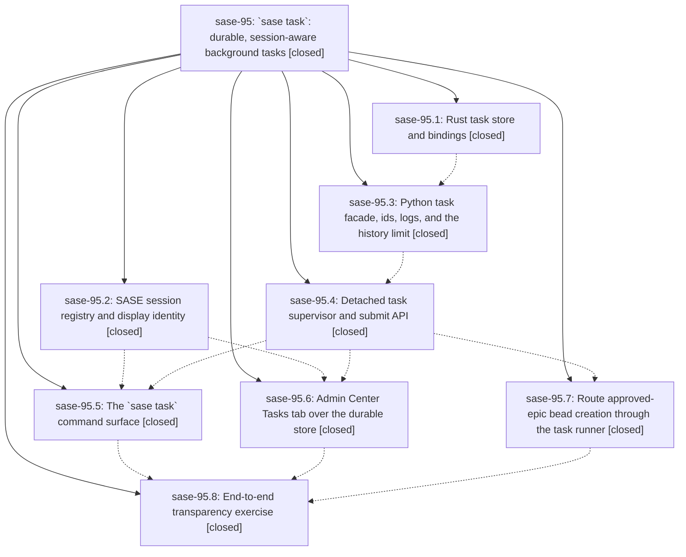

# Bead: sase-95 — \`sase task\`: durable, session-aware background tasks

[Bead Pages](../README.md) / sase-95

**Status:** ✓ closed · **Resolution:** (unrecorded) · **Type:** plan · **Tier:** epic
**Owner:** `bryanbugyi34@gmail.com` · **Assignee:** `sase-95.land`
**Created:** 2026-07-25 12:04:58 UTC · **Closed:** 2026-07-26 13:55:45 UTC
**Plan:** [202607/background\_tasks.md](https://github.com/sase-org/sase--plans/blob/main/202607/background_tasks.md)

## Description

Every SASE background task is durably recorded, listable and inspectable from the CLI, attributed to the TUI session it came from, and launchable with `sase task run`; approving an epic runs its `sase bead work` bead creation as one of these visible tasks instead of an invisible detached process.

## Phases

| Bead | Title | Status | Size | Agents | Commits |
|---|---|---|---|---:|---:|
| [sase-95.1](sase-95.1.md) | Rust task store and bindings | ✓ closed | medium | 1 | 1 |
| [sase-95.2](sase-95.2.md) | SASE session registry and display identity | ✓ closed | small | 1 | 1 |
| [sase-95.3](sase-95.3.md) | Python task facade, ids, logs, and the history limit | ✓ closed | medium | 1 | 1 |
| [sase-95.4](sase-95.4.md) | Detached task supervisor and submit API | ✓ closed | medium | 1 | 1 |
| [sase-95.5](sase-95.5.md) | The \`sase task\` command surface | ✓ closed | medium | 0 | 1 |
| [sase-95.6](sase-95.6.md) | Admin Center Tasks tab over the durable store | ✓ closed | medium | 0 | 1 |
| [sase-95.7](sase-95.7.md) | Route approved-epic bead creation through the task runner | ✓ closed | small | 1 | 1 |
| [sase-95.8](sase-95.8.md) | End-to-end transparency exercise | ✓ closed | small | 1 | 1 |

## Lineage

## Agents

| Agent | Bead | Commits |
|---|---|---:|
| [bbugyi200.athena.sase-95.1](https://github.com/sase-org/sase--agents/blob/main/agents/bbugyi200.athena.sase-95.1/README.md) | [sase-95.1](sase-95.1.md) | 1 |
| [bbugyi200.athena.sase-95.2](https://github.com/sase-org/sase--agents/blob/main/agents/bbugyi200.athena.sase-95.2/README.md) | [sase-95.2](sase-95.2.md) | 1 |
| [bbugyi200.athena.sase-95.3](https://github.com/sase-org/sase--agents/blob/main/agents/bbugyi200.athena.sase-95.3/README.md) | [sase-95.3](sase-95.3.md) | 1 |
| [bbugyi200.athena.sase-95.4](https://github.com/sase-org/sase--agents/blob/main/agents/bbugyi200.athena.sase-95.4/README.md) | [sase-95.4](sase-95.4.md) | 1 |
| [bbugyi200.athena.sase-95.7](https://github.com/sase-org/sase--agents/blob/main/agents/bbugyi200.athena.sase-95.7/README.md) | [sase-95.7](sase-95.7.md) | 1 |
| [bbugyi200.athena.sase-95.8](https://github.com/sase-org/sase--agents/blob/main/agents/bbugyi200.athena.sase-95.8/README.md) | [sase-95.8](sase-95.8.md) | 1 |

## Commits

| Commit | Subject | Bead | Committed (UTC) |
|---|---|---|---|
| [`9ebae15`](https://github.com/sase-org/sase/commit/9ebae1577d22b0155eb4cc95521d50e852e5d2f6) | feat(sessions): add session registry and display identity (sase-95.2) | [sase-95.2](sase-95.2.md) | 2026-07-25 13:06:03 |
| [`sase-core@240d93c`](https://github.com/sase-org/sase-core/commit/240d93c82f948926b0a43fe304952d253802e093) | feat(tasks): add durable background task store (sase-95.1) | [sase-95.1](sase-95.1.md) | 2026-07-25 13:15:00 |
| [`b262933`](https://github.com/sase-org/sase/commit/b26293395587b056bf4cf340a8038a4e4e968b30) | feat(tasks): add durable task store facade (sase-95.3) | [sase-95.3](sase-95.3.md) | 2026-07-25 14:14:58 |
| [`13598dc`](https://github.com/sase-org/sase/commit/13598dc3d14bd28b004406794b8a99df3f8b21fe) | feat(tasks): add detached task supervision (sase-95.4) | [sase-95.4](sase-95.4.md) | 2026-07-25 15:02:57 |
| [`441882d`](https://github.com/sase-org/sase/commit/441882db9949c7f057bd7e68a2be0aaeffc986bd) | feat(beads): route approved epic launch through the task runner (sase-95.7) | [sase-95.7](sase-95.7.md) | 2026-07-25 15:27:04 |
| [`8eafb2a`](https://github.com/sase-org/sase/commit/8eafb2aa587005f2499ada614e9542346bd4a066) | feat: Admin Center Tasks tab over the durable store (sase-95.6) | [sase-95.6](sase-95.6.md) | 2026-07-25 18:16:46 |
| [`6e97d2a`](https://github.com/sase-org/sase/commit/6e97d2a4f53be62c3303e830e6386d72144c7baf) | feat: add \`sase task\` commands (sase-95.5) | [sase-95.5](sase-95.5.md) | 2026-07-25 18:22:55 |
| [`54e0978`](https://github.com/sase-org/sase/commit/54e097800228f0779af2d98db6717a55efaccec8) | fix(tui): avoid terminal task mirror races (sase-95.8) | [sase-95.8](sase-95.8.md) | 2026-07-25 19:12:07 |
