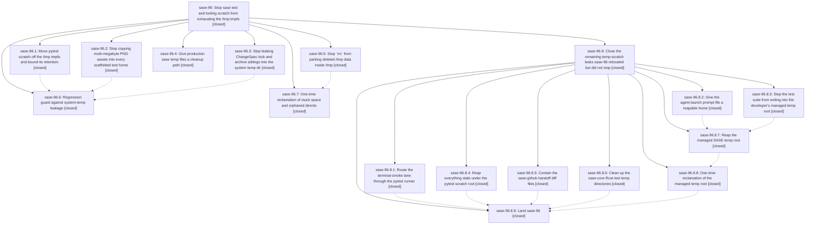

# Bead: sase-96 — Stop sase test and tooling scratch from exhausting the /tmp tmpfs

[Bead Pages](../README.md) / sase-96

**Status:** ✓ closed · **Resolution:** (unrecorded) · **Type:** plan · **Tier:** epic
**Owner:** `bryanbugyi34@gmail.com` · **Assignee:** `sase-96.land`
**Created:** 2026-07-25 12:15:00 UTC · **Closed:** 2026-07-26 10:57:36 UTC
**Plan:** [202607/tmp\_space\_exhaustion.md](https://github.com/sase-org/sase--plans/blob/main/202607/tmp_space_exhaustion.md)

## Description

A full `just check` sweep across every sase workspace no longer grows the /tmp tmpfs without bound: pytest scratch lives off tmpfs with bounded retention, per-test scaffolding stops copying multi-megabyte binary assets, ChangeSpec lock and archive siblings stay inside pytest-managed temp trees, production sase temp files are cleaned up, deleting something under /tmp actually reclaims its space, and a regression guard fails the suite if system-temp leakage returns.

## Phases

| Bead | Title | Status | Size | Agents | Commits |
|---|---|---|---|---:|---:|
| [sase-96.1](sase-96.1.md) | Move pytest scratch off the /tmp tmpfs and bound its retention | ✓ closed | medium | 1 | 1 |
| [sase-96.2](sase-96.2.md) | Stop copying multi-megabyte PNG assets into every scaffolded test home | ✓ closed | medium | 1 | 1 |
| [sase-96.3](sase-96.3.md) | Stop leaking ChangeSpec lock and archive siblings into the system temp dir | ✓ closed | medium | 1 | 1 |
| [sase-96.4](sase-96.4.md) | Give production sase temp files a cleanup path | ✓ closed | small | 1 | 1 |
| [sase-96.5](sase-96.5.md) | Stop \`rm\` from parking deleted /tmp data inside /tmp | ✓ closed | small | 0 | 0 |
| [sase-96.6](sase-96.6.md) | Regression guard against system-temp leakage | ✓ closed | small | 1 | 1 |
| [sase-96.7](sase-96.7.md) | One-time reclamation of stuck space and orphaned dirents | ✓ closed | small | 0 | 0 |

## Lineage

## Agents

| Agent | Bead | Commits |
|---|---|---:|
| [bbugyi200.athena.sase-96.1](https://github.com/sase-org/sase--agents/blob/main/agents/bbugyi200.athena.sase-96.1/README.md) | [sase-96.1](sase-96.1.md) | 1 |
| [bbugyi200.athena.sase-96.2](https://github.com/sase-org/sase--agents/blob/main/agents/bbugyi200.athena.sase-96.2/README.md) | [sase-96.2](sase-96.2.md) | 1 |
| [bbugyi200.athena.sase-96.3](https://github.com/sase-org/sase--agents/blob/main/agents/bbugyi200.athena.sase-96.3/README.md) | [sase-96.3](sase-96.3.md) | 1 |
| [bbugyi200.athena.sase-96.4](https://github.com/sase-org/sase--agents/blob/main/agents/bbugyi200.athena.sase-96.4/README.md) | [sase-96.4](sase-96.4.md) | 1 |
| [bbugyi200.athena.sase-96.6](https://github.com/sase-org/sase--agents/blob/main/agents/bbugyi200.athena.sase-96.6/README.md) | [sase-96.6](sase-96.6.md) | 1 |
| [bbugyi200.athena.sase-96.8.1](https://github.com/sase-org/sase--agents/blob/main/agents/bbugyi200.athena.sase-96.8.1/README.md) | [sase-96.8.1](sase-96.8.1.md) | 1 |
| [bbugyi200.athena.sase-96.8.2](https://github.com/sase-org/sase--agents/blob/main/agents/bbugyi200.athena.sase-96.8.2/README.md) | [sase-96.8.2](sase-96.8.2.md) | 1 |
| [bbugyi200.athena.sase-96.8.3](https://github.com/sase-org/sase--agents/blob/main/agents/bbugyi200.athena.sase-96.8.3/README.md) | [sase-96.8.3](sase-96.8.3.md) | 1 |
| [bbugyi200.athena.sase-96.8.4](https://github.com/sase-org/sase--agents/blob/main/agents/bbugyi200.athena.sase-96.8.4/README.md) | [sase-96.8.4](sase-96.8.4.md) | 1 |
| [bbugyi200.athena.sase-96.8.6](https://github.com/sase-org/sase--agents/blob/main/agents/bbugyi200.athena.sase-96.8.6/README.md) | [sase-96.8.6](sase-96.8.6.md) | 1 |
| [bbugyi200.athena.sase-96.8.7](https://github.com/sase-org/sase--agents/blob/main/agents/bbugyi200.athena.sase-96.8.7/README.md) | [sase-96.8.7](sase-96.8.7.md) | 1 |
| [bbugyi200.athena.sase-96.8.9](https://github.com/sase-org/sase--agents/blob/main/agents/bbugyi200.athena.sase-96.8.9/README.md) | [sase-96.8.9](sase-96.8.9.md) | 1 |
| [bbugyi200.athena.sase-96.8.land](https://github.com/sase-org/sase--agents/blob/main/agents/bbugyi200.athena.sase-96.8.land/README.md) | [sase-96.8](sase-96.8.md) | 0 |

## Commits

| Commit | Subject | Bead | Committed (UTC) |
|---|---|---|---|
| [`4520b4c`](https://github.com/sase-org/sase/commit/4520b4cc353a8368fc1534dd92acf03f01f55324) | test: contain ChangeSpec temp artifacts (sase-96.3) | [sase-96.3](sase-96.3.md) | 2026-07-25 13:22:41 |
| [`7340235`](https://github.com/sase-org/sase/commit/7340235b22b94173d94dc752127932895552f749) | perf(test): avoid copying large directory map assets (sase-96.2) | [sase-96.2](sase-96.2.md) | 2026-07-25 13:26:44 |
| [`c3316b7`](https://github.com/sase-org/sase/commit/c3316b71948506cebdb15da499b171f02d1ce584) | fix: clean up production temp artifacts (sase-96.4) | [sase-96.4](sase-96.4.md) | 2026-07-25 13:45:48 |
| [`15ea05a`](https://github.com/sase-org/sase/commit/15ea05af681131a2266531414b69cf823d574520) | fix(test): move pytest scratch off tmpfs (sase-96.1) | [sase-96.1](sase-96.1.md) | 2026-07-25 15:25:23 |
| [`396c9a9`](https://github.com/sase-org/sase/commit/396c9a908196141725d1bf12bf8ae33f793fd217) | test: guard against system-temp leakage (sase-96.6) | [sase-96.6](sase-96.6.md) | 2026-07-25 17:35:48 |
| [`sase-core@8b3b028`](https://github.com/sase-org/sase-core/commit/8b3b0282c54587d263ad12c8bfa949301172196d) | test(core-py): reap binding test temp dirs (sase-96.8.6) | [sase-96.8.6](sase-96.8.6.md) | 2026-07-25 18:36:56 |
| [`88cb087`](https://github.com/sase-org/sase/commit/88cb0876d1990363dae046381a6ce22eab5de516) | fix: reap stale pytest scratch entries (sase-96.8.4) | [sase-96.8.4](sase-96.8.4.md) | 2026-07-25 18:54:50 |
| [`63b9d88`](https://github.com/sase-org/sase/commit/63b9d8814590ea857e4675b5b55099a0d475f3c4) | fix: give the agent-launch prompt file a reapable home (sase-96.8.2) | [sase-96.8.2](sase-96.8.2.md) | 2026-07-25 19:16:39 |
| [`bd16432`](https://github.com/sase-org/sase/commit/bd16432c966c92dc66f4a31489eef8214f4d73a1) | fix: stop the test suite from writing into the managed temp root (sase-96.8.3) | [sase-96.8.3](sase-96.8.3.md) | 2026-07-25 19:37:20 |
| [`15a5a0e`](https://github.com/sase-org/sase/commit/15a5a0e67ad521644e7b85063aaefba5798b2adf) | feat(axe): reap the managed SASE temp root (sase-96.8.7) | [sase-96.8.7](sase-96.8.7.md) | 2026-07-25 20:37:45 |
| [`0417b41`](https://github.com/sase-org/sase/commit/0417b415d8c7b30c9e1c94e2c5cebe3e2a3aa31c) | build: route terminal smoke through pytest runner (sase-96.8.1) | [sase-96.8.1](sase-96.8.1.md) | 2026-07-26 10:36:18 |
| [`sase--plans@07b527a`](https://github.com/sase-org/sase--plans/commit/07b527a9da87832a706b01b235c504cee76648d1) | chore(plans): close sase-96 and mark its plans done (sase-96.8.9) | [sase-96.8.9](sase-96.8.9.md) | 2026-07-26 11:04:29 |
