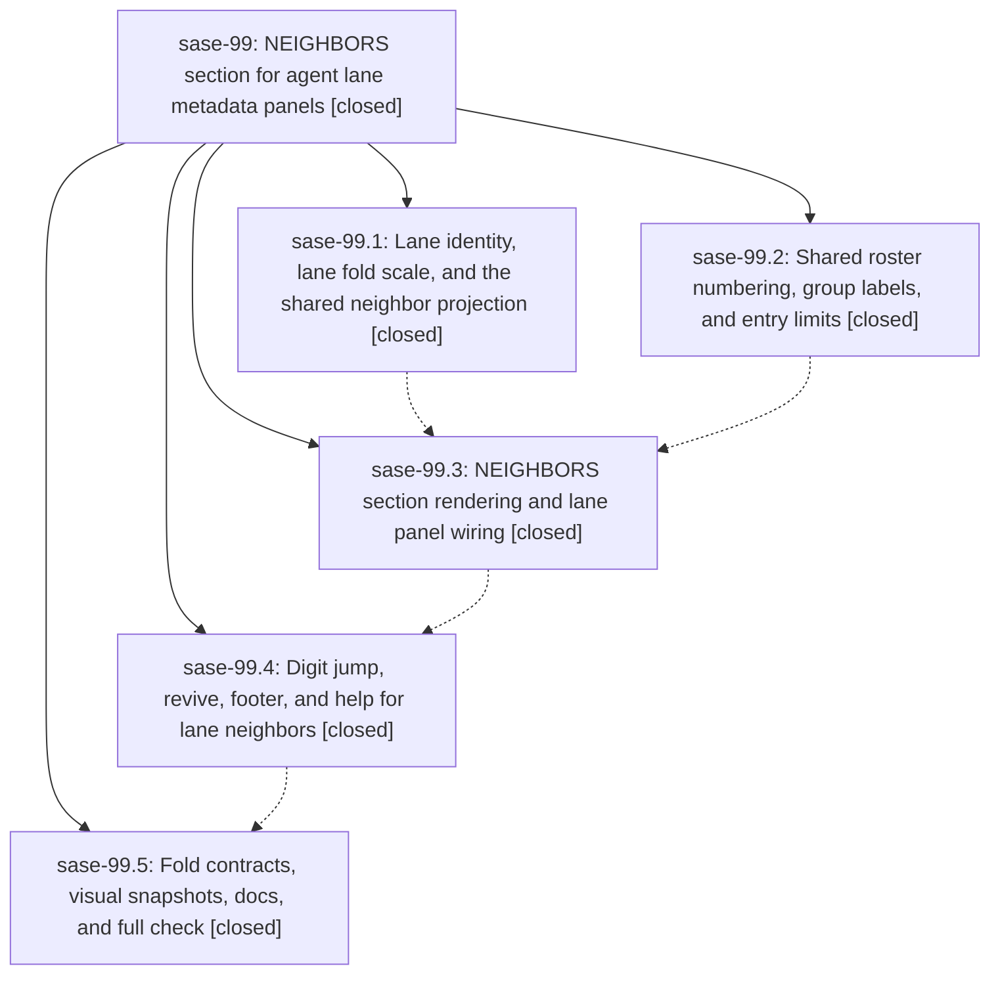

# Bead: sase-99 — NEIGHBORS section for agent lane metadata panels

[Bead Pages](../README.md) / sase-99

**Status:** ✓ closed · **Resolution:** (unrecorded) · **Type:** plan · **Tier:** epic
**Owner:** `bryanbugyi34@gmail.com` · **Assignee:** `sase-99.land`
**Created:** 2026-07-25 12:39:31 UTC · **Closed:** 2026-07-25 17:20:05 UTC
**Plan:** [202607/lane\_neighbors\_section.md](https://github.com/sase-org/sase--plans/blob/main/202607/lane_neighbors_section.md)

## Description

Every agent lane metadata panel (family container rows, and single agents that own their lane) renders a numbered, fold-aware NEIGHBORS section listing exactly the related agents the `~` neighbors modal offers for that lane, digit keys jump to (or revive) them, and single agents gain real fold-level support.

## Phases

| Bead | Title | Status | Size | Agents | Commits |
|---|---|---|---|---:|---:|
| [sase-99.1](sase-99.1.md) | Lane identity, lane fold scale, and the shared neighbor projection | ✓ closed | medium | 1 | 1 |
| [sase-99.2](sase-99.2.md) | Shared roster numbering, group labels, and entry limits | ✓ closed | medium | 1 | 1 |
| [sase-99.3](sase-99.3.md) | NEIGHBORS section rendering and lane panel wiring | ✓ closed | medium | 1 | 1 |
| [sase-99.4](sase-99.4.md) | Digit jump, revive, footer, and help for lane neighbors | ✓ closed | medium | 1 | 1 |
| [sase-99.5](sase-99.5.md) | Fold contracts, visual snapshots, docs, and full check | ✓ closed | small | 1 | 1 |

## Lineage

## Agents

| Agent | Bead | Commits |
|---|---|---:|
| [bbugyi200.athena.sase-99.1](https://github.com/sase-org/sase--agents/blob/main/agents/bbugyi200.athena.sase-99.1/README.md) | [sase-99.1](sase-99.1.md) | 1 |
| [bbugyi200.athena.sase-99.2](https://github.com/sase-org/sase--agents/blob/main/agents/bbugyi200.athena.sase-99.2/README.md) | [sase-99.2](sase-99.2.md) | 1 |
| [bbugyi200.athena.sase-99.3](https://github.com/sase-org/sase--agents/blob/main/agents/bbugyi200.athena.sase-99.3/README.md) | [sase-99.3](sase-99.3.md) | 1 |
| [bbugyi200.athena.sase-99.4](https://github.com/sase-org/sase--agents/blob/main/agents/bbugyi200.athena.sase-99.4/README.md) | [sase-99.4](sase-99.4.md) | 1 |
| [bbugyi200.athena.sase-99.5](https://github.com/sase-org/sase--agents/blob/main/agents/bbugyi200.athena.sase-99.5/README.md) | [sase-99.5](sase-99.5.md) | 1 |
| [bbugyi200.athena.sase-99.land](https://github.com/sase-org/sase--agents/blob/main/agents/bbugyi200.athena.sase-99.land/README.md) | [sase-99](README.md) | 1 |

## Commits

| Commit | Subject | Bead | Committed (UTC) |
|---|---|---|---|
| [`1d6c95e`](https://github.com/sase-org/sase/commit/1d6c95e60d6ae0f98c309de41490aa4c8738a9d9) | refactor(ace): share lane neighbor projection (sase-99.1) | [sase-99.1](sase-99.1.md) | 2026-07-25 13:34:08 |
| [`a8f9e58`](https://github.com/sase-org/sase/commit/a8f9e5802c395c3cce113edee9dac1c53d56dc08) | feat(tui): extend shared member roster rendering (sase-99.2) | [sase-99.2](sase-99.2.md) | 2026-07-25 13:46:11 |
| [`a53f5a5`](https://github.com/sase-org/sase/commit/a53f5a55b9c0ff299ef5cc3b2db9f3f2c0c1fa5c) | feat(tui): render fold-aware lane neighbors (sase-99.3) | [sase-99.3](sase-99.3.md) | 2026-07-25 15:29:37 |
| [`23c0061`](https://github.com/sase-org/sase/commit/23c0061450fdeeb83dc6644ea1918391c6aef9e8) | feat(ace): add digit jumps for lane neighbors (sase-99.4) | [sase-99.4](sase-99.4.md) | 2026-07-25 15:58:58 |
| [`c4063f4`](https://github.com/sase-org/sase/commit/c4063f44788f86af1169ee1ac22ca4565c1858b2) | fix(ace): exclude a lane from its own neighbor list (sase-99.5) | [sase-99.5](sase-99.5.md) | 2026-07-25 16:41:11 |
| [`ffc7aa8`](https://github.com/sase-org/sase/commit/ffc7aa874735fb008fa5a489fa254e36c02092ae) | docs(ace): describe lane fold behavior in help and agent docs (sase-99) | [sase-99](README.md) | 2026-07-25 17:22:56 |
