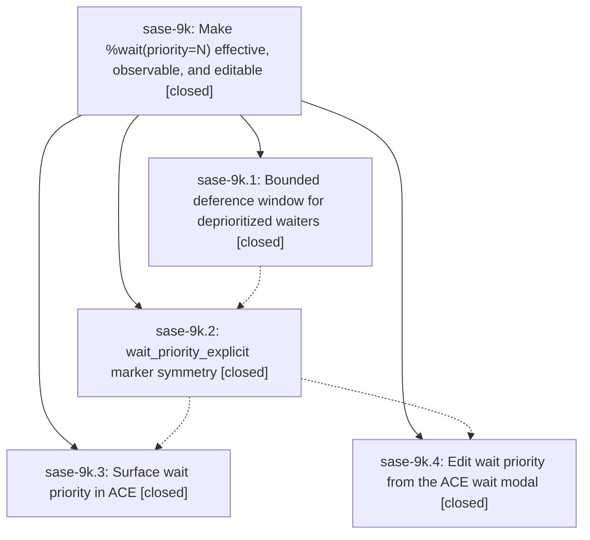

# Bead: sase-9k — Make %wait(priority=N) effective, observable, and editable

[Bead Pages](../README.md) / sase-9k

**Status:** ✓ closed · **Resolution:** (unrecorded) · **Type:** plan · **Tier:** epic
**Owner:** `bryanbugyi34@gmail.com` · **Assignee:** `sase-9k.land`
**Created:** 2026-07-25 14:38:22 UTC · **Closed:** 2026-07-26 13:55:45 UTC
**Plan:** [sase/repos/plans/202607/wait\_priority.md](https://github.com/sase-org/sase--plans/blob/main/sase/repos/plans/202607/wait_priority.md)

## Description

A deprioritized agent (%wait with a priority above the default) reliably yields runner-slot capacity to normal-priority work that becomes runnable moments later, and the priority that decided a queue outcome is visible and editable from ACE.

## Phases

| Bead | Title | Status | Size | Agents | Commits |
|---|---|---|---|---:|---:|
| [sase-9k.1](sase-9k.1.md) | Bounded deference window for deprioritized waiters | ✓ closed | medium | 1 | 1 |
| [sase-9k.2](sase-9k.2.md) | wait\_priority\_explicit marker symmetry | ✓ closed | small | 1 | 1 |
| [sase-9k.3](sase-9k.3.md) | Surface wait priority in ACE | ✓ closed | small | 1 | 1 |
| [sase-9k.4](sase-9k.4.md) | Edit wait priority from the ACE wait modal | ✓ closed | medium | 1 | 1 |

## Lineage

## Agents

| Agent | Bead | Commits |
|---|---|---:|
| [bbugyi200.athena.sase-9k.1](https://github.com/sase-org/sase--agents/blob/main/agents/bbugyi200.athena.sase-9k.1/README.md) | [sase-9k.1](sase-9k.1.md) | 1 |
| [bbugyi200.athena.sase-9k.2](https://github.com/sase-org/sase--agents/blob/main/agents/bbugyi200.athena.sase-9k.2/README.md) | [sase-9k.2](sase-9k.2.md) | 1 |
| [bbugyi200.athena.sase-9k.3](https://github.com/sase-org/sase--agents/blob/main/agents/bbugyi200.athena.sase-9k.3/README.md) | [sase-9k.3](sase-9k.3.md) | 1 |
| [bbugyi200.athena.sase-9k.4](https://github.com/sase-org/sase--agents/blob/main/agents/bbugyi200.athena.sase-9k.4/README.md) | [sase-9k.4](sase-9k.4.md) | 1 |
| [bbugyi200.athena.sase-9k.land](https://github.com/sase-org/sase--agents/blob/main/agents/bbugyi200.athena.sase-9k.land/README.md) | [sase-9k](README.md) | 1 |
| [bbugyi200.athena.sase-9k.land--code](https://github.com/sase-org/sase--agents/blob/main/families/bbugyi200.athena.sase-9k.land.md#member-code) | [sase-9k](README.md) | 0 |

## Commits

| Commit | Subject | Bead | Committed (UTC) |
|---|---|---|---|
| [`43ba5da`](https://github.com/sase-org/sase/commit/43ba5daf72c0d112902fe4b33fbc9bc07e4a86c1) | fix(runner-slots): defer deprioritized admission (sase-9k.1) | [sase-9k.1](sase-9k.1.md) | 2026-07-25 15:06:09 |
| [`64ac40d`](https://github.com/sase-org/sase/commit/64ac40d38983ea26c6ed2d983813495e74058809) | fix(wait): persist wait priority explicitness (sase-9k.2) | [sase-9k.2](sase-9k.2.md) | 2026-07-25 15:34:11 |
| [`68723be`](https://github.com/sase-org/sase/commit/68723bedb8e0b29b53533200999f6a25f36b081e) | feat(ace): show explicit wait priorities (sase-9k.3) | [sase-9k.3](sase-9k.3.md) | 2026-07-25 16:17:50 |
| [`3a8540f`](https://github.com/sase-org/sase/commit/3a8540f321764da347f69c38eced0b96c1f0119f) | feat(ace): edit wait priority from wait modal (sase-9k.4) | [sase-9k.4](sase-9k.4.md) | 2026-07-25 16:21:34 |
| [`4b9281d`](https://github.com/sase-org/sase/commit/4b9281d3d7d92f0de8a03c8bdea802d28eea6901) | docs: document bounded runner-slot deference (sase-9k) | [sase-9k](README.md) | 2026-07-25 16:53:09 |
