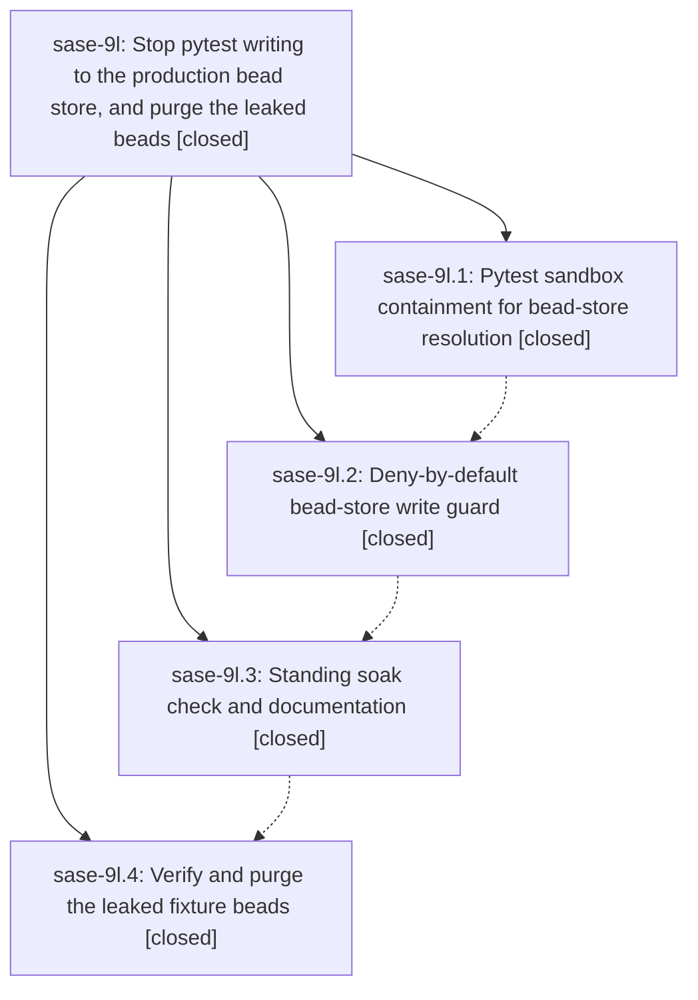

# Bead: sase-9l — Stop pytest writing to the production bead store, and purge the leaked beads

[Bead Pages](../README.md) / sase-9l

**Status:** ✓ closed · **Resolution:** (unrecorded) · **Type:** plan · **Tier:** epic
**Owner:** `bryanbugyi34@gmail.com` · **Assignee:** `sase-9l.land`
**Created:** 2026-07-25 14:56:24 UTC · **Closed:** 2026-07-25 18:08:18 UTC
**Plan:** [202607/bead\_store\_pytest\_isolation.md](https://github.com/sase-org/sase--plans/blob/main/202607/bead_store_pytest_isolation.md)

## Description

A sase test run can no longer mutate any bead store outside its own pytest sandbox, the tests that were silently targeting the shared plans sidecar resolve to isolated stores instead, a standing check proves the production store is byte-identical across a full suite run, and the leaked pytest-fixture beads are removed from the shared store.

## Phases

| Bead | Title | Status | Size | Agents | Commits |
|---|---|---|---|---:|---:|
| [sase-9l.1](sase-9l.1.md) | Pytest sandbox containment for bead-store resolution | ✓ closed | medium | 1 | 1 |
| [sase-9l.2](sase-9l.2.md) | Deny-by-default bead-store write guard | ✓ closed | medium | 1 | 1 |
| [sase-9l.3](sase-9l.3.md) | Standing soak check and documentation | ✓ closed | small | 1 | 1 |
| [sase-9l.4](sase-9l.4.md) | Verify and purge the leaked fixture beads | ✓ closed | small | 0 | 0 |

## Lineage

## Agents

| Agent | Bead | Commits |
|---|---|---:|
| [bbugyi200.athena.sase-9l.1](https://github.com/sase-org/sase--agents/blob/main/agents/bbugyi200.athena.sase-9l.1/README.md) | [sase-9l.1](sase-9l.1.md) | 1 |
| [bbugyi200.athena.sase-9l.2](https://github.com/sase-org/sase--agents/blob/main/agents/bbugyi200.athena.sase-9l.2/README.md) | [sase-9l.2](sase-9l.2.md) | 1 |
| [bbugyi200.athena.sase-9l.3](https://github.com/sase-org/sase--agents/blob/main/agents/bbugyi200.athena.sase-9l.3/README.md) | [sase-9l.3](sase-9l.3.md) | 1 |
| [bbugyi200.athena.sase-9l.land](https://github.com/sase-org/sase--agents/blob/main/agents/bbugyi200.athena.sase-9l.land/README.md) | [sase-9l](README.md) | 1 |

## Commits

| Commit | Subject | Bead | Committed (UTC) |
|---|---|---|---|
| [`5ae5e9a`](https://github.com/sase-org/sase/commit/5ae5e9a4dcdc51c496009259baa4e0625ba44b9c) | fix(tests): contain bead resolution in pytest sandbox (sase-9l.1) | [sase-9l.1](sase-9l.1.md) | 2026-07-25 15:19:11 |
| [`289222b`](https://github.com/sase-org/sase/commit/289222b19ca37c8fdf34a86112aa3997807abf96) | fix(tests): deny unsandboxed pytest bead-store writes (sase-9l.2) | [sase-9l.2](sase-9l.2.md) | 2026-07-25 17:12:33 |
| [`c95b361`](https://github.com/sase-org/sase/commit/c95b361f1c92288108a53e27c3ef7401ca566144) | test: add bead-store soak guard (sase-9l.3) | [sase-9l.3](sase-9l.3.md) | 2026-07-25 17:49:31 |
| [`84f6619`](https://github.com/sase-org/sase/commit/84f6619ec4e9478559701a049c95e8ea60036498) | fix: guard the event-store manifest repair write path (sase-9l) | [sase-9l](README.md) | 2026-07-25 18:09:54 |
