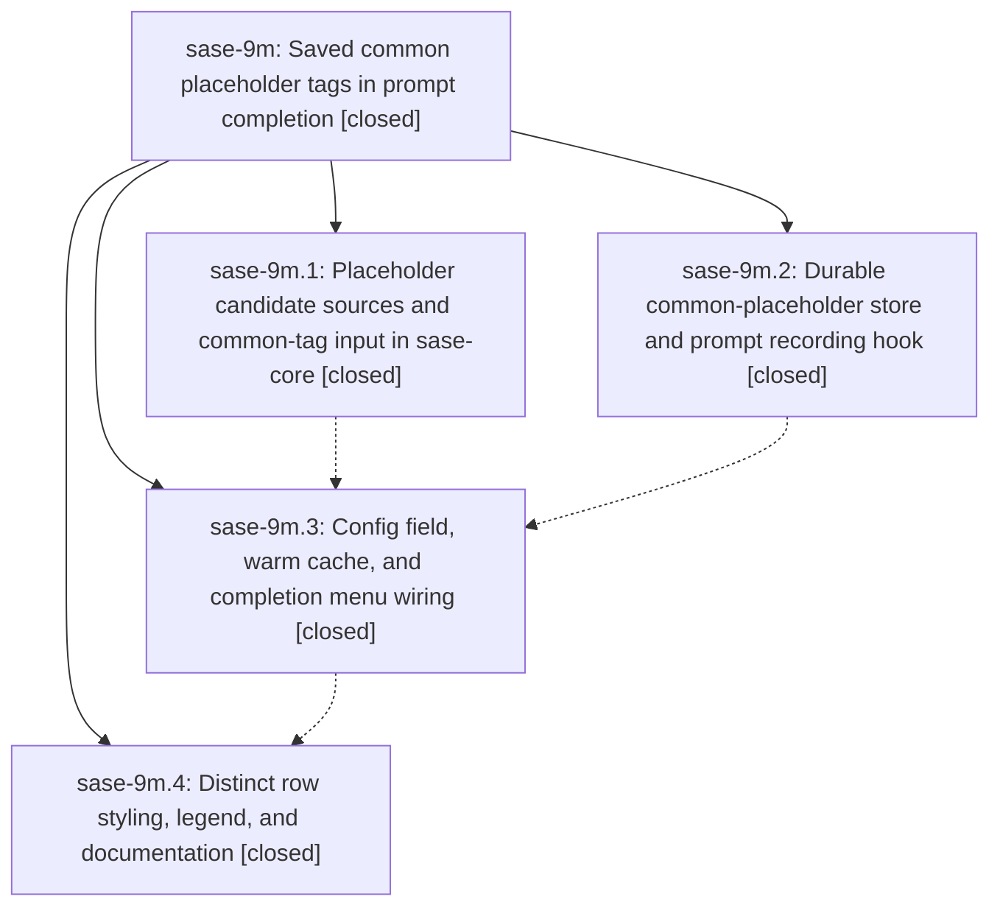

# Bead: sase-9m — Saved common placeholder tags in prompt completion

[Bead Pages](../README.md) / sase-9m

**Status:** ✓ closed · **Resolution:** (unrecorded) · **Type:** plan · **Tier:** epic
**Owner:** `bryanbugyi34@gmail.com` · **Assignee:** `sase-9m.land`
**Created:** 2026-07-25 16:44:17 UTC · **Closed:** 2026-07-25 19:10:35 UTC
**Plan:** [202607/common\_placeholder\_tags.md](https://github.com/sase-org/sase--plans/blob/main/202607/common_placeholder_tags.md)

## Description

Every `<foobar>` tag the user writes in a prompt is saved to a durable, capped, frecency-ranked store, and those saved tags appear beneath the current prompt's own tags in the `<` completion menu, rendered in a visually distinct style that makes the two groups tellable apart at a glance.

## Phases

| Bead | Title | Status | Size | Agents | Commits |
|---|---|---|---|---:|---:|
| [sase-9m.1](sase-9m.1.md) | Placeholder candidate sources and common-tag input in sase-core | ✓ closed | medium | 1 | 2 |
| [sase-9m.2](sase-9m.2.md) | Durable common-placeholder store and prompt recording hook | ✓ closed | medium | 1 | 1 |
| [sase-9m.3](sase-9m.3.md) | Config field, warm cache, and completion menu wiring | ✓ closed | medium | 1 | 1 |
| [sase-9m.4](sase-9m.4.md) | Distinct row styling, legend, and documentation | ✓ closed | small | 1 | 1 |

## Lineage

## Agents

| Agent | Bead | Commits |
|---|---|---:|
| [bbugyi200.athena.sase-9m.1](https://github.com/sase-org/sase--agents/blob/main/agents/bbugyi200.athena.sase-9m.1/README.md) | [sase-9m.1](sase-9m.1.md) | 2 |
| [bbugyi200.athena.sase-9m.2](https://github.com/sase-org/sase--agents/blob/main/agents/bbugyi200.athena.sase-9m.2/README.md) | [sase-9m.2](sase-9m.2.md) | 1 |
| [bbugyi200.athena.sase-9m.3](https://github.com/sase-org/sase--agents/blob/main/agents/bbugyi200.athena.sase-9m.3/README.md) | [sase-9m.3](sase-9m.3.md) | 1 |
| [bbugyi200.athena.sase-9m.4](https://github.com/sase-org/sase--agents/blob/main/agents/bbugyi200.athena.sase-9m.4/README.md) | [sase-9m.4](sase-9m.4.md) | 1 |
| [bbugyi200.athena.sase-9m.land](https://github.com/sase-org/sase--agents/blob/main/agents/bbugyi200.athena.sase-9m.land/README.md) | [sase-9m](README.md) | 2 |

## Commits

| Commit | Subject | Bead | Committed (UTC) |
|---|---|---|---|
| [`sase-core@69504fe`](https://github.com/sase-org/sase-core/commit/69504fefb6be894a98a189fa0fe439c0eeb7e2d8) | feat(editor)!: tag placeholder candidates with a source and accept common tags (sase-9m.1) | [sase-9m.1](sase-9m.1.md) | 2026-07-25 17:11:02 |
| [`9f8f04a`](https://github.com/sase-org/sase/commit/9f8f04a4ae7f927447469de0674ebb2ca76d38dd) | feat(history): add durable common-placeholder store (sase-9m.2) | [sase-9m.2](sase-9m.2.md) | 2026-07-25 17:11:27 |
| [`26b4a4c`](https://github.com/sase-org/sase/commit/26b4a4cc936d3270f654c6ab20fe7b5e1ec75f36) | fix(xprompt): read the new placeholder candidate shape from sase-core (sase-9m.1) | [sase-9m.1](sase-9m.1.md) | 2026-07-25 17:11:51 |
| [`e3e0bd8`](https://github.com/sase-org/sase/commit/e3e0bd8bb65997d26def5abc2056d1faf3d215d8) | feat(ace): offer saved common placeholder tags in prompt completion (sase-9m.3) | [sase-9m.3](sase-9m.3.md) | 2026-07-25 17:51:59 |
| [`141aaf7`](https://github.com/sase-org/sase/commit/141aaf7f51cc8a7a3bfd47b717eb8ff8f219c033) | feat(ace): distinguish saved placeholder completions (sase-9m.4) | [sase-9m.4](sase-9m.4.md) | 2026-07-25 18:41:57 |
| [`9aee679`](https://github.com/sase-org/sase/commit/9aee6792baf80c31dda202cba2206f72fcd0022d) | refactor(ace): make the common-placeholder limit helper private (sase-9m) | [sase-9m](README.md) | 2026-07-25 20:18:59 |
| [`sase--plans@cc77c87`](https://github.com/sase-org/sase--plans/commit/cc77c87ca8888d74b9853aa24cdb001680b0d3c6) | docs: mark the common placeholder tags plan done and file the core release follow-up (sase-9m) | [sase-9m](README.md) | 2026-07-25 20:20:43 |
