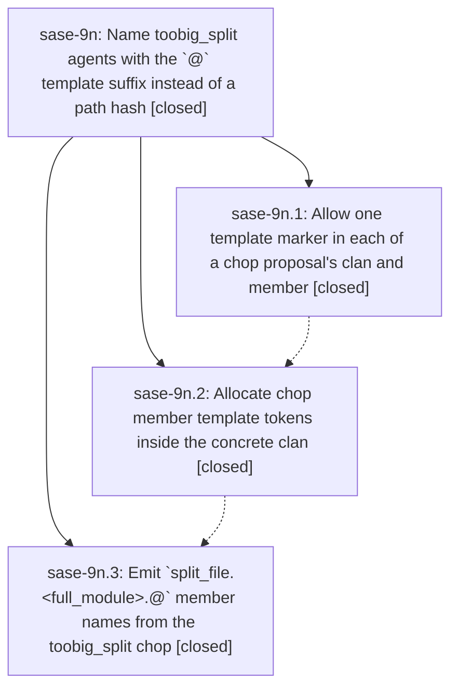

# Bead: sase-9n — Name toobig\_split agents with the \`@\` template suffix instead of a path hash

[Bead Pages](../README.md) / sase-9n

**Status:** ✓ closed · **Resolution:** (unrecorded) · **Type:** plan · **Tier:** epic
**Owner:** `bryanbugyi34@gmail.com` · **Assignee:** `sase-9n.land`
**Created:** 2026-07-25 16:59:12 UTC · **Closed:** 2026-07-25 20:12:12 UTC
**Plan:** [202607/toobig\_split\_at\_names.md](https://github.com/sase-org/sase--plans/blob/main/202607/toobig_split_at_names.md)

## Description

Agents proposed by the `toobig_split` chop are named `split_file.<full_dotted_module>.@` (rendered as `<clan>.split_file.<module>.0`) instead of `split_file.<truncated_module>.<8-hex-hash>`, which requires SASE to support one `@` template marker in a chop proposal's `clan` and another in its `agent_name`.

## Phases

| Bead | Title | Status | Size | Agents | Commits |
|---|---|---|---|---:|---:|
| [sase-9n.1](sase-9n.1.md) | Allow one template marker in each of a chop proposal's clan and member | ✓ closed | small | 0 | 0 |
| [sase-9n.2](sase-9n.2.md) | Allocate chop member template tokens inside the concrete clan | ✓ closed | medium | 0 | 1 |
| [sase-9n.3](sase-9n.3.md) | Emit \`split\_file.\<full\_module\>.@\` member names from the toobig\_split chop | ✓ closed | small | 0 | 0 |

## Lineage

## Agents

| Agent | Bead | Commits |
|---|---|---:|
| [bbugyi200.athena.sase-9n.land](https://github.com/sase-org/sase--agents/blob/main/agents/bbugyi200.athena.sase-9n.land/README.md) | [sase-9n](README.md) | 1 |

## Commits

| Commit | Subject | Bead | Committed (UTC) |
|---|---|---|---|
| [`f15d02d`](https://github.com/sase-org/sase/commit/f15d02d03a81e74931151400b52bcb4eaedf6e7f) | feat: planner-member-tokens (sase-9n.2) | [sase-9n.2](sase-9n.2.md) | 2026-07-25 17:53:51 |
| [`4b9a5be`](https://github.com/sase-org/sase/commit/4b9a5bec2bf492792020be3fb71ef61a9a48a0a5) | docs: document templated chop member names in the plugin guide (sase-9n) | [sase-9n](README.md) | 2026-07-25 20:14:06 |
