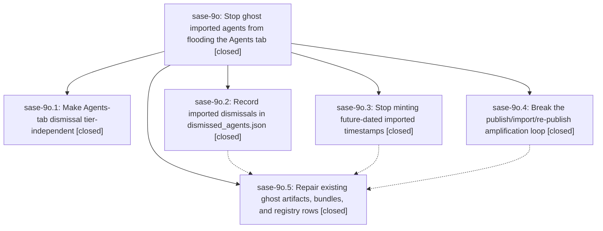

# Bead: sase-9o — Stop ghost imported agents from flooding the Agents tab

[Bead Pages](../README.md) / sase-9o

**Status:** ✓ closed · **Resolution:** (unrecorded) · **Type:** plan · **Tier:** epic
**Owner:** `bryanbugyi34@gmail.com` · **Assignee:** `sase-9o.land`
**Created:** 2026-07-25 19:10:48 UTC · **Closed:** 2026-07-26 12:01:18 UTC
**Plan:** [202607/ghost\_imported\_agents.md](https://github.com/sase-org/sase--plans/blob/main/202607/ghost_imported_agents.md)

## Description

Agents-sync imports never mint future-dated agent artifacts, never re-publish themselves, and are consistently hidden by every Agents-tab load tier, so previously dismissed agents stop appearing and disappearing in `sase ace`.

## Phases

| Bead | Title | Status | Size | Agents | Commits |
|---|---|---|---|---:|---:|
| [sase-9o.1](sase-9o.1.md) | Make Agents-tab dismissal tier-independent | ✓ closed | medium | 1 | 1 |
| [sase-9o.2](sase-9o.2.md) | Record imported dismissals in dismissed\_agents.json | ✓ closed | small | 1 | 1 |
| [sase-9o.3](sase-9o.3.md) | Stop minting future-dated imported timestamps | ✓ closed | medium | 1 | 1 |
| [sase-9o.4](sase-9o.4.md) | Break the publish/import/re-publish amplification loop | ✓ closed | medium | 1 | 1 |
| [sase-9o.5](sase-9o.5.md) | Repair existing ghost artifacts, bundles, and registry rows | ✓ closed | medium | 0 | 1 |

## Lineage

## Agents

| Agent | Bead | Commits |
|---|---|---:|
| [bbugyi200.athena.sase-9o.1](https://github.com/sase-org/sase--agents/blob/main/agents/bbugyi200.athena.sase-9o.1/README.md) | [sase-9o.1](sase-9o.1.md) | 1 |
| [bbugyi200.athena.sase-9o.2](https://github.com/sase-org/sase--agents/blob/main/agents/bbugyi200.athena.sase-9o.2/README.md) | [sase-9o.2](sase-9o.2.md) | 1 |
| [bbugyi200.athena.sase-9o.3](https://github.com/sase-org/sase--agents/blob/main/agents/bbugyi200.athena.sase-9o.3/README.md) | [sase-9o.3](sase-9o.3.md) | 1 |
| [bbugyi200.athena.sase-9o.4](https://github.com/sase-org/sase--agents/blob/main/agents/bbugyi200.athena.sase-9o.4/README.md) | [sase-9o.4](sase-9o.4.md) | 1 |
| [bbugyi200.athena.sase-9o.land](https://github.com/sase-org/sase--agents/blob/main/agents/bbugyi200.athena.sase-9o.land/README.md) | [sase-9o](README.md) | 1 |

## Commits

| Commit | Subject | Bead | Committed (UTC) |
|---|---|---|---|
| [`e0fbcec`](https://github.com/sase-org/sase/commit/e0fbcecc8f3b4709c1aeea7fa9769fbce8064e72) | fix(agents-sync): prevent future import timestamps (sase-9o.3) | [sase-9o.3](sase-9o.3.md) | 2026-07-26 10:15:48 |
| [`2a40c25`](https://github.com/sase-org/sase/commit/2a40c2530ce18b4c3369d15e9cc9b0f7b53e279f) | fix(agents-sync): prevent imported history amplification (sase-9o.4) | [sase-9o.4](sase-9o.4.md) | 2026-07-26 10:31:39 |
| [`6363f22`](https://github.com/sase-org/sase/commit/6363f22db23d6c6a90585dbad53d0a741d962d99) | fix: record dismissed identities during v2 import (sase-9o.2) | [sase-9o.2](sase-9o.2.md) | 2026-07-26 10:42:17 |
| [`44c5ce3`](https://github.com/sase-org/sase/commit/44c5ce3de5cf9b29b431a1207018e275ac8f4ca2) | fix(ace): make agent dismissal tier-independent (sase-9o.1) | [sase-9o.1](sase-9o.1.md) | 2026-07-26 10:49:38 |
| [`7ae51f4`](https://github.com/sase-org/sase/commit/7ae51f46342ce4ce6cc86665d748f61f22b84734) | fix(agents): repair future-dated imported state (sase-9o.5) | [sase-9o.5](sase-9o.5.md) | 2026-07-26 11:32:17 |
| [`eda646e`](https://github.com/sase-org/sase/commit/eda646ec02177d9e28ebb03cb322a68b52bb2f9c) | docs(agents): document the agent index repair subcommand (sase-9o) | [sase-9o](README.md) | 2026-07-26 12:25:22 |
