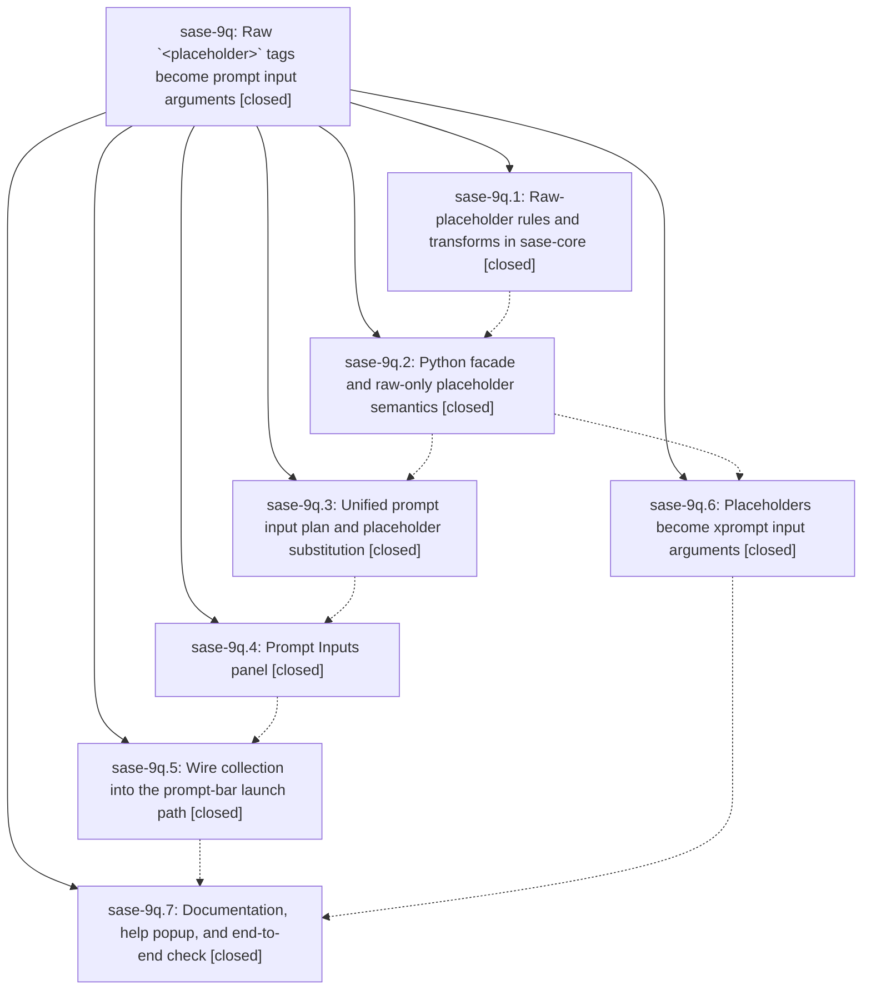

# Bead: sase-9q — Raw \`\<placeholder\>\` tags become prompt input arguments

[Bead Pages](../README.md) / sase-9q

**Status:** ✓ closed · **Resolution:** (unrecorded) · **Type:** plan · **Tier:** epic
**Owner:** `bryanbugyi34@gmail.com` · **Assignee:** `sase-9q.land`
**Created:** 2026-07-26 10:06:46 UTC · **Closed:** 2026-07-26 16:24:31 UTC
**Plan:** [sase/repos/plans/202607/raw\_placeholder\_inputs.md](https://github.com/sase-org/sase--plans/blob/main/sase/repos/plans/202607/raw_placeholder_inputs.md)

## Description

Submitting a prompt that contains raw `<placeholder>` tags opens one page that collects a value for each unique tag (alongside any declared `input:` arguments) and substitutes them before launch, and saving that draft as a global or local xprompt turns the same tags into `text` input arguments wired into the saved body.

## Phases

| Bead | Title | Status | Size | Agents | Commits |
|---|---|---|---|---:|---:|
| [sase-9q.1](sase-9q.1.md) | Raw-placeholder rules and transforms in sase-core | ✓ closed | medium | 0 | 0 |
| [sase-9q.2](sase-9q.2.md) | Python facade and raw-only placeholder semantics | ✓ closed | small | 1 | 1 |
| [sase-9q.3](sase-9q.3.md) | Unified prompt input plan and placeholder substitution | ✓ closed | small | 0 | 1 |
| [sase-9q.4](sase-9q.4.md) | Prompt Inputs panel | ✓ closed | medium | 1 | 1 |
| [sase-9q.5](sase-9q.5.md) | Wire collection into the prompt-bar launch path | ✓ closed | small | 1 | 1 |
| [sase-9q.6](sase-9q.6.md) | Placeholders become xprompt input arguments | ✓ closed | medium | 0 | 1 |
| [sase-9q.7](sase-9q.7.md) | Documentation, help popup, and end-to-end check | ✓ closed | small | 1 | 1 |

## Lineage

## Agents

| Agent | Bead | Commits |
|---|---|---:|
| [bbugyi200.athena.sase-9q.2](https://github.com/sase-org/sase--agents/blob/main/agents/bbugyi200.athena.sase-9q.2/README.md) | [sase-9q.2](sase-9q.2.md) | 1 |
| [bbugyi200.athena.sase-9q.4](https://github.com/sase-org/sase--agents/blob/main/agents/bbugyi200.athena.sase-9q.4/README.md) | [sase-9q.4](sase-9q.4.md) | 1 |
| [bbugyi200.athena.sase-9q.5](https://github.com/sase-org/sase--agents/blob/main/agents/bbugyi200.athena.sase-9q.5/README.md) | [sase-9q.5](sase-9q.5.md) | 1 |
| [bbugyi200.athena.sase-9q.7](https://github.com/sase-org/sase--agents/blob/main/agents/bbugyi200.athena.sase-9q.7/README.md) | [sase-9q.7](sase-9q.7.md) | 1 |
| [bbugyi200.athena.sase-9q.land](https://github.com/sase-org/sase--agents/blob/main/agents/bbugyi200.athena.sase-9q.land/README.md) | [sase-9q](README.md) | 1 |
| [bbugyi200.athena.sase-9q.land--code](https://github.com/sase-org/sase--agents/blob/main/families/bbugyi200.athena.sase-9q.land.md#member-code) | [sase-9q](README.md) | 0 |

## Commits

| Commit | Subject | Bead | Committed (UTC) |
|---|---|---|---|
| [`aedbb6b`](https://github.com/sase-org/sase/commit/aedbb6b07ad73fb4c61c4c02db2e0d3e71d8029f) | feat(xprompt): add raw placeholder facade (sase-9q.2) | [sase-9q.2](sase-9q.2.md) | 2026-07-26 11:06:51 |
| [`73269f8`](https://github.com/sase-org/sase/commit/73269f8e47a788be43ec5d2c6f5ebd5768a6b345) | feat: add prompt input plan for raw placeholders (sase-9q.3) | [sase-9q.3](sase-9q.3.md) | 2026-07-26 11:38:49 |
| [`5654ed2`](https://github.com/sase-org/sase/commit/5654ed2bd7a19bafb60f42730de84038c699617b) | feat(xprompt): convert placeholders to input arguments (sase-9q.6) | [sase-9q.6](sase-9q.6.md) | 2026-07-26 11:49:49 |
| [`1106561`](https://github.com/sase-org/sase/commit/11065612bcdb544d9f1e41036b9f23d9ad950898) | feat(tui): add unified prompt inputs panel (sase-9q.4) | [sase-9q.4](sase-9q.4.md) | 2026-07-26 12:29:13 |
| [`2ce0f95`](https://github.com/sase-org/sase/commit/2ce0f956da2facb017cfcb5f1874388fb10e2b5c) | feat(tui): collect prompt inputs on prompt-bar submit (sase-9q.5) | [sase-9q.5](sase-9q.5.md) | 2026-07-26 12:53:37 |
| [`a397e5b`](https://github.com/sase-org/sase/commit/a397e5b6bef5c0d46749bb8e47c8c9ed6b1a856c) | docs: document raw placeholder prompt inputs (sase-9q.7) | [sase-9q.7](sase-9q.7.md) | 2026-07-26 14:52:23 |
| [`f5f30f9`](https://github.com/sase-org/sase/commit/f5f30f91e6f5c76b02d58b371d64761910448e39) | feat(ace): honor xprompt placeholder argument toggle (sase-9q) | [sase-9q](README.md) | 2026-07-26 16:28:25 |
