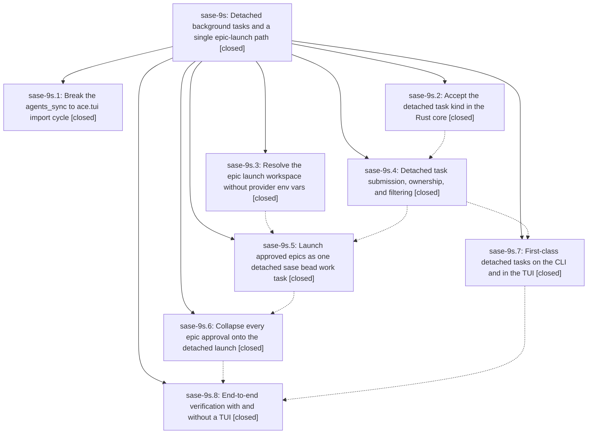

# Bead: sase-9s — Detached background tasks and a single epic-launch path

[Bead Pages](../README.md) / sase-9s

**Status:** ✓ closed · **Resolution:** (unrecorded) · **Type:** plan · **Tier:** epic
**Owner:** `bryanbugyi34@gmail.com` · **Assignee:** `sase-9s.land`
**Created:** 2026-07-26 11:20:14 UTC · **Closed:** 2026-07-26 17:37:35 UTC
**Plan:** [sase/repos/plans/202607/detached\_epic\_launch.md](https://github.com/sase-org/sase--plans/blob/main/sase/repos/plans/202607/detached_epic_launch.md)

## Description

Approving an epic plan always launches `sase bead work` as one durable, session-independent "detached" background task — from the TUI, from Telegram, from the CLI, or with nothing interactive running at all — and that task is legible, killable, and beautiful on every surface that shows background tasks.

## Phases

| Bead | Title | Status | Size | Agents | Commits |
|---|---|---|---|---:|---:|
| [sase-9s.1](sase-9s.1.md) | Break the agents\_sync to ace.tui import cycle | ✓ closed | small | 1 | 1 |
| [sase-9s.2](sase-9s.2.md) | Accept the detached task kind in the Rust core | ✓ closed | small | 0 | 0 |
| [sase-9s.3](sase-9s.3.md) | Resolve the epic launch workspace without provider env vars | ✓ closed | small | 1 | 1 |
| [sase-9s.4](sase-9s.4.md) | Detached task submission, ownership, and filtering | ✓ closed | small | 1 | 1 |
| [sase-9s.5](sase-9s.5.md) | Launch approved epics as one detached sase bead work task | ✓ closed | medium | 1 | 1 |
| [sase-9s.6](sase-9s.6.md) | Collapse every epic approval onto the detached launch | ✓ closed | medium | 1 | 1 |
| [sase-9s.7](sase-9s.7.md) | First-class detached tasks on the CLI and in the TUI | ✓ closed | medium | 1 | 1 |
| [sase-9s.8](sase-9s.8.md) | End-to-end verification with and without a TUI | ✓ closed | small | 0 | 0 |

## Lineage

## Agents

| Agent | Bead | Commits |
|---|---|---:|
| [bbugyi200.athena.sase-9s.1](https://github.com/sase-org/sase--agents/blob/main/agents/bbugyi200.athena.sase-9s.1/README.md) | [sase-9s.1](sase-9s.1.md) | 1 |
| [bbugyi200.athena.sase-9s.3](https://github.com/sase-org/sase--agents/blob/main/agents/bbugyi200.athena.sase-9s.3/README.md) | [sase-9s.3](sase-9s.3.md) | 1 |
| [bbugyi200.athena.sase-9s.4](https://github.com/sase-org/sase--agents/blob/main/agents/bbugyi200.athena.sase-9s.4/README.md) | [sase-9s.4](sase-9s.4.md) | 1 |
| [bbugyi200.athena.sase-9s.5](https://github.com/sase-org/sase--agents/blob/main/agents/bbugyi200.athena.sase-9s.5/README.md) | [sase-9s.5](sase-9s.5.md) | 1 |
| [bbugyi200.athena.sase-9s.6](https://github.com/sase-org/sase--agents/blob/main/agents/bbugyi200.athena.sase-9s.6/README.md) | [sase-9s.6](sase-9s.6.md) | 1 |
| [bbugyi200.athena.sase-9s.7](https://github.com/sase-org/sase--agents/blob/main/agents/bbugyi200.athena.sase-9s.7/README.md) | [sase-9s.7](sase-9s.7.md) | 1 |
| [bbugyi200.athena.sase-9s.land](https://github.com/sase-org/sase--agents/blob/main/agents/bbugyi200.athena.sase-9s.land/README.md) | [sase-9s](README.md) | 2 |
| [bbugyi200.athena.sase-9s.land--code](https://github.com/sase-org/sase--agents/blob/main/families/bbugyi200.athena.sase-9s.land.md#member-code) | [sase-9s](README.md) | 0 |

## Commits

| Commit | Subject | Bead | Committed (UTC) |
|---|---|---|---|
| [`657f14f`](https://github.com/sase-org/sase/commit/657f14f778c6dcaf636f9b6ec2e8a73cefd1440c) | fix: resolve epic launch workspace from shared env contract (sase-9s.3) | [sase-9s.3](sase-9s.3.md) | 2026-07-26 12:06:36 |
| [`f49e598`](https://github.com/sase-org/sase/commit/f49e598037b7e1183e4434bc198cc39a4d72bbf4) | feat(tasks): submit, own, and filter detached tasks (sase-9s.4) | [sase-9s.4](sase-9s.4.md) | 2026-07-26 12:28:54 |
| [`a3b3ff7`](https://github.com/sase-org/sase/commit/a3b3ff7bf14b1fd6fb555c6c7c2703c152e5e4d9) | fix: break agents sync ace import cycle (sase-9s.1) | [sase-9s.1](sase-9s.1.md) | 2026-07-26 12:34:04 |
| [`6d78d49`](https://github.com/sase-org/sase/commit/6d78d490d27eec12e0b28f2f554a44dc60c46b5e) | feat(bead): launch approved epics as detached tasks (sase-9s.5) | [sase-9s.5](sase-9s.5.md) | 2026-07-26 12:59:14 |
| [`9176e23`](https://github.com/sase-org/sase/commit/9176e2396ef8e4516e38c0221c5b9513bc65647b) | feat(tasks): expose detached work across CLI and TUI (sase-9s.7) | [sase-9s.7](sase-9s.7.md) | 2026-07-26 13:00:08 |
| [`b6d59fa`](https://github.com/sase-org/sase/commit/b6d59fa0fa7824a21dbf393c2b689797dbaa2d73) | feat!: remove legacy epic approval launch paths (sase-9s.6) | [sase-9s.6](sase-9s.6.md) | 2026-07-26 13:44:39 |
| [`f499ca1`](https://github.com/sase-org/sase/commit/f499ca1db61a7f2ccef55e6d8d59f57048617d49) | feat(tasks): record detached epic launch origins (sase-9s) | [sase-9s](README.md) | 2026-07-26 17:40:57 |
| [`1cb134f`](https://github.com/sase-org/sase/commit/1cb134fd1cd8e76f8427aad797844a8c681060b8) | test: stabilize post-rebase suite checks (sase-9s) | [sase-9s](README.md) | 2026-07-26 18:43:57 |
