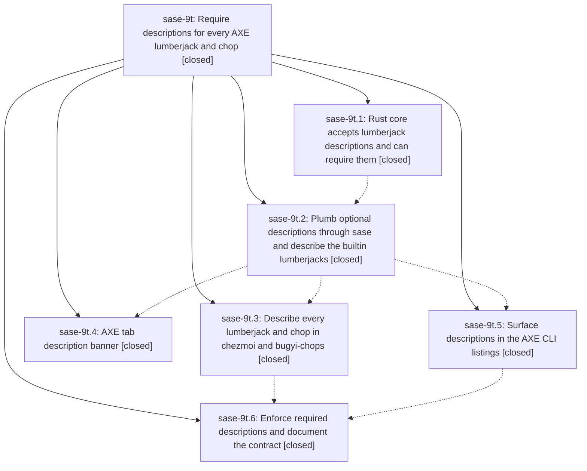

# Bead: sase-9t — Require descriptions for every AXE lumberjack and chop

[Bead Pages](../README.md) / sase-9t

**Status:** ✓ closed · **Resolution:** (unrecorded) · **Type:** plan · **Tier:** epic
**Owner:** `bryanbugyi34@gmail.com` · **Assignee:** `sase-9t.land`
**Created:** 2026-07-26 12:53:13 UTC · **Closed:** 2026-07-26 17:00:37 UTC
**Plan:** [sase/repos/plans/202607/axe\_required\_descriptions.md](https://github.com/sase-org/sase--plans/blob/main/sase/repos/plans/202607/axe_required_descriptions.md)

## Description

Every configured lumberjack and every chop carries a non-blank `description`, enforced fail-closed by the shared config authority, supplied by all first-party and user-owned configs, and shown prominently in a dedicated always-visible banner on the ACE AXE tab whenever a lumberjack or chop row is selected.

## Phases

| Bead | Title | Status | Size | Agents | Commits |
|---|---|---|---|---:|---:|
| [sase-9t.1](sase-9t.1.md) | Rust core accepts lumberjack descriptions and can require them | ✓ closed | medium | 1 | 1 |
| [sase-9t.2](sase-9t.2.md) | Plumb optional descriptions through sase and describe the builtin lumberjacks | ✓ closed | medium | 1 | 1 |
| [sase-9t.3](sase-9t.3.md) | Describe every lumberjack and chop in chezmoi and bugyi-chops | ✓ closed | small | 0 | 0 |
| [sase-9t.4](sase-9t.4.md) | AXE tab description banner | ✓ closed | medium | 1 | 1 |
| [sase-9t.5](sase-9t.5.md) | Surface descriptions in the AXE CLI listings | ✓ closed | small | 1 | 1 |
| [sase-9t.6](sase-9t.6.md) | Enforce required descriptions and document the contract | ✓ closed | medium | 1 | 1 |

## Lineage

## Agents

| Agent | Bead | Commits |
|---|---|---:|
| [bbugyi200.athena.sase-9t.1](https://github.com/sase-org/sase--agents/blob/main/agents/bbugyi200.athena.sase-9t.1/README.md) | [sase-9t.1](sase-9t.1.md) | 1 |
| [bbugyi200.athena.sase-9t.2](https://github.com/sase-org/sase--agents/blob/main/agents/bbugyi200.athena.sase-9t.2/README.md) | [sase-9t.2](sase-9t.2.md) | 1 |
| [bbugyi200.athena.sase-9t.4](https://github.com/sase-org/sase--agents/blob/main/agents/bbugyi200.athena.sase-9t.4/README.md) | [sase-9t.4](sase-9t.4.md) | 1 |
| [bbugyi200.athena.sase-9t.5](https://github.com/sase-org/sase--agents/blob/main/agents/bbugyi200.athena.sase-9t.5/README.md) | [sase-9t.5](sase-9t.5.md) | 1 |
| [bbugyi200.athena.sase-9t.6](https://github.com/sase-org/sase--agents/blob/main/agents/bbugyi200.athena.sase-9t.6/README.md) | [sase-9t.6](sase-9t.6.md) | 1 |
| [bbugyi200.athena.sase-9t.land](https://github.com/sase-org/sase--agents/blob/main/agents/bbugyi200.athena.sase-9t.land/README.md) | [sase-9t](README.md) | 2 |
| [bbugyi200.athena.sase-9t.land--code](https://github.com/sase-org/sase--agents/blob/main/families/bbugyi200.athena.sase-9t.land.md#member-code) | [sase-9t](README.md) | 0 |

## Commits

| Commit | Subject | Bead | Committed (UTC) |
|---|---|---|---|
| [`sase-core@8b76c42`](https://github.com/sase-org/sase-core/commit/8b76c424578cb99e2eacdee389634d8f2dec5892) | feat(axe): support required config descriptions (sase-9t.1) | [sase-9t.1](sase-9t.1.md) | 2026-07-26 13:04:34 |
| [`b3bfb81`](https://github.com/sase-org/sase/commit/b3bfb817399efea2d19a58b4df106dbe4b8c1534) | feat(axe): plumb optional lumberjack descriptions (sase-9t.2) | [sase-9t.2](sase-9t.2.md) | 2026-07-26 13:42:24 |
| [`a24874d`](https://github.com/sase-org/sase/commit/a24874d2df2db84c542eadf5a547c6304e87c478) | feat(axe): surface descriptions in the AXE CLI listings (sase-9t.5) | [sase-9t.5](sase-9t.5.md) | 2026-07-26 14:03:00 |
| [`7681646`](https://github.com/sase-org/sase/commit/7681646627201d68281dcb2edda2caab1c2b283a) | feat(axe): show selected item descriptions (sase-9t.4) | [sase-9t.4](sase-9t.4.md) | 2026-07-26 14:15:34 |
| [`98a3d9c`](https://github.com/sase-org/sase/commit/98a3d9c4e30fbf12ba21bcb0e4931d2089711038) | feat(axe)!: require configuration descriptions (sase-9t.6) | [sase-9t.6](sase-9t.6.md) | 2026-07-26 14:48:55 |
| [`20c131b`](https://github.com/sase-org/sase/commit/20c131b55788ae5d07ea32fcae66328c48e748ab) | build(deps): require sase-core-rs 0.10 (sase-9t) | [sase-9t](README.md) | 2026-07-26 17:01:06 |
| [`sase--plans@4708947`](https://github.com/sase-org/sase--plans/commit/470894791d88a3cf937f340b9da971195c3221d6) | docs: mark AXE descriptions plan done (sase-9t) | [sase-9t](README.md) | 2026-07-26 17:31:58 |
