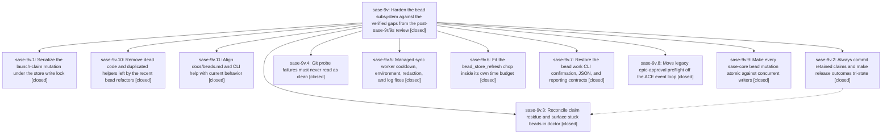

# Bead: sase-9v — Harden the bead subsystem against the verified gaps from the post-sase-9r/9s review

[Bead Pages](../README.md) / sase-9v

**Status:** ✓ closed · **Resolution:** (unrecorded) · **Type:** plan · **Tier:** epic
**Owner:** `bryanbugyi34@gmail.com` · **Assignee:** `sase-9v.land`
**Created:** 2026-07-26 15:32:00 UTC · **Closed:** 2026-07-26 18:39:10 UTC
**Plan:** [sase/repos/plans/202607/bead\_review\_hardening.md](https://github.com/sase-org/sase--plans/blob/main/sase/repos/plans/202607/bead_review_hardening.md)

## Description

The verified bugs and inconsistencies from the five-reviewer bead-subsystem audit are fixed: every runner bead mutation runs under the store write lock, retained claims are always committed and publishable, claim residue is reconciled and visible to doctor, git probe failures fail closed, the managed sync worker clears cooldowns and stops leaking process state, the bead_store_refresh chop fits its own time budget, the `sase bead work` CLI honors its confirmation/JSON/reporting contracts, legacy epic approvals stop blocking the ACE event loop, sase-core bead mutations are atomic against each other, dead code left by the recent refactors is removed, and docs/beads.md matches current behavior.

## Phases

| Bead | Title | Status | Size | Agents | Commits |
|---|---|---|---|---:|---:|
| [sase-9v.1](sase-9v.1.md) | Serialize the launch-claim mutation under the store write lock | ✓ closed | small | 1 | 1 |
| [sase-9v.10](sase-9v.10.md) | Remove dead code and duplicated helpers left by the recent bead refactors | ✓ closed | small | 1 | 1 |
| [sase-9v.11](sase-9v.11.md) | Align docs/beads.md and CLI help with current behavior | ✓ closed | small | 1 | 1 |
| [sase-9v.2](sase-9v.2.md) | Always commit retained claims and make release outcomes tri-state | ✓ closed | medium | 1 | 1 |
| [sase-9v.3](sase-9v.3.md) | Reconcile claim residue and surface stuck beads in doctor | ✓ closed | small | 1 | 1 |
| [sase-9v.4](sase-9v.4.md) | Git probe failures must never read as clean | ✓ closed | small | 1 | 1 |
| [sase-9v.5](sase-9v.5.md) | Managed sync worker cooldown, environment, redaction, and log fixes | ✓ closed | small | 1 | 1 |
| [sase-9v.6](sase-9v.6.md) | Fit the bead\_store\_refresh chop inside its own time budget | ✓ closed | small | 1 | 1 |
| [sase-9v.7](sase-9v.7.md) | Restore the bead work CLI confirmation, JSON, and reporting contracts | ✓ closed | medium | 1 | 1 |
| [sase-9v.8](sase-9v.8.md) | Move legacy epic-approval preflight off the ACE event loop | ✓ closed | small | 1 | 1 |
| [sase-9v.9](sase-9v.9.md) | Make every sase-core bead mutation atomic against concurrent writers | ✓ closed | medium | 1 | 1 |

## Lineage

## Agents

| Agent | Bead | Commits |
|---|---|---:|
| [bbugyi200.athena.sase-9v.1](https://github.com/sase-org/sase--agents/blob/main/agents/bbugyi200.athena.sase-9v.1/README.md) | [sase-9v.1](sase-9v.1.md) | 1 |
| [bbugyi200.athena.sase-9v.10](https://github.com/sase-org/sase--agents/blob/main/agents/bbugyi200.athena.sase-9v.10/README.md) | [sase-9v.10](sase-9v.10.md) | 1 |
| [bbugyi200.athena.sase-9v.11](https://github.com/sase-org/sase--agents/blob/main/agents/bbugyi200.athena.sase-9v.11/README.md) | [sase-9v.11](sase-9v.11.md) | 1 |
| [bbugyi200.athena.sase-9v.2](https://github.com/sase-org/sase--agents/blob/main/agents/bbugyi200.athena.sase-9v.2/README.md) | [sase-9v.2](sase-9v.2.md) | 1 |
| [bbugyi200.athena.sase-9v.3](https://github.com/sase-org/sase--agents/blob/main/agents/bbugyi200.athena.sase-9v.3/README.md) | [sase-9v.3](sase-9v.3.md) | 1 |
| [bbugyi200.athena.sase-9v.4](https://github.com/sase-org/sase--agents/blob/main/agents/bbugyi200.athena.sase-9v.4/README.md) | [sase-9v.4](sase-9v.4.md) | 1 |
| [bbugyi200.athena.sase-9v.5](https://github.com/sase-org/sase--agents/blob/main/agents/bbugyi200.athena.sase-9v.5/README.md) | [sase-9v.5](sase-9v.5.md) | 1 |
| [bbugyi200.athena.sase-9v.6](https://github.com/sase-org/sase--agents/blob/main/agents/bbugyi200.athena.sase-9v.6/README.md) | [sase-9v.6](sase-9v.6.md) | 1 |
| [bbugyi200.athena.sase-9v.7](https://github.com/sase-org/sase--agents/blob/main/agents/bbugyi200.athena.sase-9v.7/README.md) | [sase-9v.7](sase-9v.7.md) | 1 |
| [bbugyi200.athena.sase-9v.8](https://github.com/sase-org/sase--agents/blob/main/agents/bbugyi200.athena.sase-9v.8/README.md) | [sase-9v.8](sase-9v.8.md) | 1 |
| [bbugyi200.athena.sase-9v.9](https://github.com/sase-org/sase--agents/blob/main/agents/bbugyi200.athena.sase-9v.9/README.md) | [sase-9v.9](sase-9v.9.md) | 1 |
| [bbugyi200.athena.sase-9v.land](https://github.com/sase-org/sase--agents/blob/main/agents/bbugyi200.athena.sase-9v.land/README.md) | [sase-9v](README.md) | 4 |
| [bbugyi200.athena.sase-9v.land--code](https://github.com/sase-org/sase--agents/blob/main/families/bbugyi200.athena.sase-9v.land.md#member-code) | [sase-9v](README.md) | 0 |

## Commits

| Commit | Subject | Bead | Committed (UTC) |
|---|---|---|---|
| [`241de00`](https://github.com/sase-org/sase/commit/241de00c2ee716e9daf0f20aee70881801e41683) | fix(beads): harden managed sync worker hygiene (sase-9v.5) | [sase-9v.5](sase-9v.5.md) | 2026-07-26 16:00:30 |
| [`26c26fe`](https://github.com/sase-org/sase/commit/26c26fec23542b62be756aad42c559a868e12f73) | fix(beads): serialize the launch-claim mutation under the store write lock (sase-9v.1) | [sase-9v.1](sase-9v.1.md) | 2026-07-26 16:04:52 |
| [`sase-core@5df18bb`](https://github.com/sase-org/sase-core/commit/5df18bb42421ed9dcef1dce0344e9be18af7a3c4) | fix(beads)!: make store mutations atomic (sase-9v.9) | [sase-9v.9](sase-9v.9.md) | 2026-07-26 16:08:54 |
| [`a91b71d`](https://github.com/sase-org/sase/commit/a91b71d3702a24a8dde5a1a1fb0f8c811bc4f143) | fix(beads): persist and safely release waiting claims (sase-9v.2) | [sase-9v.2](sase-9v.2.md) | 2026-07-26 16:17:13 |
| [`1f1c406`](https://github.com/sase-org/sase/commit/1f1c4064c705581b23dd672dc4f8c47466503350) | fix(bead): restore epic work CLI contracts (sase-9v.7) | [sase-9v.7](sase-9v.7.md) | 2026-07-26 16:20:24 |
| [`54f4203`](https://github.com/sase-org/sase/commit/54f42034b81f28bc6b08294c43505cec8c2b2890) | fix(axe): fit bead\_store\_refresh chop inside its time budget (sase-9v.6) | [sase-9v.6](sase-9v.6.md) | 2026-07-26 16:26:16 |
| [`0c051a0`](https://github.com/sase-org/sase/commit/0c051a009d8ca740c801bb9d1ef9fe3281ba94c3) | fix(tui): offload legacy epic approval launch (sase-9v.8) | [sase-9v.8](sase-9v.8.md) | 2026-07-26 16:36:05 |
| [`480cbfc`](https://github.com/sase-org/sase/commit/480cbfc3a99d8dbf76d7ec31c77de526af4d8838) | docs(beads): align bead docs and CLI help with current behavior (sase-9v.11) | [sase-9v.11](sase-9v.11.md) | 2026-07-26 16:38:02 |
| [`f3680c3`](https://github.com/sase-org/sase/commit/f3680c3c9d0a8a1680887a8754abbf288e4392bb) | fix: fail closed on sdd git probe errors (sase-9v.4) | [sase-9v.4](sase-9v.4.md) | 2026-07-26 16:47:40 |
| [`896e024`](https://github.com/sase-org/sase/commit/896e024004e1ce40a5247f7c17583a092d24b8d2) | fix(bead): reconcile claim residue and flag stuck beads (sase-9v.3) | [sase-9v.3](sase-9v.3.md) | 2026-07-26 17:08:30 |
| [`4f65c6b`](https://github.com/sase-org/sase/commit/4f65c6bf53b7d0f1f754bb6ece9e47bc6b964f22) | refactor(bead): remove dead cleanup helpers (sase-9v.10) | [sase-9v.10](sase-9v.10.md) | 2026-07-26 17:26:42 |
| [`bb04762`](https://github.com/sase-org/sase/commit/bb0476224f547a751f81643dbe607089531d5609) | test(bead): fix work-launch push-hint call (sase-9v) | [sase-9v](README.md) | 2026-07-26 18:39:24 |
| [`41d02f6`](https://github.com/sase-org/sase/commit/41d02f653a516602ecd01983e23390f9b730387e) | build(deps): require sase-core-rs 0.11 (sase-9v) | [sase-9v](README.md) | 2026-07-26 19:14:03 |
| [`9e63c5e`](https://github.com/sase-org/sase/commit/9e63c5eb785c8ed009e74841cf4cc301a5bbcc9d) | fix(agents-sync): skip tribe wait relationships (sase-9v) | [sase-9v](README.md) | 2026-07-26 19:16:03 |
| [`sase--plans@241f426`](https://github.com/sase-org/sase--plans/commit/241f426707b193d57b62c1153aad2625ad989df4) | docs: mark bead review hardening plan done (sase-9v) | [sase-9v](README.md) | 2026-07-26 19:17:12 |
