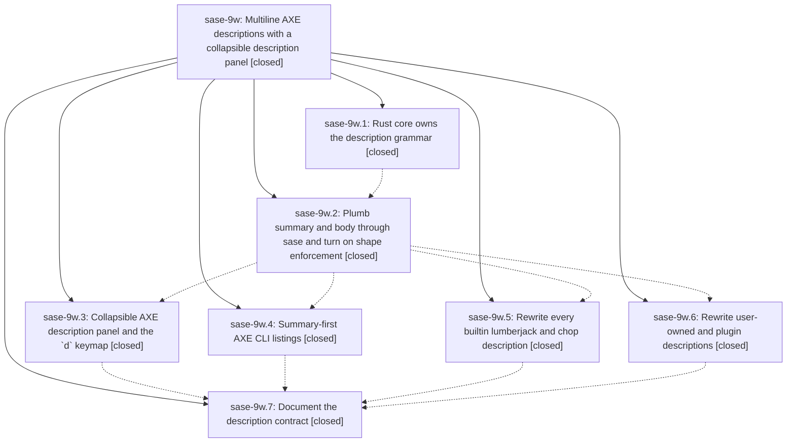

# Bead: sase-9w — Multiline AXE descriptions with a collapsible description panel

[Bead Pages](../README.md) / sase-9w

**Status:** ✓ closed · **Resolution:** (unrecorded) · **Type:** plan · **Tier:** epic
**Owner:** `bryanbugyi34@gmail.com` · **Assignee:** `sase-9w.land`
**Created:** 2026-07-26 17:59:52 UTC · **Closed:** 2026-07-27 11:18:50 UTC
**Plan:** [202607/axe\_multiline\_descriptions.md](https://github.com/sase-org/sase--plans/blob/main/202607/axe_multiline_descriptions.md)

## Description

Every AXE lumberjack and chop description authored by the sase-9t epic becomes a rich multi-line document with a one-line summary and an explanatory body, the shared Rust config authority owns and enforces that grammar, and the ACE AXE tab renders the full description in a beautiful accent-gutter panel that a new `d` keymap collapses to its summary line and expands again.

## Phases

| Bead | Title | Status | Size | Agents | Commits |
|---|---|---|---|---:|---:|
| [sase-9w.1](sase-9w.1.md) | Rust core owns the description grammar | ✓ closed | medium | 1 | 1 |
| [sase-9w.2](sase-9w.2.md) | Plumb summary and body through sase and turn on shape enforcement | ✓ closed | medium | 1 | 1 |
| [sase-9w.3](sase-9w.3.md) | Collapsible AXE description panel and the \`d\` keymap | ✓ closed | medium | 1 | 1 |
| [sase-9w.4](sase-9w.4.md) | Summary-first AXE CLI listings | ✓ closed | small | 1 | 1 |
| [sase-9w.5](sase-9w.5.md) | Rewrite every builtin lumberjack and chop description | ✓ closed | medium | 1 | 1 |
| [sase-9w.6](sase-9w.6.md) | Rewrite user-owned and plugin descriptions | ✓ closed | small | 0 | 0 |
| [sase-9w.7](sase-9w.7.md) | Document the description contract | ✓ closed | small | 1 | 1 |

## Lineage

## Agents

| Agent | Bead | Commits |
|---|---|---:|
| [bbugyi200.athena.sase-9w.1](https://github.com/sase-org/sase--agents/blob/main/agents/bbugyi200.athena.sase-9w.1/README.md) | [sase-9w.1](sase-9w.1.md) | 1 |
| [bbugyi200.athena.sase-9w.2](https://github.com/sase-org/sase--agents/blob/main/agents/bbugyi200.athena.sase-9w.2/README.md) | [sase-9w.2](sase-9w.2.md) | 1 |
| [bbugyi200.athena.sase-9w.3](https://github.com/sase-org/sase--agents/blob/main/agents/bbugyi200.athena.sase-9w.3/README.md) | [sase-9w.3](sase-9w.3.md) | 1 |
| [bbugyi200.athena.sase-9w.4](https://github.com/sase-org/sase--agents/blob/main/agents/bbugyi200.athena.sase-9w.4/README.md) | [sase-9w.4](sase-9w.4.md) | 1 |
| [bbugyi200.athena.sase-9w.5](https://github.com/sase-org/sase--agents/blob/main/agents/bbugyi200.athena.sase-9w.5/README.md) | [sase-9w.5](sase-9w.5.md) | 1 |
| [bbugyi200.athena.sase-9w.7](https://github.com/sase-org/sase--agents/blob/main/agents/bbugyi200.athena.sase-9w.7/README.md) | [sase-9w.7](sase-9w.7.md) | 1 |
| [bbugyi200.athena.sase-9w.land](https://github.com/sase-org/sase--agents/blob/main/agents/bbugyi200.athena.sase-9w.land/README.md) | [sase-9w](README.md) | 1 |

## Commits

| Commit | Subject | Bead | Committed (UTC) |
|---|---|---|---|
| [`sase-core@740aa4f`](https://github.com/sase-org/sase-core/commit/740aa4f06421f076f678a7768a9e9cec2415f81f) | feat(axe): add description summary-body grammar (sase-9w.1) | [sase-9w.1](sase-9w.1.md) | 2026-07-26 18:10:14 |
| [`dd114a6`](https://github.com/sase-org/sase/commit/dd114a6ef057de37974490ff941554e1d25529ec) | feat(axe): plumb structured descriptions (sase-9w.2) | [sase-9w.2](sase-9w.2.md) | 2026-07-26 19:58:22 |
| [`cdde8de`](https://github.com/sase-org/sase/commit/cdde8dec1e7d51fca75a11facbaf453d0a31dc24) | docs(axe): expand builtin chop descriptions (sase-9w.5) | [sase-9w.5](sase-9w.5.md) | 2026-07-26 21:21:30 |
| [`9b3074c`](https://github.com/sase-org/sase/commit/9b3074c66cafe32b21f392a3af7f9c6392652d95) | feat(ace): add collapsible AXE description panel (sase-9w.3) | [sase-9w.3](sase-9w.3.md) | 2026-07-26 21:46:39 |
| [`f2c53c2`](https://github.com/sase-org/sase/commit/f2c53c28f83fd9961460f8ff7dcb4fea29424364) | feat(axe): show summary-first list descriptions (sase-9w.4) | [sase-9w.4](sase-9w.4.md) | 2026-07-27 10:31:46 |
| [`3694f5a`](https://github.com/sase-org/sase/commit/3694f5a484480749a938a8963d83b7b4157f25f1) | docs(axe): document the AXE description contract (sase-9w.7) | [sase-9w.7](sase-9w.7.md) | 2026-07-27 11:07:05 |
| [`sase--plans@aecc61c`](https://github.com/sase-org/sase--plans/commit/aecc61c1ac1b65df4256882db8374ed7b7b648e0) | chore(plans): mark axe\_multiline\_descriptions plan done (sase-9w) | [sase-9w](README.md) | 2026-07-27 11:21:57 |
