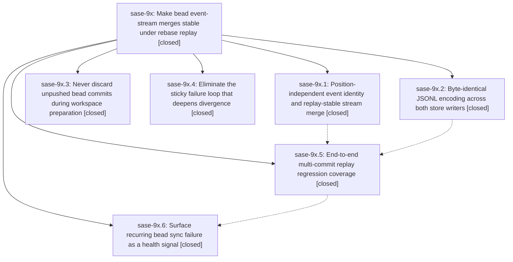

# Bead: sase-9x — Make bead event-stream merges stable under rebase replay

[Bead Pages](../README.md) / sase-9x

**Status:** ✓ closed · **Resolution:** (unrecorded) · **Type:** plan · **Tier:** epic
**Owner:** `bryanbugyi34@gmail.com` · **Assignee:** `sase-9x.land`
**Created:** 2026-07-27 10:37:04 UTC · **Closed:** 2026-07-27 13:44:35 UTC
**Plan:** [202607/bead\_merge\_replay\_stability.md](https://github.com/sase-org/sase--plans/blob/main/202607/bead_merge_replay_stability.md)

## Description

Concurrent bead writers in every plans-sidecar clone converge without human intervention: a multi-commit rebase replays to completion, derived bead files stay byte-stable across the Rust and Python writers, unpushed bead commits are never discarded, and recurring sync failure is surfaced as a health signal instead of surfacing as a hand-resolved merge conflict.

## Phases

| Bead | Title | Status | Size | Agents | Commits |
|---|---|---|---|---:|---:|
| [sase-9x.1](sase-9x.1.md) | Position-independent event identity and replay-stable stream merge | ✓ closed | large | 1 | 0 |
| [sase-9x.2](sase-9x.2.md) | Byte-identical JSONL encoding across both store writers | ✓ closed | small | 1 | 1 |
| [sase-9x.3](sase-9x.3.md) | Never discard unpushed bead commits during workspace preparation | ✓ closed | small | 1 | 1 |
| [sase-9x.4](sase-9x.4.md) | Eliminate the sticky failure loop that deepens divergence | ✓ closed | medium | 1 | 1 |
| [sase-9x.5](sase-9x.5.md) | End-to-end multi-commit replay regression coverage | ✓ closed | medium | 1 | 1 |
| [sase-9x.6](sase-9x.6.md) | Surface recurring bead sync failure as a health signal | ✓ closed | small | 1 | 1 |

## Lineage

## Agents

| Agent | Bead | Commits |
|---|---|---:|
| [bbugyi200.athena.sase-9x.1--code](https://github.com/sase-org/sase--agents/blob/main/families/bbugyi200.athena.sase-9x.1.md#member-code) | [sase-9x.1](sase-9x.1.md) | 0 |
| [bbugyi200.athena.sase-9x.2](https://github.com/sase-org/sase--agents/blob/main/agents/bbugyi200.athena.sase-9x.2/README.md) | [sase-9x.2](sase-9x.2.md) | 1 |
| [bbugyi200.athena.sase-9x.3](https://github.com/sase-org/sase--agents/blob/main/agents/bbugyi200.athena.sase-9x.3/README.md) | [sase-9x.3](sase-9x.3.md) | 1 |
| [bbugyi200.athena.sase-9x.4](https://github.com/sase-org/sase--agents/blob/main/agents/bbugyi200.athena.sase-9x.4/README.md) | [sase-9x.4](sase-9x.4.md) | 1 |
| [bbugyi200.athena.sase-9x.5](https://github.com/sase-org/sase--agents/blob/main/agents/bbugyi200.athena.sase-9x.5/README.md) | [sase-9x.5](sase-9x.5.md) | 1 |
| [bbugyi200.athena.sase-9x.6](https://github.com/sase-org/sase--agents/blob/main/agents/bbugyi200.athena.sase-9x.6/README.md) | [sase-9x.6](sase-9x.6.md) | 1 |
| [bbugyi200.athena.sase-9x.land](https://github.com/sase-org/sase--agents/blob/main/agents/bbugyi200.athena.sase-9x.land/README.md) | [sase-9x](README.md) | 1 |
| [bbugyi200.athena.sase-9x.land--code](https://github.com/sase-org/sase--agents/blob/main/families/bbugyi200.athena.sase-9x.land.md#member-code) | [sase-9x](README.md) | 0 |

## Commits

| Commit | Subject | Bead | Committed (UTC) |
|---|---|---|---|
| [`5993058`](https://github.com/sase-org/sase/commit/59930584cdf8a46d651d246cdaa763c88ada407e) | fix(beads): recover from transient sync divergence (sase-9x.4) | [sase-9x.4](sase-9x.4.md) | 2026-07-27 11:11:19 |
| [`19bb1ad`](https://github.com/sase-org/sase/commit/19bb1adc74f8194b0d451936f07e7291bb473723) | fix(bead): emit byte-identical JSONL from both store writers (sase-9x.2) | [sase-9x.2](sase-9x.2.md) | 2026-07-27 11:16:46 |
| [`0b51af9`](https://github.com/sase-org/sase/commit/0b51af99549e2a3cfbb1fc7201cb0faf9ba4a19a) | fix: preserve bead commits before sidecar workspace reset (sase-9x.3) | [sase-9x.3](sase-9x.3.md) | 2026-07-27 11:22:18 |
| [`87dd076`](https://github.com/sase-org/sase/commit/87dd076f28defadf254154e7c6dcb1bc23ac8d3f) | test(beads): cover deep managed sync replay (sase-9x.5) | [sase-9x.5](sase-9x.5.md) | 2026-07-27 12:03:53 |
| [`7538b93`](https://github.com/sase-org/sase/commit/7538b9395489ffc74de8c58525bd9cee2d870889) | feat(bead): report recurring managed-sync failures (sase-9x.6) | [sase-9x.6](sase-9x.6.md) | 2026-07-27 12:42:25 |
| [`fa07151`](https://github.com/sase-org/sase/commit/fa07151cf1414f652b836ac1511f302e8dafac2d) | test: track sase-core-rs 0.11.2 minimum (sase-9x) | [sase-9x](README.md) | 2026-07-27 13:51:05 |
