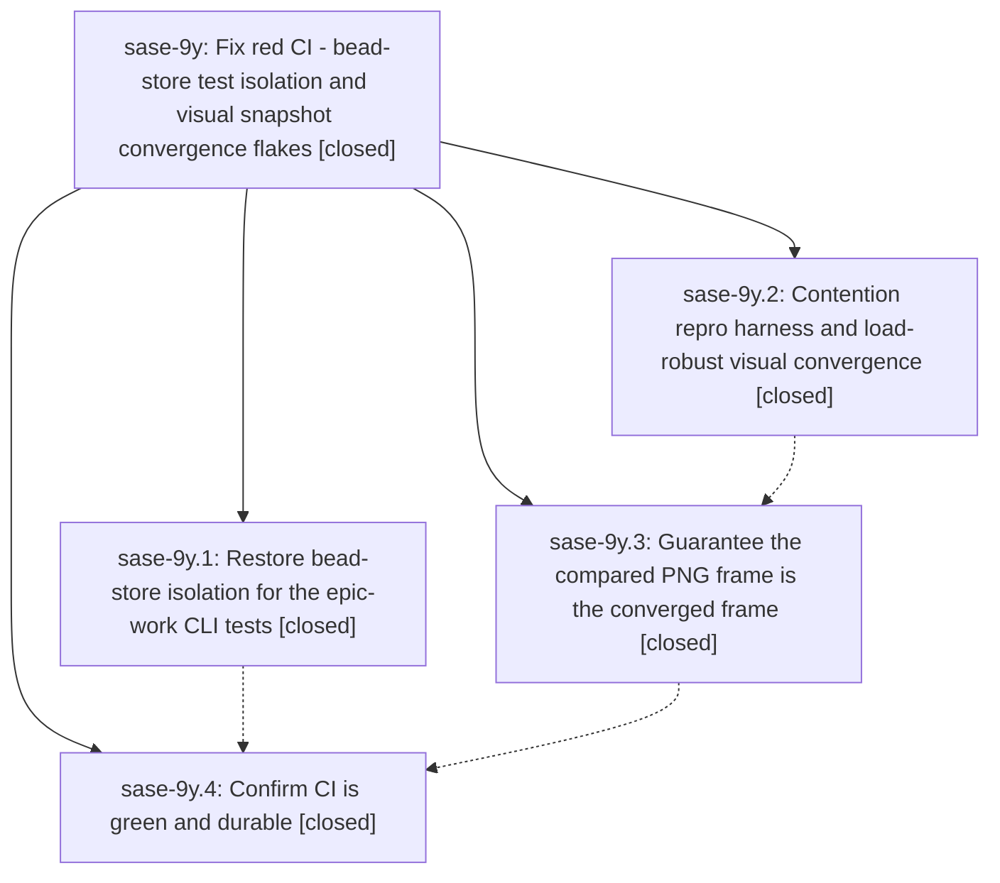

# Bead: sase-9y — Fix red CI - bead-store test isolation and visual snapshot convergence flakes

[Bead Pages](../README.md) / sase-9y

**Status:** ✓ closed · **Resolution:** (unrecorded) · **Type:** plan · **Tier:** epic
**Owner:** `bryanbugyi34@gmail.com` · **Assignee:** `sase-9y.land`
**Created:** 2026-07-27 10:57:28 UTC · **Closed:** 2026-07-27 16:22:08 UTC
**Plan:** [202607/fix\_ci\_bead\_isolation\_and\_visual\_flakes.md](https://github.com/sase-org/sase--plans/blob/main/202607/fix_ci_bead_isolation_and_visual_flakes.md)

## Description

Every job in the sase CI workflow passes on master again, and stays passing across repeated runs: the bead-backend and test-matrix jobs stop tripping the pytest state write guard, and the visual-test job stops failing on timing-dependent PNG snapshot captures. Both fixes address the underlying causes; neither is worked around by regenerating goldens or by loosening the exact-equality PNG comparison.

## Phases

| Bead | Title | Status | Size | Agents | Commits |
|---|---|---|---|---:|---:|
| [sase-9y.1](sase-9y.1.md) | Restore bead-store isolation for the epic-work CLI tests | ✓ closed | small | 1 | 1 |
| [sase-9y.2](sase-9y.2.md) | Contention repro harness and load-robust visual convergence | ✓ closed | medium | 1 | 1 |
| [sase-9y.3](sase-9y.3.md) | Guarantee the compared PNG frame is the converged frame | ✓ closed | medium | 1 | 1 |
| [sase-9y.4](sase-9y.4.md) | Confirm CI is green and durable | ✓ closed | small | 0 | 0 |

## Lineage

## Agents

| Agent | Bead | Commits |
|---|---|---:|
| [bbugyi200.athena.sase-9y.1](https://github.com/sase-org/sase--agents/blob/main/agents/bbugyi200.athena.sase-9y.1/README.md) | [sase-9y.1](sase-9y.1.md) | 1 |
| [bbugyi200.athena.sase-9y.2](https://github.com/sase-org/sase--agents/blob/main/agents/bbugyi200.athena.sase-9y.2/README.md) | [sase-9y.2](sase-9y.2.md) | 1 |
| [bbugyi200.athena.sase-9y.3](https://github.com/sase-org/sase--agents/blob/main/agents/bbugyi200.athena.sase-9y.3/README.md) | [sase-9y.3](sase-9y.3.md) | 1 |
| [bbugyi200.athena.sase-9y.land](https://github.com/sase-org/sase--agents/blob/main/agents/bbugyi200.athena.sase-9y.land/README.md) | [sase-9y](README.md) | 1 |
| [bbugyi200.athena.sase-9y.land--code](https://github.com/sase-org/sase--agents/blob/main/families/bbugyi200.athena.sase-9y.land.md#member-code) | [sase-9y](README.md) | 0 |

## Commits

| Commit | Subject | Bead | Committed (UTC) |
|---|---|---|---|
| [`3e0dbc7`](https://github.com/sase-org/sase/commit/3e0dbc7234ac8f6f07fe60eab5638bf3bf3dc90b) | test(bead): isolate epic-work CLI tests from the real bead store (sase-9y.1) | [sase-9y.1](sase-9y.1.md) | 2026-07-27 11:50:51 |
| [`a0636fc`](https://github.com/sase-org/sase/commit/a0636fcbbaf268c80434ef429b0caba6ccd19281) | fix: make visual convergence robust under CPU contention (sase-9y.2) | [sase-9y.2](sase-9y.2.md) | 2026-07-27 12:39:57 |
| [`57e3acb`](https://github.com/sase-org/sase/commit/57e3acb3a9ebf7fc777c1db799f09facbce5fd07) | test: harden ACE PNG snapshot convergence (sase-9y.3) | [sase-9y.3](sase-9y.3.md) | 2026-07-27 14:12:37 |
| [`a947469`](https://github.com/sase-org/sase/commit/a947469eece2988bdfff48bd6ee40b5a9701172f) | docs: record final visual contention baseline (sase-9y) | [sase-9y](README.md) | 2026-07-27 16:24:46 |
