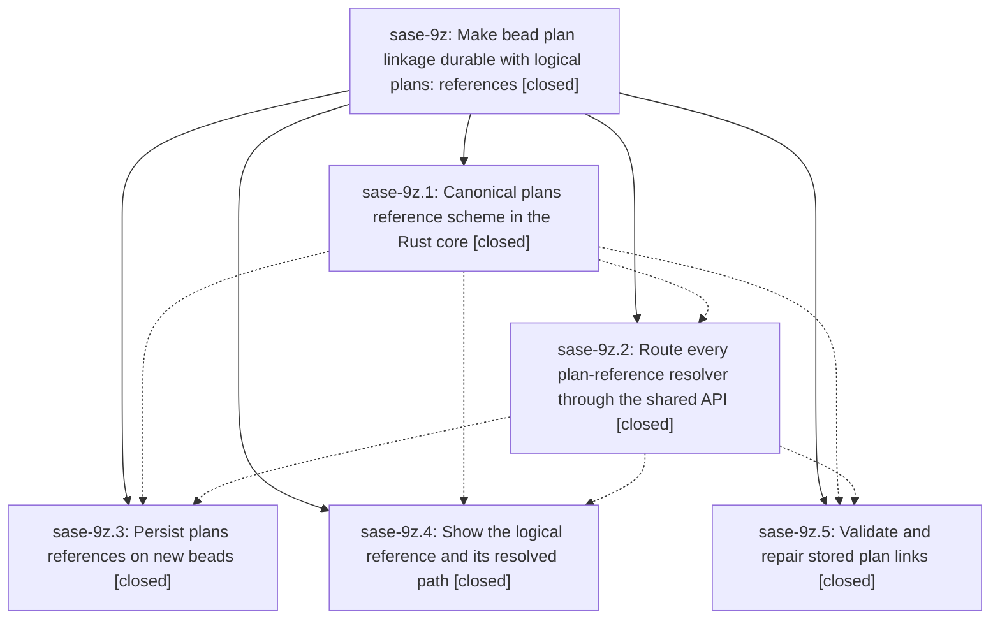

# Bead: sase-9z — Make bead plan linkage durable with logical plans: references

[Bead Pages](../README.md) / sase-9z

**Status:** ✓ closed · **Resolution:** (unrecorded) · **Type:** plan · **Tier:** epic
**Owner:** `bryanbugyi34@gmail.com` · **Assignee:** `sase-9z.land`
**Created:** 2026-07-27 12:39:04 UTC · **Closed:** 2026-07-27 16:19:52 UTC
**Plan:** [202607/durable\_plan\_refs.md](https://github.com/sase-org/sase--plans/blob/main/202607/durable_plan_refs.md)

## Description

A bead's link to its plan survives machines, workspaces, and SDD layout changes: beads store a logical `plans:<YYYYMM>/<name>.md` reference resolved against the active plan roots at read time, one shared API owns canonicalization and resolution for every caller, `sase bead doctor` reports broken and ambiguous links instead of silently passing, and `--fix-design-refs` repairs the 227 stored links that no longer resolve.

## Phases

| Bead | Title | Status | Size | Agents | Commits |
|---|---|---|---|---:|---:|
| [sase-9z.1](sase-9z.1.md) | Canonical plans reference scheme in the Rust core | ✓ closed | medium | 1 | 1 |
| [sase-9z.2](sase-9z.2.md) | Route every plan-reference resolver through the shared API | ✓ closed | medium | 1 | 1 |
| [sase-9z.3](sase-9z.3.md) | Persist plans references on new beads | ✓ closed | small | 1 | 1 |
| [sase-9z.4](sase-9z.4.md) | Show the logical reference and its resolved path | ✓ closed | small | 1 | 1 |
| [sase-9z.5](sase-9z.5.md) | Validate and repair stored plan links | ✓ closed | large | 2 | 1 |

## Lineage

## Agents

| Agent | Bead | Commits |
|---|---|---:|
| [bbugyi200.athena.sase-9z.1](https://github.com/sase-org/sase--agents/blob/main/agents/bbugyi200.athena.sase-9z.1/README.md) | [sase-9z.1](sase-9z.1.md) | 1 |
| [bbugyi200.athena.sase-9z.2](https://github.com/sase-org/sase--agents/blob/main/agents/bbugyi200.athena.sase-9z.2/README.md) | [sase-9z.2](sase-9z.2.md) | 1 |
| [bbugyi200.athena.sase-9z.3](https://github.com/sase-org/sase--agents/blob/main/agents/bbugyi200.athena.sase-9z.3/README.md) | [sase-9z.3](sase-9z.3.md) | 1 |
| [bbugyi200.athena.sase-9z.4](https://github.com/sase-org/sase--agents/blob/main/agents/bbugyi200.athena.sase-9z.4/README.md) | [sase-9z.4](sase-9z.4.md) | 1 |
| [bbugyi200.athena.sase-9z.5](https://github.com/sase-org/sase--agents/blob/main/agents/bbugyi200.athena.sase-9z.5/README.md) | [sase-9z.5](sase-9z.5.md) | 1 |
| [bbugyi200.athena.sase-9z.5--code](https://github.com/sase-org/sase--agents/blob/main/families/bbugyi200.athena.sase-9z.5.md#member-code) | [sase-9z.5](sase-9z.5.md) | 0 |
| [bbugyi200.athena.sase-9z.land](https://github.com/sase-org/sase--agents/blob/main/agents/bbugyi200.athena.sase-9z.land/README.md) | [sase-9z](README.md) | 1 |

## Commits

| Commit | Subject | Bead | Committed (UTC) |
|---|---|---|---|
| [`6065356`](https://github.com/sase-org/sase/commit/6065356e7beacd1dfd452b081ad093a0894afe99) | feat(sdd): add shared plan reference facade (sase-9z.1) | [sase-9z.1](sase-9z.1.md) | 2026-07-27 13:17:41 |
| [`f593eca`](https://github.com/sase-org/sase/commit/f593eca04f2279b35c41e05472e21a3ca5cf3224) | feat: unify plan reference resolution across readers (sase-9z.2) | [sase-9z.2](sase-9z.2.md) | 2026-07-27 13:54:47 |
| [`b3a4bc2`](https://github.com/sase-org/sase/commit/b3a4bc282b0fd04bc849797b00dd0d8570282cef) | fix(bead): persist canonical plan references (sase-9z.3) | [sase-9z.3](sase-9z.3.md) | 2026-07-27 14:15:15 |
| [`7ac5b91`](https://github.com/sase-org/sase/commit/7ac5b917c08ebe10f847caacdcabf2a2fcc401a6) | feat(beads): repair legacy design references (sase-9z.5) | [sase-9z.5](sase-9z.5.md) | 2026-07-27 15:18:08 |
| [`881636a`](https://github.com/sase-org/sase/commit/881636a745de9f88d43cbfcec868f6a537e9f0a2) | feat(sdd): surface plan references and where they resolve (sase-9z.4) | [sase-9z.4](sase-9z.4.md) | 2026-07-27 16:03:49 |
| [`f90108a`](https://github.com/sase-org/sase/commit/f90108a46beb4305672921509275ed43337bc692) | chore(sdd): land sase-9z epic cleanup and sase-core-rs 0.11.3 floor (sase-9z) | [sase-9z](README.md) | 2026-07-27 16:27:40 |
