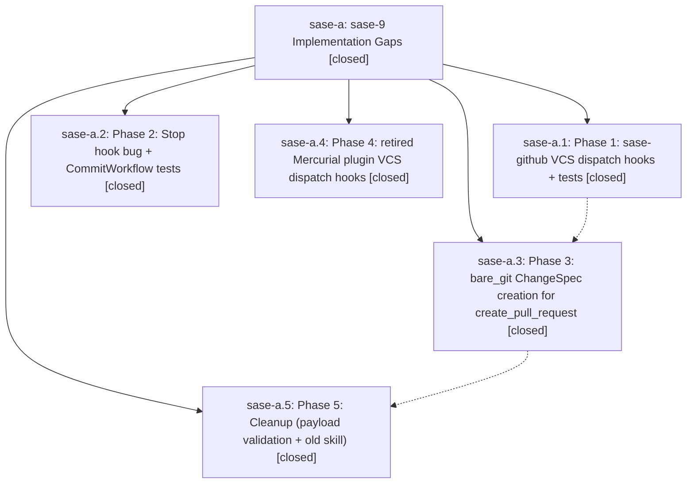

# Bead: sase-a — sase-9 Implementation Gaps

[Bead Pages](../README.md) / sase-a

**Status:** ✓ closed · **Resolution:** (unrecorded) · **Type:** plan · **Tier:** epic
**Owner:** `bryanbugyi34@gmail.com`
**Created:** 2026-03-24 09:56:33 UTC · **Closed:** 2026-03-24 16:31:00 UTC
**Plan:** [202603/sase\_9\_gaps.md](https://github.com/sase-org/sase--plans/blob/main/202603/sase_9_gaps.md)

## Phases

| Bead | Title | Status | Size | Agents | Commits |
|---|---|---|---|---:|---:|
| [sase-a.1](sase-a.1.md) | Phase 1: sase-github VCS dispatch hooks + tests | ✓ closed | small | 0 | 0 |
| [sase-a.2](sase-a.2.md) | Phase 2: Stop hook bug + CommitWorkflow tests | ✓ closed | small | 0 | 1 |
| [sase-a.3](sase-a.3.md) | Phase 3: bare\_git ChangeSpec creation for create\_pull\_request | ✓ closed | small | 0 | 1 |
| [sase-a.4](sase-a.4.md) | Phase 4: retired Mercurial plugin VCS dispatch hooks | ✓ closed | small | 0 | 1 |
| [sase-a.5](sase-a.5.md) | Phase 5: Cleanup (payload validation + old skill) | ✓ closed | small | 0 | 1 |

## Lineage

## Commits

| Commit | Subject | Bead | Committed (UTC) |
|---|---|---|---|
| [`f3248ef`](https://github.com/sase-org/sase/commit/f3248ef8ed5cb29709d77f64d279577d43bf3f4f) | fix: Use VCS-aware skill name in sibling repo stop hook + add CommitWorkflow and bare\_git dispatch tests (sase-a.2) | [sase-a.2](sase-a.2.md) | 2026-03-24 10:01:49 |
| [`70916b4`](https://github.com/sase-org/sase/commit/70916b4a5ff70687ba241d9d2979265769013c3e) | feat: Add ChangeSpec creation after successful create\_pull\_request dispatch (sase-a.3) | [sase-a.3](sase-a.3.md) | 2026-03-24 10:09:10 |
| [`04d8da9`](https://github.com/sase-org/sase/commit/04d8da9ed675b74089128fe00dfadcab66cfe492) | chore: Add payload validation to CommitWorkflow (sase-a.5) | [sase-a.5](sase-a.5.md) | 2026-03-24 10:11:39 |
| [`5c542d4`](https://github.com/sase-org/sase/commit/5c542d4a571da73e1231d01b0bd8d75706e35618) | chore: Update bead tracking for sase-a epic completion (sase-a.4) | [sase-a.4](sase-a.4.md) | 2026-03-24 10:14:45 |
