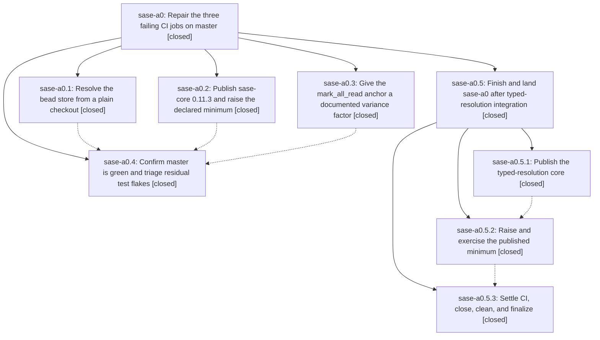

# Bead: sase-a0 — Repair the three failing CI jobs on master

[Bead Pages](../README.md) / sase-a0

**Status:** ✓ closed · **Resolution:** canceled · **Type:** plan · **Tier:** epic
**Owner:** `bryanbugyi34@gmail.com` · **Assignee:** `sase-a0.land`
**Created:** 2026-07-27 16:01:22 UTC · **Closed:** 2026-07-28 09:44:53 UTC
**Plan:** [202607/fix\_ci\_failures.md](https://github.com/sase-org/sase--plans/blob/main/202607/fix_ci_failures.md)

## Description

CI on sase-org/sase master goes green: `lint` resolves epic-symbol beads instead of failing on every `--epic-symbol` entry, `published-core-minimum-smoke` finds every required `sase_core_rs` binding in the published minimum, and `phase7-perf-floor` stops tripping on documented notification-store runner variance.

## Phases

| Bead | Title | Status | Size | Agents | Commits |
|---|---|---|---|---:|---:|
| [sase-a0.1](sase-a0.1.md) | Resolve the bead store from a plain checkout | ✓ closed | medium | 1 | 1 |
| [sase-a0.2](sase-a0.2.md) | Publish sase-core 0.11.3 and raise the declared minimum | ✓ closed | small | 0 | 0 |
| [sase-a0.3](sase-a0.3.md) | Give the mark\_all\_read anchor a documented variance factor | ✓ closed | small | 1 | 1 |
| [sase-a0.4](sase-a0.4.md) | Confirm master is green and triage residual test flakes | ✓ closed | small | 1 | 1 |

## Lineage

## Agents

| Agent | Bead | Commits |
|---|---|---:|
| [bbugyi200.athena.sase-a0.1](https://github.com/sase-org/sase--agents/blob/main/agents/bbugyi200.athena.sase-a0.1/README.md) | [sase-a0.1](sase-a0.1.md) | 1 |
| [bbugyi200.athena.sase-a0.3](https://github.com/sase-org/sase--agents/blob/main/agents/bbugyi200.athena.sase-a0.3/README.md) | [sase-a0.3](sase-a0.3.md) | 1 |
| [bbugyi200.athena.sase-a0.4](https://github.com/sase-org/sase--agents/blob/main/agents/bbugyi200.athena.sase-a0.4/README.md) | [sase-a0.4](sase-a0.4.md) | 1 |
| [bbugyi200.athena.sase-a0.5.2](https://github.com/sase-org/sase--agents/blob/main/agents/bbugyi200.athena.sase-a0.5.2/README.md) | [sase-a0.5.2](sase-a0.5.2.md) | 1 |
| [bbugyi200.athena.sase-a0.5.2--1](https://github.com/sase-org/sase--agents/blob/main/families/bbugyi200.athena.sase-a0.5.2.md#member-1) | [sase-a0.5.2](sase-a0.5.2.md) | 0 |

## Commits

| Commit | Subject | Bead | Committed (UTC) |
|---|---|---|---|
| [`55a2b03`](https://github.com/sase-org/sase/commit/55a2b032160da180f25e929e60170f7a811bac95) | test(perf): add mark\_all\_read floor variance override (sase-a0.3) | [sase-a0.3](sase-a0.3.md) | 2026-07-27 16:13:02 |
| [`26ead3f`](https://github.com/sase-org/sase/commit/26ead3f39ac89b6969b71ce1872edab834760aee) | fix(bead): resolve sidecar store from plain checkouts (sase-a0.1) | [sase-a0.1](sase-a0.1.md) | 2026-07-27 16:20:31 |
| [`921ca80`](https://github.com/sase-org/sase/commit/921ca80f7200b5e8b8fd80c35d7d427f04b741a3) | test: remove ambient-environment dependencies from two test (3.14) failures (sase-a0.4) | [sase-a0.4](sase-a0.4.md) | 2026-07-27 17:04:43 |
| [`465b95a`](https://github.com/sase-org/sase/commit/465b95a9f4781b563d3dc814ebe86c22b7bd9489) | build(deps): require published sase-core-rs 0.12.1 (sase-a0.5.2) | [sase-a0.5.2](sase-a0.5.2.md) | 2026-07-27 19:10:22 |
