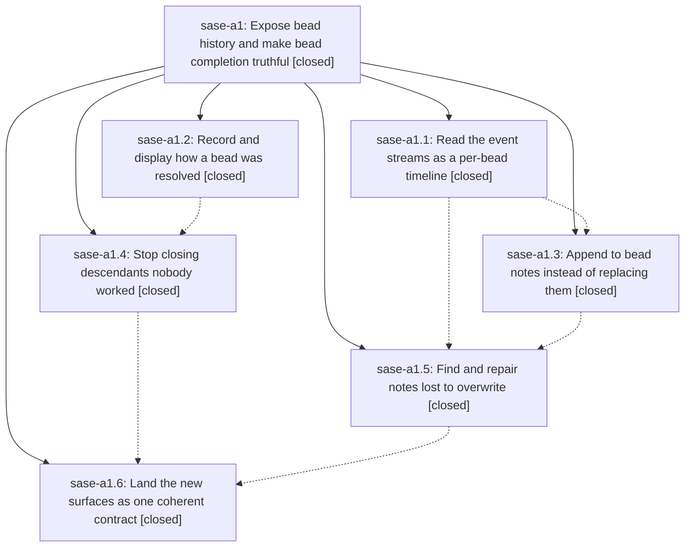

# Bead: sase-a1 — Expose bead history and make bead completion truthful

[Bead Pages](../README.md) / sase-a1

**Status:** ✓ closed · **Resolution:** done · **Type:** plan · **Tier:** epic
**Owner:** `bryanbugyi34@gmail.com` · **Assignee:** `sase-a1.land`
**Created:** 2026-07-27 16:34:17 UTC · **Closed:** 2026-07-28 09:45:18 UTC
**Plan:** [202607/bead\_history\_truthful\_close.md](https://github.com/sase-org/sase--plans/blob/main/202607/bead_history_truthful_close.md)

## Description

A closed bead is trustworthy evidence and a bead's working history is readable: every note revision the event streams already hold is reachable from the CLI, notes accumulate instead of being overwritten, the ~509 beads whose notes lost earlier revisions can be repaired, closing a parent no longer silently manufactures completion for descendants nobody worked, every closure records a done/canceled/superseded resolution, and reopening a bead reopens the ancestors whose completion claim it invalidates.

## Phases

| Bead | Title | Status | Size | Agents | Commits |
|---|---|---|---|---:|---:|
| [sase-a1.1](sase-a1.1.md) | Read the event streams as a per-bead timeline | ✓ closed | medium | 1 | 2 |
| [sase-a1.2](sase-a1.2.md) | Record and display how a bead was resolved | ✓ closed | medium | 1 | 2 |
| [sase-a1.3](sase-a1.3.md) | Append to bead notes instead of replacing them | ✓ closed | small | 1 | 2 |
| [sase-a1.4](sase-a1.4.md) | Stop closing descendants nobody worked | ✓ closed | medium | 1 | 2 |
| [sase-a1.5](sase-a1.5.md) | Find and repair notes lost to overwrite | ✓ closed | medium | 1 | 2 |
| [sase-a1.6](sase-a1.6.md) | Land the new surfaces as one coherent contract | ✓ closed | small | 1 | 1 |

## Lineage

## Agents

| Agent | Bead | Commits |
|---|---|---:|
| [bbugyi200.athena.sase-a1.1](https://github.com/sase-org/sase--agents/blob/main/agents/bbugyi200.athena.sase-a1.1/README.md) | [sase-a1.1](sase-a1.1.md) | 2 |
| [bbugyi200.athena.sase-a1.2](https://github.com/sase-org/sase--agents/blob/main/agents/bbugyi200.athena.sase-a1.2/README.md) | [sase-a1.2](sase-a1.2.md) | 2 |
| [bbugyi200.athena.sase-a1.3](https://github.com/sase-org/sase--agents/blob/main/agents/bbugyi200.athena.sase-a1.3/README.md) | [sase-a1.3](sase-a1.3.md) | 2 |
| [bbugyi200.athena.sase-a1.4](https://github.com/sase-org/sase--agents/blob/main/agents/bbugyi200.athena.sase-a1.4/README.md) | [sase-a1.4](sase-a1.4.md) | 2 |
| [bbugyi200.athena.sase-a1.5](https://github.com/sase-org/sase--agents/blob/main/agents/bbugyi200.athena.sase-a1.5/README.md) | [sase-a1.5](sase-a1.5.md) | 2 |
| [bbugyi200.athena.sase-a1.6](https://github.com/sase-org/sase--agents/blob/main/agents/bbugyi200.athena.sase-a1.6/README.md) | [sase-a1.6](sase-a1.6.md) | 1 |

## Commits

| Commit | Subject | Bead | Committed (UTC) |
|---|---|---|---|
| [`sase-core@815e2e1`](https://github.com/sase-org/sase-core/commit/815e2e17dcfc19b3a51ee13d3dc6741e2d480a08) | feat(bead): record typed close resolutions (sase-a1.2) | [sase-a1.2](sase-a1.2.md) | 2026-07-27 17:04:18 |
| [`d1b02a6`](https://github.com/sase-org/sase/commit/d1b02a69f3471c97c40cb214eb42f411bd5184e8) | feat(bead): expose typed close resolutions (sase-a1.2) | [sase-a1.2](sase-a1.2.md) | 2026-07-27 17:05:25 |
| [`sase-core@e97d150`](https://github.com/sase-org/sase-core/commit/e97d1509228937153cd454427df25475433d9f4f) | feat(beads): expose event history replay (sase-a1.1) | [sase-a1.1](sase-a1.1.md) | 2026-07-27 17:24:34 |
| [`3dd9765`](https://github.com/sase-org/sase/commit/3dd976565937d0b9851d25c94be1ef89442d2885) | feat(beads): add history command (sase-a1.1) | [sase-a1.1](sase-a1.1.md) | 2026-07-27 17:25:21 |
| [`sase-core@ef75d5f`](https://github.com/sase-org/sase-core/commit/ef75d5f27bfae066aff8692ea697ac1a37b18196) | feat(bead)!: make descendant close sweeps explicit (sase-a1.4) | [sase-a1.4](sase-a1.4.md) | 2026-07-27 17:43:43 |
| [`3deac7d`](https://github.com/sase-org/sase/commit/3deac7d22675315a5adbebe28fd6a2fc4c549241) | feat(bead)!: require explicit descendant close sweeps (sase-a1.4) | [sase-a1.4](sase-a1.4.md) | 2026-07-27 17:44:38 |
| [`sase-core@2053dae`](https://github.com/sase-org/sase-core/commit/2053dae51d860793f44762c0b9c39bf4492faf4b) | feat(bead): append notes atomically in core (sase-a1.3) | [sase-a1.3](sase-a1.3.md) | 2026-07-27 18:15:03 |
| [`b25e7db`](https://github.com/sase-org/sase/commit/b25e7dbc677ef9e5653f6bef7419c827463f85cb) | feat(bead): add note append command (sase-a1.3) | [sase-a1.3](sase-a1.3.md) | 2026-07-27 18:16:15 |
| [`sase-core@5174448`](https://github.com/sase-org/sase-core/commit/51744485f204f9d667dd73dd94b09a0f494ed2f7) | feat(beads): detect overwritten note revisions (sase-a1.5) | [sase-a1.5](sase-a1.5.md) | 2026-07-27 18:43:26 |
| [`b24e69c`](https://github.com/sase-org/sase/commit/b24e69c047a2e8428784f5992cdc734ed4b4e428) | feat(beads): restore overwritten note revisions (sase-a1.5) | [sase-a1.5](sase-a1.5.md) | 2026-07-27 18:44:15 |
| [`6ad452e`](https://github.com/sase-org/sase/commit/6ad452e1e84d47bafc39eb3a2850a954a1891768) | docs(beads): document truthful completion contract (sase-a1.6) | [sase-a1.6](sase-a1.6.md) | 2026-07-27 21:17:33 |
