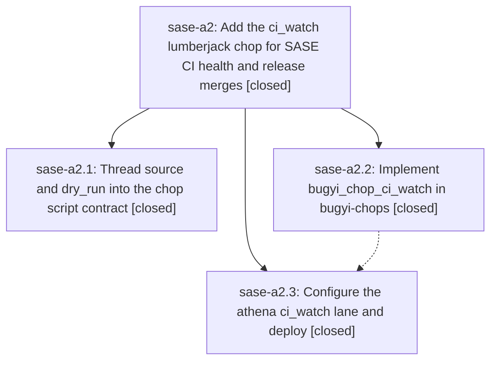

# Bead: sase-a2 — Add the ci\_watch lumberjack chop for SASE CI health and release merges

[Bead Pages](../README.md) / sase-a2

**Status:** ✓ closed · **Resolution:** done · **Type:** plan · **Tier:** epic
**Owner:** `bryanbugyi34@gmail.com` · **Assignee:** `sase-a2.land`
**Created:** 2026-07-27 16:51:08 UTC · **Closed:** 2026-07-27 17:41:00 UTC
**Plan:** [202607/ci\_watch\_chop.md](https://github.com/sase-org/sase--plans/blob/main/202607/ci_watch_chop.md)

## Description

A bugyi_chop_ci_watch script chop sweeps GitHub Actions health for all SASE repos every five minutes, proposes at most one CI-fix agent per tick and only when zero other agents are running, deterministically merges green release-please/release-plz PRs once explicitly enabled, and ships configured (merges off) as an athena lumberjack lane.

## Phases

| Bead | Title | Status | Size | Agents | Commits |
|---|---|---|---|---:|---:|
| [sase-a2.1](sase-a2.1.md) | Thread source and dry\_run into the chop script contract | ✓ closed | small | 1 | 1 |
| [sase-a2.2](sase-a2.2.md) | Implement bugyi\_chop\_ci\_watch in bugyi-chops | ✓ closed | medium | 0 | 0 |
| [sase-a2.3](sase-a2.3.md) | Configure the athena ci\_watch lane and deploy | ✓ closed | small | 0 | 0 |

## Lineage

## Agents

| Agent | Bead | Commits |
|---|---|---:|
| [bbugyi200.athena.sase-a2.1](https://github.com/sase-org/sase--agents/blob/main/agents/bbugyi200.athena.sase-a2.1/README.md) | [sase-a2.1](sase-a2.1.md) | 1 |

## Commits

| Commit | Subject | Bead | Committed (UTC) |
|---|---|---|---|
| [`f15c05d`](https://github.com/sase-org/sase/commit/f15c05dc6cb8b9c7a6b5564655a676a3d3257e6f) | feat(axe): expose chop run source and dry-run state (sase-a2.1) | [sase-a2.1](sase-a2.1.md) | 2026-07-27 17:31:36 |
