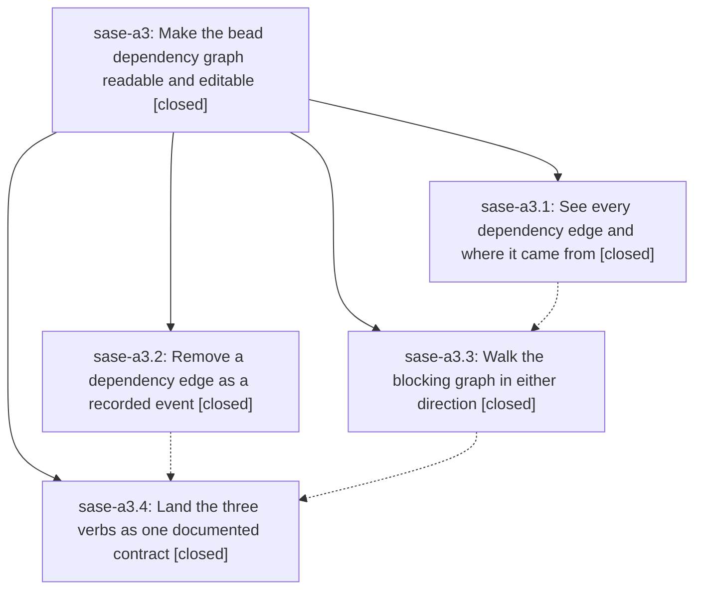

# Bead: sase-a3 — Make the bead dependency graph readable and editable

[Bead Pages](../README.md) / sase-a3

**Status:** ✓ closed · **Resolution:** done · **Type:** plan · **Tier:** epic
**Owner:** `bryanbugyi34@gmail.com` · **Assignee:** `sase-a3.land`
**Created:** 2026-07-27 17:45:29 UTC · **Closed:** 2026-07-27 20:24:15 UTC
**Plan:** [202607/bead\_dep\_subcommands.md](https://github.com/sase-org/sase--plans/blob/main/202607/bead_dep_subcommands.md)

## Description

`sase bead dep` becomes a complete verb: every edge in the store is visible with the provenance that says who added it and when, the blocking graph can be walked in either direction with cycles and diamonds rendered honestly, and a wrong edge can be removed through an auditable event instead of storage surgery.

## Phases

| Bead | Title | Status | Size | Agents | Commits |
|---|---|---|---|---:|---:|
| [sase-a3.1](sase-a3.1.md) | See every dependency edge and where it came from | ✓ closed | medium | 1 | 1 |
| [sase-a3.2](sase-a3.2.md) | Remove a dependency edge as a recorded event | ✓ closed | medium | 1 | 2 |
| [sase-a3.3](sase-a3.3.md) | Walk the blocking graph in either direction | ✓ closed | medium | 1 | 1 |
| [sase-a3.4](sase-a3.4.md) | Land the three verbs as one documented contract | ✓ closed | small | 1 | 1 |

## Lineage

## Agents

| Agent | Bead | Commits |
|---|---|---:|
| [bbugyi200.athena.sase-a3.1](https://github.com/sase-org/sase--agents/blob/main/agents/bbugyi200.athena.sase-a3.1/README.md) | [sase-a3.1](sase-a3.1.md) | 1 |
| [bbugyi200.athena.sase-a3.2](https://github.com/sase-org/sase--agents/blob/main/agents/bbugyi200.athena.sase-a3.2/README.md) | [sase-a3.2](sase-a3.2.md) | 2 |
| [bbugyi200.athena.sase-a3.3](https://github.com/sase-org/sase--agents/blob/main/agents/bbugyi200.athena.sase-a3.3/README.md) | [sase-a3.3](sase-a3.3.md) | 1 |
| [bbugyi200.athena.sase-a3.4](https://github.com/sase-org/sase--agents/blob/main/agents/bbugyi200.athena.sase-a3.4/README.md) | [sase-a3.4](sase-a3.4.md) | 1 |
| [bbugyi200.athena.sase-a3.land](https://github.com/sase-org/sase--agents/blob/main/agents/bbugyi200.athena.sase-a3.land/README.md) | [sase-a3](README.md) | 1 |

## Commits

| Commit | Subject | Bead | Committed (UTC) |
|---|---|---|---|
| [`87bc8f7`](https://github.com/sase-org/sase/commit/87bc8f72f5c917ee898a1da18218ff4710d7b0a6) | feat(beads): list dependency graph edges (sase-a3.1) | [sase-a3.1](sase-a3.1.md) | 2026-07-27 18:33:28 |
| [`sase-core@d366547`](https://github.com/sase-org/sase-core/commit/d3665473b8df35d705dd5cc6f41a5934f1ff8536) | feat(bead): record dependency removals (sase-a3.2) | [sase-a3.2](sase-a3.2.md) | 2026-07-27 18:37:22 |
| [`786b672`](https://github.com/sase-org/sase/commit/786b6720e72cb520408b6e93e425406cbb092bda) | feat(bead): add dependency removal command (sase-a3.2) | [sase-a3.2](sase-a3.2.md) | 2026-07-27 18:41:46 |
| [`793887c`](https://github.com/sase-org/sase/commit/793887cf80f9e5491e4cd227682a344c4aece8ae) | feat(bead): add dependency tree command (sase-a3.3) | [sase-a3.3](sase-a3.3.md) | 2026-07-27 19:06:22 |
| [`830245c`](https://github.com/sase-org/sase/commit/830245c8cdf01ef0f60c3b86346fba02a0b6d68a) | fix(bead): require core dependency removal support (sase-a3.4) | [sase-a3.4](sase-a3.4.md) | 2026-07-27 19:56:57 |
| [`sase--plans@27256c8`](https://github.com/sase-org/sase--plans/commit/27256c89e5dfc99611fd5247a518f1fde49b0a71) | docs: mark bead dependency plan done (sase-a3) | [sase-a3](README.md) | 2026-07-27 20:28:52 |
