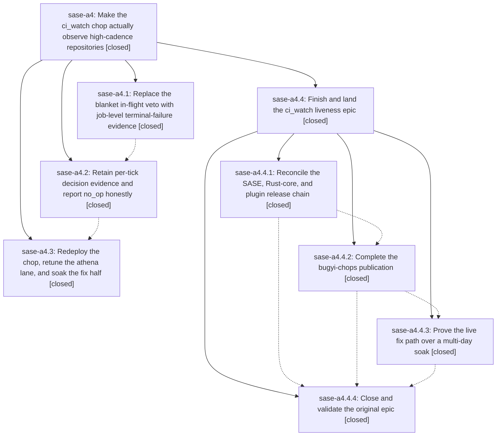

# Bead: sase-a4 — Make the ci\_watch chop actually observe high-cadence repositories

[Bead Pages](../README.md) / sase-a4

**Status:** ✓ closed · **Resolution:** canceled · **Type:** plan · **Tier:** epic
**Owner:** `bryanbugyi34@gmail.com` · **Assignee:** `sase-a4.land`
**Created:** 2026-07-27 18:00:31 UTC · **Closed:** 2026-07-27 20:34:10 UTC
**Plan:** [202607/ci\_watch\_liveness.md](https://github.com/sase-org/sase--plans/blob/main/202607/ci_watch_liveness.md)

## Description

Rework ci_watch so a continuously-busy repository like sase-org/sase can be classified red or green instead of being permanently masked as run_in_flight, stop counting CI-less repositories as errors, retain per-tick decision evidence, and redeploy with a soak that proves the fix half fires.

## Phases

| Bead | Title | Status | Size | Agents | Commits |
|---|---|---|---|---:|---:|
| [sase-a4.1](sase-a4.1.md) | Replace the blanket in-flight veto with job-level terminal-failure evidence | ✓ closed | medium | 0 | 0 |
| [sase-a4.2](sase-a4.2.md) | Retain per-tick decision evidence and report no\_op honestly | ✓ closed | small | 0 | 0 |
| [sase-a4.3](sase-a4.3.md) | Redeploy the chop, retune the athena lane, and soak the fix half | ✓ closed | small | 0 | 0 |

## Lineage

## Agents

| Agent | Bead | Commits |
|---|---|---:|
| [bbugyi200.athena.sase-a4.4.4](https://github.com/sase-org/sase--agents/blob/main/agents/bbugyi200.athena.sase-a4.4.4/README.md) | [sase-a4.4.4](sase-a4.4.4.md) | 0 |
| [bbugyi200.athena.sase-a4.4.land](https://github.com/sase-org/sase--agents/blob/main/agents/bbugyi200.athena.sase-a4.4.land/README.md) | [sase-a4.4](sase-a4.4.md) | 0 |
| [bbugyi200.athena.toobig-0a.split\_file.src.sase.bead.cli\_dep.0](https://github.com/sase-org/sase--agents/blob/main/agents/bbugyi200.athena.toobig-0a.split_file.src.sase.bead.cli_dep.0/README.md) | [sase-a4.4.1](sase-a4.4.1.md) | 1 |
| [bbugyi200.athena.toobig-0a.split\_file.tests.perf.bench\_tui\_trace.0](https://github.com/sase-org/sase--agents/blob/main/agents/bbugyi200.athena.toobig-0a.split_file.tests.perf.bench_tui_trace.0/README.md) | [sase-a4.4.1](sase-a4.4.1.md) | 1 |

## Commits

| Commit | Subject | Bead | Committed (UTC) |
|---|---|---|---|
| [`daeb6b0`](https://github.com/sase-org/sase/commit/daeb6b0e8b48776dd759b451b74659366ee34ca9) | refactor(bead): split dependency CLI implementation (sase-a4.4.1) | [sase-a4.4.1](sase-a4.4.1.md) | 2026-07-27 20:06:20 |
| [`f1db8d0`](https://github.com/sase-org/sase/commit/f1db8d0cb67d828c7f5d0f9d60d72437931acabd) | refactor(tests): split TUI trace benchmark modules (sase-a4.4.1) | [sase-a4.4.1](sase-a4.4.1.md) | 2026-07-27 20:27:43 |
