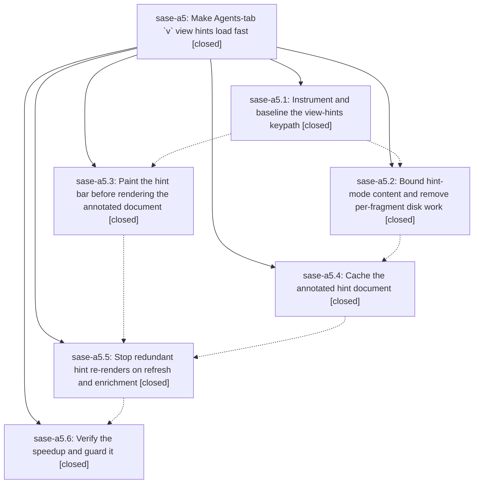

# Bead: sase-a5 — Make Agents-tab \`v\` view hints load fast

[Bead Pages](../README.md) / sase-a5

**Status:** ✓ closed · **Resolution:** done · **Type:** plan · **Tier:** epic
**Owner:** `bryanbugyi34@gmail.com`
**Created:** 2026-07-27 18:21:10 UTC · **Closed:** 2026-07-28 10:03:45 UTC
**Plan:** [202607/agents\_view\_hints\_perf.md](https://github.com/sase-org/sase--plans/blob/main/202607/agents_view_hints_perf.md)

## Description

Pressing `v` on the Agents tab paints the hint input bar immediately and renders numbered hints in bounded, cached, off-pump work, so hint latency stops scaling with transcript size, family member count, or auto-refresh cadence.

## Phases

| Bead | Title | Status | Size | Agents | Commits |
|---|---|---|---|---:|---:|
| [sase-a5.1](sase-a5.1.md) | Instrument and baseline the view-hints keypath | ✓ closed | small | 1 | 1 |
| [sase-a5.2](sase-a5.2.md) | Bound hint-mode content and remove per-fragment disk work | ✓ closed | medium | 1 | 1 |
| [sase-a5.3](sase-a5.3.md) | Paint the hint bar before rendering the annotated document | ✓ closed | medium | 1 | 1 |
| [sase-a5.4](sase-a5.4.md) | Cache the annotated hint document | ✓ closed | medium | 1 | 1 |
| [sase-a5.5](sase-a5.5.md) | Stop redundant hint re-renders on refresh and enrichment | ✓ closed | medium | 1 | 1 |
| [sase-a5.6](sase-a5.6.md) | Verify the speedup and guard it | ✓ closed | small | 1 | 1 |

## Lineage

## Agents

| Agent | Bead | Commits |
|---|---|---:|
| [bbugyi200.athena.sase-a5.1](https://github.com/sase-org/sase--agents/blob/main/agents/bbugyi200.athena.sase-a5.1/README.md) | [sase-a5.1](sase-a5.1.md) | 1 |
| [bbugyi200.athena.sase-a5.2](https://github.com/sase-org/sase--agents/blob/main/agents/bbugyi200.athena.sase-a5.2/README.md) | [sase-a5.2](sase-a5.2.md) | 1 |
| [bbugyi200.athena.sase-a5.3](https://github.com/sase-org/sase--agents/blob/main/agents/bbugyi200.athena.sase-a5.3/README.md) | [sase-a5.3](sase-a5.3.md) | 1 |
| [bbugyi200.athena.sase-a5.4](https://github.com/sase-org/sase--agents/blob/main/agents/bbugyi200.athena.sase-a5.4/README.md) | [sase-a5.4](sase-a5.4.md) | 1 |
| [bbugyi200.athena.sase-a5.5](https://github.com/sase-org/sase--agents/blob/main/agents/bbugyi200.athena.sase-a5.5/README.md) | [sase-a5.5](sase-a5.5.md) | 1 |
| [bbugyi200.athena.sase-a5.6](https://github.com/sase-org/sase--agents/blob/main/agents/bbugyi200.athena.sase-a5.6/README.md) | [sase-a5.6](sase-a5.6.md) | 1 |

## Commits

| Commit | Subject | Bead | Committed (UTC) |
|---|---|---|---|
| [`60c9b3e`](https://github.com/sase-org/sase/commit/60c9b3e7b1334655b79438838bd6b2bf2a4247f7) | perf(ace): instrument and baseline the view-hints keypath (sase-a5.1) | [sase-a5.1](sase-a5.1.md) | 2026-07-27 19:31:24 |
| [`9385e8a`](https://github.com/sase-org/sase/commit/9385e8a6209256a46176353cda1e5fd2a36f8539) | perf(tui): bound file hint rendering work (sase-a5.2) | [sase-a5.2](sase-a5.2.md) | 2026-07-27 19:54:25 |
| [`419790e`](https://github.com/sase-org/sase/commit/419790e846b17308052b65ce0d22096d7094ce59) | perf(tui): defer agent hint document rendering (sase-a5.3) | [sase-a5.3](sase-a5.3.md) | 2026-07-27 20:12:59 |
| [`57c5b8c`](https://github.com/sase-org/sase/commit/57c5b8c6a9007fae7c6b18ba4ea56b9e038be88a) | perf(tui): cache annotated hint documents (sase-a5.4) | [sase-a5.4](sase-a5.4.md) | 2026-07-27 20:41:17 |
| [`41ba006`](https://github.com/sase-org/sase/commit/41ba006bd4c6f41a041abae4508d2ed90c5c8f24) | perf(tui): skip unchanged hint document renders (sase-a5.5) | [sase-a5.5](sase-a5.5.md) | 2026-07-27 21:07:34 |
| [`a49e63e`](https://github.com/sase-org/sase/commit/a49e63e3581075d5681a3a593234ddb6462f78d1) | perf(ace): guard Agents-tab view-hints latency (sase-a5.6) | [sase-a5.6](sase-a5.6.md) | 2026-07-28 10:01:15 |
