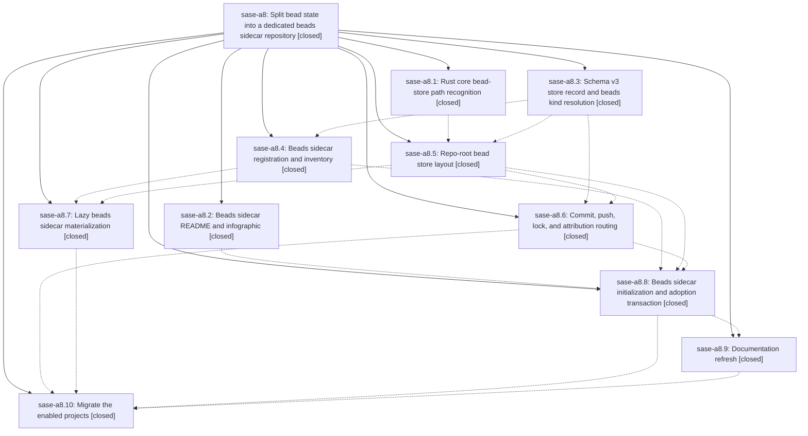

# Bead: sase-a8 — Split bead state into a dedicated beads sidecar repository

[Bead Pages](../README.md) / sase-a8

**Status:** ✓ closed · **Resolution:** done · **Type:** plan · **Tier:** epic
**Owner:** `bryanbugyi34@gmail.com` · **Assignee:** `sase-a8.land`
**Created:** 2026-07-27 19:46:10 UTC · **Closed:** 2026-07-28 12:54:27 UTC
**Plan:** [202607/beads\_sidecar\_repo.md](https://github.com/sase-org/sase--plans/blob/main/202607/beads_sidecar_repo.md)

## Description

Every SASE-managed project stores bead state in its own auto-cloned `<project>--beads` sidecar repository, seeded by `sase repo init` with a generated README and infographic, lazily cloned by `sase bead` when absent, and adopted from the plans sidecar by a reversible migration that has been run against every currently enabled project.

## Phases

| Bead | Title | Status | Size | Agents | Commits |
|---|---|---|---|---:|---:|
| [sase-a8.1](sase-a8.1.md) | Rust core bead-store path recognition | ✓ closed | small | 0 | 0 |
| [sase-a8.10](sase-a8.10.md) | Migrate the enabled projects | ✓ closed | small | 1 | 0 |
| [sase-a8.2](sase-a8.2.md) | Beads sidecar README and infographic | ✓ closed | medium | 1 | 1 |
| [sase-a8.3](sase-a8.3.md) | Schema v3 store record and beads kind resolution | ✓ closed | medium | 1 | 1 |
| [sase-a8.4](sase-a8.4.md) | Beads sidecar registration and inventory | ✓ closed | medium | 1 | 1 |
| [sase-a8.5](sase-a8.5.md) | Repo-root bead store layout | ✓ closed | medium | 1 | 1 |
| [sase-a8.6](sase-a8.6.md) | Commit, push, lock, and attribution routing | ✓ closed | medium | 1 | 1 |
| [sase-a8.7](sase-a8.7.md) | Lazy beads sidecar materialization | ✓ closed | medium | 1 | 1 |
| [sase-a8.8](sase-a8.8.md) | Beads sidecar initialization and adoption transaction | ✓ closed | medium | 1 | 1 |
| [sase-a8.9](sase-a8.9.md) | Documentation refresh | ✓ closed | small | 1 | 1 |

## Lineage

## Agents

| Agent | Bead | Commits |
|---|---|---:|
| [bbugyi200.athena.sase-a8.10--1](https://github.com/sase-org/sase--agents/blob/main/families/bbugyi200.athena.sase-a8.10.md#member-1) | [sase-a8.10](sase-a8.10.md) | 0 |
| [bbugyi200.athena.sase-a8.2](https://github.com/sase-org/sase--agents/blob/main/agents/bbugyi200.athena.sase-a8.2/README.md) | [sase-a8.2](sase-a8.2.md) | 1 |
| [bbugyi200.athena.sase-a8.3](https://github.com/sase-org/sase--agents/blob/main/agents/bbugyi200.athena.sase-a8.3/README.md) | [sase-a8.3](sase-a8.3.md) | 1 |
| [bbugyi200.athena.sase-a8.4](https://github.com/sase-org/sase--agents/blob/main/agents/bbugyi200.athena.sase-a8.4/README.md) | [sase-a8.4](sase-a8.4.md) | 1 |
| [bbugyi200.athena.sase-a8.5](https://github.com/sase-org/sase--agents/blob/main/agents/bbugyi200.athena.sase-a8.5/README.md) | [sase-a8.5](sase-a8.5.md) | 1 |
| [bbugyi200.athena.sase-a8.6](https://github.com/sase-org/sase--agents/blob/main/agents/bbugyi200.athena.sase-a8.6/README.md) | [sase-a8.6](sase-a8.6.md) | 1 |
| [bbugyi200.athena.sase-a8.7](https://github.com/sase-org/sase--agents/blob/main/agents/bbugyi200.athena.sase-a8.7/README.md) | [sase-a8.7](sase-a8.7.md) | 1 |
| [bbugyi200.athena.sase-a8.8](https://github.com/sase-org/sase--agents/blob/main/agents/bbugyi200.athena.sase-a8.8/README.md) | [sase-a8.8](sase-a8.8.md) | 1 |
| [bbugyi200.athena.sase-a8.9](https://github.com/sase-org/sase--agents/blob/main/agents/bbugyi200.athena.sase-a8.9/README.md) | [sase-a8.9](sase-a8.9.md) | 1 |

## Commits

| Commit | Subject | Bead | Committed (UTC) |
|---|---|---|---|
| [`f9bd6ad`](https://github.com/sase-org/sase/commit/f9bd6ad226fba1067e1abfd6ae885e3ad312c371) | feat(sdd): support split beads sidecar records (sase-a8.3) | [sase-a8.3](sase-a8.3.md) | 2026-07-27 20:16:40 |
| [`fde7e62`](https://github.com/sase-org/sase/commit/fde7e62a15f934b3824264848cc068af7f81f88a) | feat(sdd): add beads sidecar guide bundle (sase-a8.2) | [sase-a8.2](sase-a8.2.md) | 2026-07-27 20:37:36 |
| [`c113156`](https://github.com/sase-org/sase/commit/c113156466bd746064212cfe48e80fc74073ffe3) | feat: register beads as a managed sidecar (sase-a8.4) | [sase-a8.4](sase-a8.4.md) | 2026-07-27 20:43:42 |
| [`5cf149c`](https://github.com/sase-org/sase/commit/5cf149c1f5c2a914c1df0a98a63bd7d02fad5b81) | feat(beads): support repository-root bead stores (sase-a8.5) | [sase-a8.5](sase-a8.5.md) | 2026-07-27 20:58:04 |
| [`3dba997`](https://github.com/sase-org/sase/commit/3dba997d0c80ce4ec8234d650514ae50eff838a0) | feat(sdd): route bead operations to dedicated sidecar (sase-a8.6) | [sase-a8.6](sase-a8.6.md) | 2026-07-27 21:24:31 |
| [`73a75f9`](https://github.com/sase-org/sase/commit/73a75f94d4370b0ba582bccfa025f45839f4976f) | feat(beads): materialize split sidecar on demand (sase-a8.7) | [sase-a8.7](sase-a8.7.md) | 2026-07-27 21:31:14 |
| [`2a795b0`](https://github.com/sase-org/sase/commit/2a795b049c56283d2e55be8d6abfaaafbb89cf39) | feat: adopt bead state into dedicated sidecar (sase-a8.8) | [sase-a8.8](sase-a8.8.md) | 2026-07-28 10:13:40 |
| [`9ddd75a`](https://github.com/sase-org/sase/commit/9ddd75a3f34902c48e361942cfe9a652b37b7d49) | docs: describe the dedicated beads sidecar (sase-a8.9) | [sase-a8.9](sase-a8.9.md) | 2026-07-28 10:28:30 |
