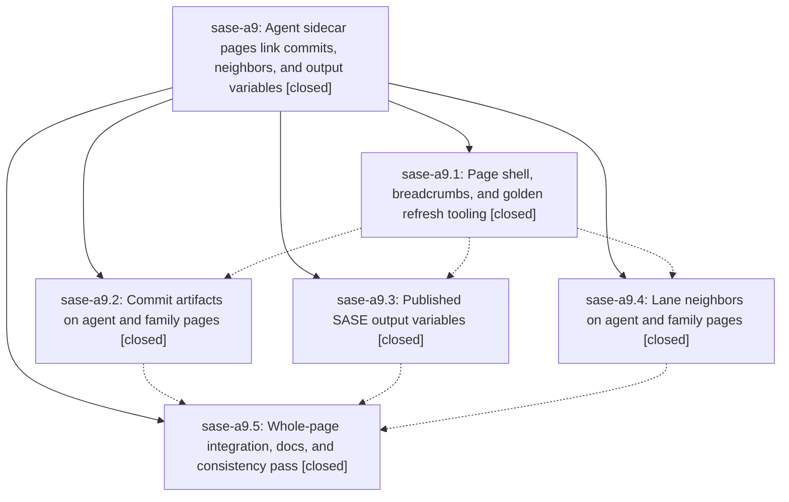

# Bead: sase-a9 — Agent sidecar pages link commits, neighbors, and output variables

[Bead Pages](../README.md) / sase-a9

**Status:** ✓ closed · **Resolution:** done · **Type:** plan · **Tier:** epic
**Owner:** `bryanbugyi34@gmail.com` · **Assignee:** `sase-a9.land`
**Created:** 2026-07-27 20:35:20 UTC · **Closed:** 2026-07-28 10:24:52 UTC
**Plan:** [202607/agent\_page\_artifacts.md](https://github.com/sase-org/sase--plans/blob/main/202607/agent_page_artifacts.md)

## Description

Every published agent and family page in the `--agents` sidecar links its commits, its lane neighbors, and the SASE output variables the run set, using one consistent, deterministic page anatomy.

## Phases

| Bead | Title | Status | Size | Agents | Commits |
|---|---|---|---|---:|---:|
| [sase-a9.1](sase-a9.1.md) | Page shell, breadcrumbs, and golden refresh tooling | ✓ closed | medium | 1 | 1 |
| [sase-a9.2](sase-a9.2.md) | Commit artifacts on agent and family pages | ✓ closed | medium | 1 | 1 |
| [sase-a9.3](sase-a9.3.md) | Published SASE output variables | ✓ closed | medium | 1 | 1 |
| [sase-a9.4](sase-a9.4.md) | Lane neighbors on agent and family pages | ✓ closed | medium | 1 | 1 |
| [sase-a9.5](sase-a9.5.md) | Whole-page integration, docs, and consistency pass | ✓ closed | small | 1 | 1 |

## Lineage

## Agents

| Agent | Bead | Commits |
|---|---|---:|
| [bbugyi200.athena.sase-a9.1](https://github.com/sase-org/sase--agents/blob/main/agents/bbugyi200.athena.sase-a9.1/README.md) | [sase-a9.1](sase-a9.1.md) | 1 |
| [bbugyi200.athena.sase-a9.2](https://github.com/sase-org/sase--agents/blob/main/agents/bbugyi200.athena.sase-a9.2/README.md) | [sase-a9.2](sase-a9.2.md) | 1 |
| [bbugyi200.athena.sase-a9.3](https://github.com/sase-org/sase--agents/blob/main/agents/bbugyi200.athena.sase-a9.3/README.md) | [sase-a9.3](sase-a9.3.md) | 1 |
| [bbugyi200.athena.sase-a9.4](https://github.com/sase-org/sase--agents/blob/main/agents/bbugyi200.athena.sase-a9.4/README.md) | [sase-a9.4](sase-a9.4.md) | 1 |
| [bbugyi200.athena.sase-a9.5](https://github.com/sase-org/sase--agents/blob/main/agents/bbugyi200.athena.sase-a9.5/README.md) | [sase-a9.5](sase-a9.5.md) | 1 |

## Commits

| Commit | Subject | Bead | Committed (UTC) |
|---|---|---|---|
| [`dbddc16`](https://github.com/sase-org/sase/commit/dbddc16c12396524ab7dec8c81a1fa1e33019d53) | feat(agents): add page breadcrumbs and golden refresh (sase-a9.1) | [sase-a9.1](sase-a9.1.md) | 2026-07-27 21:00:26 |
| [`f9064d7`](https://github.com/sase-org/sase/commit/f9064d7630ca8b542f2d01323cc81ba3e3a380d6) | feat(agents-sync): add lane neighbor sections (sase-a9.4) | [sase-a9.4](sase-a9.4.md) | 2026-07-27 21:23:00 |
| [`11ddd27`](https://github.com/sase-org/sase/commit/11ddd277631aa24521c24e4d8d484d904a704e54) | feat(agents-sync): publish linked commit artifacts (sase-a9.2) | [sase-a9.2](sase-a9.2.md) | 2026-07-27 21:29:38 |
| [`33b57c3`](https://github.com/sase-org/sase/commit/33b57c3709b688730e05da2ef0dda74534815c86) | feat(agents-sync): publish output variables (sase-a9.3) | [sase-a9.3](sase-a9.3.md) | 2026-07-27 21:39:47 |
| [`9a7fb3f`](https://github.com/sase-org/sase/commit/9a7fb3fbe157c7c5e87bbdb35656ef0a5f18ebdd) | feat(agents-sync): stabilize sidecar page anatomy (sase-a9.5) | [sase-a9.5](sase-a9.5.md) | 2026-07-28 10:14:56 |
