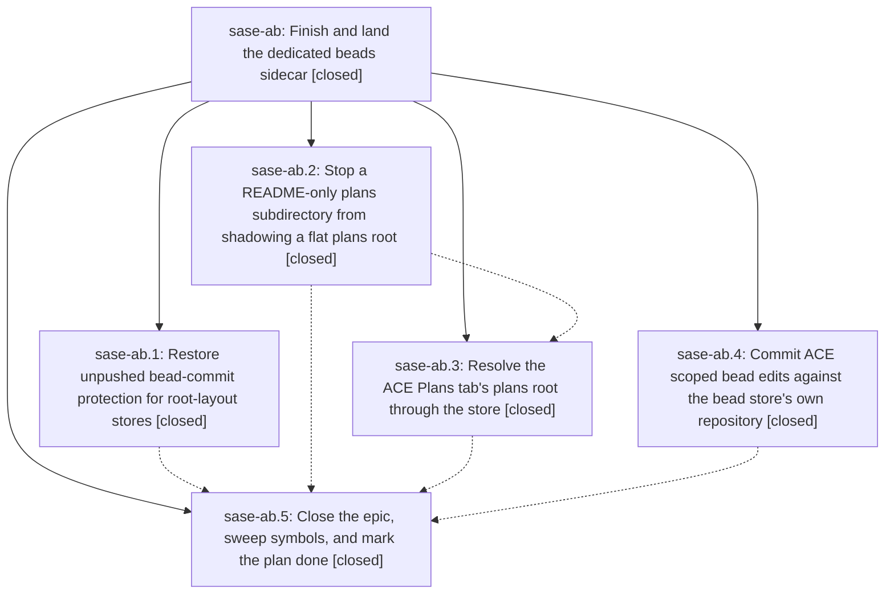

# Bead: sase-ab — Finish and land the dedicated beads sidecar

[Bead Pages](../README.md) / sase-ab

**Status:** ✓ closed · **Resolution:** done · **Type:** plan · **Tier:** epic
**Owner:** `bryanbugyi34@gmail.com` · **Assignee:** `sase-ab.land`
**Created:** 2026-07-28 11:36:00 UTC · **Closed:** 2026-07-28 13:22:50 UTC
**Plan:** [202607/land\_beads\_sidecar\_epic.md](https://github.com/sase-org/sase--plans/blob/main/202607/land_beads_sidecar_epic.md)

## Description

Every code path that locates a bead store's owning repository handles the dedicated beads sidecar's repo-root layout, so unpushed bead commits survive workspace preparation, the ACE Plans tab resolves and commits bead state correctly on migrated projects, and epic sase-a8 is closed with its plan file marked done.

## Phases

| Bead | Title | Status | Size | Agents | Commits |
|---|---|---|---|---:|---:|
| [sase-ab.1](sase-ab.1.md) | Restore unpushed bead-commit protection for root-layout stores | ✓ closed | medium | 1 | 1 |
| [sase-ab.2](sase-ab.2.md) | Stop a README-only plans subdirectory from shadowing a flat plans root | ✓ closed | small | 1 | 1 |
| [sase-ab.3](sase-ab.3.md) | Resolve the ACE Plans tab's plans root through the store | ✓ closed | medium | 1 | 1 |
| [sase-ab.4](sase-ab.4.md) | Commit ACE scoped bead edits against the bead store's own repository | ✓ closed | small | 0 | 1 |
| [sase-ab.5](sase-ab.5.md) | Close the epic, sweep symbols, and mark the plan done | ✓ closed | small | 1 | 2 |

## Lineage

## Agents

| Agent | Bead | Commits |
|---|---|---:|
| [bbugyi200.athena.sase-ab.1](https://github.com/sase-org/sase--agents/blob/main/agents/bbugyi200.athena.sase-ab.1/README.md) | [sase-ab.1](sase-ab.1.md) | 1 |
| [bbugyi200.athena.sase-ab.2](https://github.com/sase-org/sase--agents/blob/main/agents/bbugyi200.athena.sase-ab.2/README.md) | [sase-ab.2](sase-ab.2.md) | 1 |
| [bbugyi200.athena.sase-ab.3](https://github.com/sase-org/sase--agents/blob/main/agents/bbugyi200.athena.sase-ab.3/README.md) | [sase-ab.3](sase-ab.3.md) | 1 |
| [bbugyi200.athena.sase-ab.5](https://github.com/sase-org/sase--agents/blob/main/agents/bbugyi200.athena.sase-ab.5/README.md) | [sase-ab.5](sase-ab.5.md) | 2 |

## Commits

| Commit | Subject | Bead | Committed (UTC) |
|---|---|---|---|
| [`8137b10`](https://github.com/sase-org/sase/commit/8137b10480ef0e1c03613c3cad862f707e56d95d) | fix: preserve flat plans sidecar with plans README (sase-ab.2) | [sase-ab.2](sase-ab.2.md) | 2026-07-28 11:56:04 |
| [`0ee67b1`](https://github.com/sase-org/sase/commit/0ee67b10a5e36519ffa93998a4b2969c8eca86a1) | fix(bead): protect root-layout stores during workspace prep (sase-ab.1) | [sase-ab.1](sase-ab.1.md) | 2026-07-28 12:00:20 |
| [`11f16e3`](https://github.com/sase-org/sase/commit/11f16e3275e53e10681c71400c6dd9dd7a769832) | feat: See the 'acecommit' phase of 202607/land\_beads\_sidecar\_epic.md (sase-ab.4) | [sase-ab.4](sase-ab.4.md) | 2026-07-28 12:10:26 |
| [`ac12273`](https://github.com/sase-org/sase/commit/ac12273f547df64aee8b59ab951ada5e440750da) | fix(ace): resolve plans roots through SDD store (sase-ab.3) | [sase-ab.3](sase-ab.3.md) | 2026-07-28 12:25:44 |
| [`sase--plans@25229fb`](https://github.com/sase-org/sase--plans/commit/25229fb06fb5f7db7e3dc4d16cb00ead101257ff) | docs: repair SDD artifact links (sase-ab.5) | [sase-ab.5](sase-ab.5.md) | 2026-07-28 13:06:14 |
| [`sase--plans@d241ce7`](https://github.com/sase-org/sase--plans/commit/d241ce70f1be035ec5a0397e467120b99983b509) | docs: link lumberjack wait runners artifacts (sase-ab.5) | [sase-ab.5](sase-ab.5.md) | 2026-07-28 13:08:44 |
