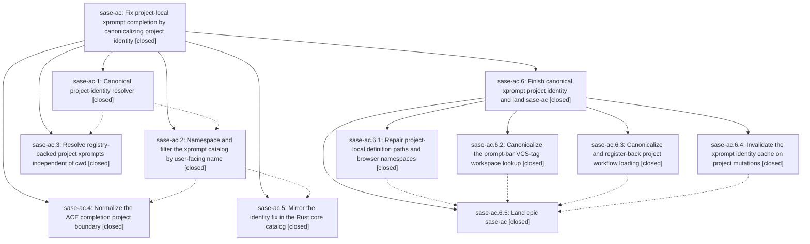

# Bead: sase-ac — Fix project-local xprompt completion by canonicalizing project identity

[Bead Pages](../README.md) / sase-ac

**Status:** ✓ closed · **Resolution:** done · **Type:** plan · **Tier:** epic
**Owner:** `bryanbugyi34@gmail.com` · **Assignee:** `sase-ac.land`
**Created:** 2026-07-28 11:41:09 UTC · **Closed:** 2026-07-28 18:59:56 UTC
**Plan:** [202607/xprompt\_project\_identity.md](https://github.com/sase-org/sase--plans/blob/main/202607/xprompt_project_identity.md)

## Description

Typing `#sase/` in the ACE prompt bar under a `#gh:sase` VCS tag completes the project's local xprompts (`#sase/reads`, `#sase/sync`), project-local xprompts are namespaced with exactly one user-facing name everywhere, and those references resolve regardless of the process working directory.

## Notes

Landing verification: the epic's headline fix is real and works. Verified from cwd=/tmp (outside the checkout): canonical_xprompt_project('gh_sase-org__sase')=='sase'; gather_structured_entries() yields sase/{docs,gact,reads,remember,sync} tagged project='sase' with no gh_sase-org__sase/* duplicates; build_structured_xprompts_catalog() selects them by key, name, and alias; get_all_xprompts(project='sase') and process_xprompt_references('#sase/sync') both resolve outside the checkout. sase-ac.5 confirmed in sase-core commit 2034123, internally consistent (known_workspaces canonical-keyed end to end). No integration conflicts with the non-epic commits landed since 370f2607f (they touch agents-sync, commit, skills, ace fold, and plans-sidecar code, none of the xprompt identity surface). NOT closing yet: four consumers were never migrated off the directory-key spelling. (1) REGRESSION - the catalog now emits 'project_local_config:sase' but xprompt_browser_helpers.resolve_source_to_file_path() still resolves via get_known_project_workspaces(), so it returns None; opening/editing a project-local sase.yml xprompt definition is broken for every key!=name project. (2) loader.get_all_project_local_prompts() still namespaces with the directory key, so the ACE xprompt browser and the doctor config check still advertise the unresolvable gh_sase-org__sase/* spelling alongside the canonical one - the epic goal 'exactly one user-facing name everywhere' is unmet. (3) _prompt_bar_requests.py derives the project from the VCS tag (user-facing name) and looks it up in the directory-key map inside a bare except, silently dropping project-local sase.yml xprompts from the selector. (4) get_all_workflows()/_load_workflows_from_project_workspace() never got the sase-ac.3 treatment, so .yml workflow xprompts resolve neither by canonical name nor outside the checkout while .md ones now do. Also flagged: project_identity's lru_caches are never invalidated, so a long-running sase ace keeps stale identity after a project is registered/renamed/re-aliased. Remaining work planned as a follow-up epic whose final phase closes sase-ac, runs symvision, and marks both plan files done. just symvision is currently clean and no sase-ac Justfile whitelist entries remain.

## Phases

| Bead | Title | Status | Size | Agents | Commits |
|---|---|---|---|---:|---:|
| [sase-ac.1](sase-ac.1.md) | Canonical project-identity resolver | ✓ closed | small | 1 | 1 |
| [sase-ac.2](sase-ac.2.md) | Namespace and filter the xprompt catalog by user-facing name | ✓ closed | medium | 1 | 1 |
| [sase-ac.3](sase-ac.3.md) | Resolve registry-backed project xprompts independent of cwd | ✓ closed | medium | 1 | 1 |
| [sase-ac.4](sase-ac.4.md) | Normalize the ACE completion project boundary | ✓ closed | small | 1 | 1 |
| [sase-ac.5](sase-ac.5.md) | Mirror the identity fix in the Rust core catalog | ✓ closed | medium | 0 | 0 |

## Lineage

## Agents

| Agent | Bead | Commits |
|---|---|---:|
| [bbugyi200.athena.sase-ac.1](https://github.com/sase-org/sase--agents/blob/main/agents/bbugyi200.athena.sase-ac.1/README.md) | [sase-ac.1](sase-ac.1.md) | 1 |
| [bbugyi200.athena.sase-ac.2](https://github.com/sase-org/sase--agents/blob/main/agents/bbugyi200.athena.sase-ac.2/README.md) | [sase-ac.2](sase-ac.2.md) | 1 |
| [bbugyi200.athena.sase-ac.3](https://github.com/sase-org/sase--agents/blob/main/agents/bbugyi200.athena.sase-ac.3/README.md) | [sase-ac.3](sase-ac.3.md) | 1 |
| [bbugyi200.athena.sase-ac.4](https://github.com/sase-org/sase--agents/blob/main/agents/bbugyi200.athena.sase-ac.4/README.md) | [sase-ac.4](sase-ac.4.md) | 1 |
| [bbugyi200.athena.sase-ac.6.1](https://github.com/sase-org/sase--agents/blob/main/agents/bbugyi200.athena.sase-ac.6.1/README.md) | [sase-ac.6.1](sase-ac.6.1.md) | 1 |
| [bbugyi200.athena.sase-ac.6.2](https://github.com/sase-org/sase--agents/blob/main/agents/bbugyi200.athena.sase-ac.6.2/README.md) | [sase-ac.6.2](sase-ac.6.2.md) | 1 |
| [bbugyi200.athena.sase-ac.6.3](https://github.com/sase-org/sase--agents/blob/main/agents/bbugyi200.athena.sase-ac.6.3/README.md) | [sase-ac.6.3](sase-ac.6.3.md) | 1 |
| [bbugyi200.athena.sase-ac.6.4](https://github.com/sase-org/sase--agents/blob/main/agents/bbugyi200.athena.sase-ac.6.4/README.md) | [sase-ac.6.4](sase-ac.6.4.md) | 1 |
| [bbugyi200.athena.sase-ac.6.land](https://github.com/sase-org/sase--agents/blob/main/agents/bbugyi200.athena.sase-ac.6.land/README.md) | [sase-ac.6](sase-ac.6.md) | 1 |

## Commits

| Commit | Subject | Bead | Committed (UTC) |
|---|---|---|---|
| [`370f260`](https://github.com/sase-org/sase/commit/370f2607f684d68272b2416a313133c8d7058e59) | feat(xprompt): add canonical project identity helpers (sase-ac.1) | [sase-ac.1](sase-ac.1.md) | 2026-07-28 12:07:40 |
| [`40f2d52`](https://github.com/sase-org/sase/commit/40f2d526e6b1e0b992dbc3e80c8cee66d5750ac6) | fix(xprompt): canonicalize project catalog namespaces (sase-ac.2) | [sase-ac.2](sase-ac.2.md) | 2026-07-28 12:27:56 |
| [`9148e45`](https://github.com/sase-org/sase/commit/9148e45e1829a445e772a07c8c71b6d919a6ff56) | feat(xprompt): resolve registered project prompts outside cwd (sase-ac.3) | [sase-ac.3](sase-ac.3.md) | 2026-07-28 12:50:28 |
| [`b449b8a`](https://github.com/sase-org/sase/commit/b449b8a4b5a133ded4771fa07e22307bf97620cb) | fix(xprompt): normalize ACE completion project identity (sase-ac.4) | [sase-ac.4](sase-ac.4.md) | 2026-07-28 12:58:11 |
| [`a0a2e40`](https://github.com/sase-org/sase/commit/a0a2e4007ae03a801a00f85d79a286683dc2c515) | fix(ace): canonicalize prompt-bar VCS-tag xprompt lookup (sase-ac.6.2) | [sase-ac.6.2](sase-ac.6.2.md) | 2026-07-28 13:29:24 |
| [`699456a`](https://github.com/sase-org/sase/commit/699456a521e25e0aaa38f4e289db38e71a6488a6) | fix(xprompt): canonicalize workflow project identity (sase-ac.6.3) | [sase-ac.6.3](sase-ac.6.3.md) | 2026-07-28 13:37:41 |
| [`02eee83`](https://github.com/sase-org/sase/commit/02eee837542948dba30c2327120de3a9c8e6fb3d) | fix: invalidate xprompt identity on project mutations (sase-ac.6.4) | [sase-ac.6.4](sase-ac.6.4.md) | 2026-07-28 13:47:00 |
| [`0db608e`](https://github.com/sase-org/sase/commit/0db608e985e2031bdb8a58322d8f29b0ce8484fb) | fix(xprompt): canonicalize project-local browser identities (sase-ac.6.1) | [sase-ac.6.1](sase-ac.6.1.md) | 2026-07-28 14:07:20 |
| [`01549ff`](https://github.com/sase-org/sase/commit/01549ff628d0fc96995e7cc11b04a44d2e7a6b52) | test(xprompt): cover browser row merge and drop cache reach-ins (sase-ac.6) | [sase-ac.6](sase-ac.6.md) | 2026-07-28 15:22:06 |
