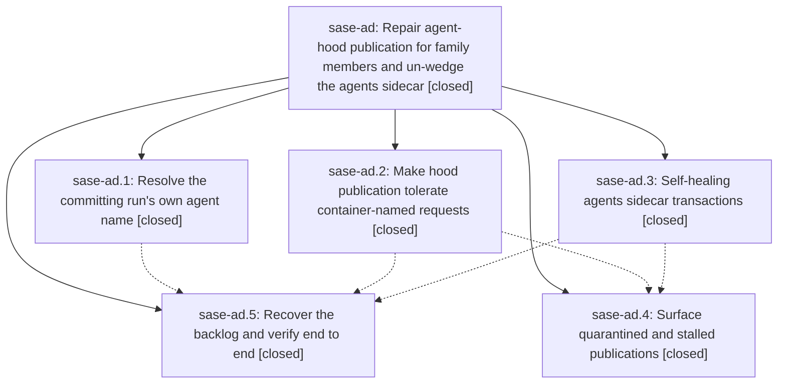

# Bead: sase-ad — Repair agent-hood publication for family members and un-wedge the agents sidecar

[Bead Pages](../README.md) / sase-ad

**Status:** ✓ closed · **Resolution:** done · **Type:** plan · **Tier:** epic
**Owner:** `bryanbugyi34@gmail.com` · **Assignee:** `sase-ad.land`
**Created:** 2026-07-28 11:43:28 UTC · **Closed:** 2026-07-28 13:10:36 UTC
**Plan:** [202607/fix\_family\_agent\_publication.md](https://github.com/sase-org/sase--plans/blob/main/202607/fix_family_agent_publication.md)

## Description

Every `sase commit` links to an agent page that actually exists in the agents sidecar, family-member commits publish their hood instead of quarantining, a dirty sidecar working tree can no longer wedge publication indefinitely, and quarantined publication requests are surfaced instead of failing silently.

## Phases

| Bead | Title | Status | Size | Agents | Commits |
|---|---|---|---|---:|---:|
| [sase-ad.1](sase-ad.1.md) | Resolve the committing run's own agent name | ✓ closed | medium | 1 | 1 |
| [sase-ad.2](sase-ad.2.md) | Make hood publication tolerate container-named requests | ✓ closed | small | 1 | 1 |
| [sase-ad.3](sase-ad.3.md) | Self-healing agents sidecar transactions | ✓ closed | medium | 1 | 1 |
| [sase-ad.4](sase-ad.4.md) | Surface quarantined and stalled publications | ✓ closed | small | 1 | 1 |
| [sase-ad.5](sase-ad.5.md) | Recover the backlog and verify end to end | ✓ closed | small | 0 | 0 |

## Lineage

## Agents

| Agent | Bead | Commits |
|---|---|---:|
| [bbugyi200.athena.sase-ad.1](https://github.com/sase-org/sase--agents/blob/main/agents/bbugyi200.athena.sase-ad.1/README.md) | [sase-ad.1](sase-ad.1.md) | 1 |
| [bbugyi200.athena.sase-ad.2](https://github.com/sase-org/sase--agents/blob/main/agents/bbugyi200.athena.sase-ad.2/README.md) | [sase-ad.2](sase-ad.2.md) | 1 |
| [bbugyi200.athena.sase-ad.3](https://github.com/sase-org/sase--agents/blob/main/agents/bbugyi200.athena.sase-ad.3/README.md) | [sase-ad.3](sase-ad.3.md) | 1 |
| [bbugyi200.athena.sase-ad.4](https://github.com/sase-org/sase--agents/blob/main/agents/bbugyi200.athena.sase-ad.4/README.md) | [sase-ad.4](sase-ad.4.md) | 1 |
| [bbugyi200.athena.sase-ad.land](https://github.com/sase-org/sase--agents/blob/main/agents/bbugyi200.athena.sase-ad.land/README.md) | [sase-ad](README.md) | 1 |

## Commits

| Commit | Subject | Bead | Committed (UTC) |
|---|---|---|---|
| [`b201c92`](https://github.com/sase-org/sase/commit/b201c9200c8954b36c226dde675af52fd7b1b66d) | fix(commit): attribute family member runs correctly (sase-ad.1) | [sase-ad.1](sase-ad.1.md) | 2026-07-28 12:15:18 |
| [`ca5c526`](https://github.com/sase-org/sase/commit/ca5c526c724957db6bdcd273b57fe860df2d0883) | fix(agents-sync): recover sidecar transaction state (sase-ad.3) | [sase-ad.3](sase-ad.3.md) | 2026-07-28 12:18:56 |
| [`53e94ca`](https://github.com/sase-org/sase/commit/53e94ca4a5e8456316a32ffbb5af8222a0d0c385) | fix(agents-sync): allow container-named hood publication (sase-ad.2) | [sase-ad.2](sase-ad.2.md) | 2026-07-28 12:19:41 |
| [`5842f04`](https://github.com/sase-org/sase/commit/5842f04af4d3eabebed72d81b64a6bec477125a3) | feat: surface agent publication outbox health (sase-ad.4) | [sase-ad.4](sase-ad.4.md) | 2026-07-28 12:48:50 |
| [`7076775`](https://github.com/sase-org/sase/commit/7076775d252780c71df7ae9769863315a19390c4) | refactor(agents\_sync): share one publication outbox path reader (sase-ad) | [sase-ad](README.md) | 2026-07-28 13:12:17 |
