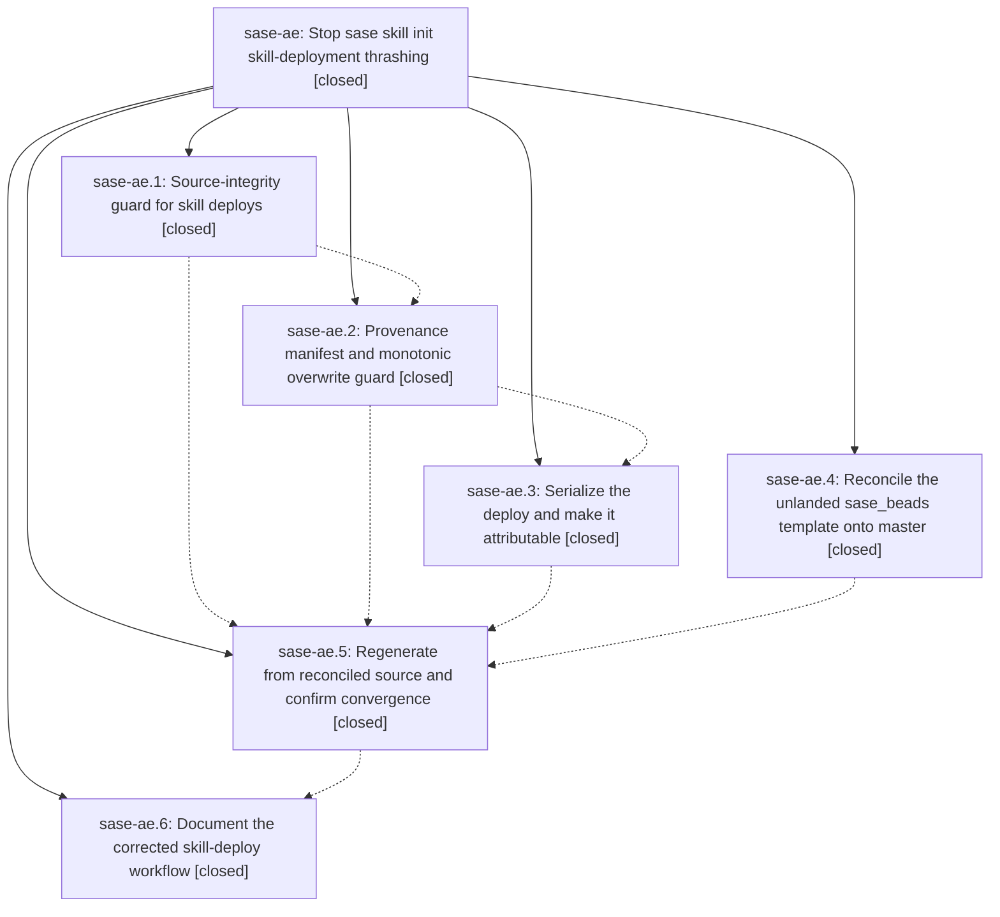

# Bead: sase-ae — Stop sase skill init skill-deployment thrashing

[Bead Pages](../README.md) / sase-ae

**Status:** ✓ closed · **Resolution:** done · **Type:** plan · **Tier:** epic
**Owner:** `bryanbugyi34@gmail.com` · **Assignee:** `sase-ae.land`
**Created:** 2026-07-28 11:53:43 UTC · **Closed:** 2026-07-28 14:10:46 UTC
**Plan:** [202607/skill\_deploy\_thrash.md](https://github.com/sase-org/sase--plans/blob/main/202607/skill_deploy_thrash.md)

## Description

Deployed provider skill files are a pure function of one canonical committed source revision, a deploy can never move the destination backwards, and the unlanded sase_beads template content is reconciled onto master.

## Phases

| Bead | Title | Status | Size | Agents | Commits |
|---|---|---|---|---:|---:|
| [sase-ae.1](sase-ae.1.md) | Source-integrity guard for skill deploys | ✓ closed | medium | 1 | 1 |
| [sase-ae.2](sase-ae.2.md) | Provenance manifest and monotonic overwrite guard | ✓ closed | medium | 1 | 1 |
| [sase-ae.3](sase-ae.3.md) | Serialize the deploy and make it attributable | ✓ closed | small | 1 | 1 |
| [sase-ae.4](sase-ae.4.md) | Reconcile the unlanded sase\_beads template onto master | ✓ closed | medium | 0 | 0 |
| [sase-ae.5](sase-ae.5.md) | Regenerate from reconciled source and confirm convergence | ✓ closed | small | 0 | 0 |
| [sase-ae.6](sase-ae.6.md) | Document the corrected skill-deploy workflow | ✓ closed | small | 1 | 1 |

## Lineage

## Agents

| Agent | Bead | Commits |
|---|---|---:|
| [bbugyi200.athena.sase-ae.1](https://github.com/sase-org/sase--agents/blob/main/agents/bbugyi200.athena.sase-ae.1/README.md) | [sase-ae.1](sase-ae.1.md) | 1 |
| [bbugyi200.athena.sase-ae.2](https://github.com/sase-org/sase--agents/blob/main/agents/bbugyi200.athena.sase-ae.2/README.md) | [sase-ae.2](sase-ae.2.md) | 1 |
| [bbugyi200.athena.sase-ae.3](https://github.com/sase-org/sase--agents/blob/main/agents/bbugyi200.athena.sase-ae.3/README.md) | [sase-ae.3](sase-ae.3.md) | 1 |
| [bbugyi200.athena.sase-ae.6--1](https://github.com/sase-org/sase--agents/blob/main/families/bbugyi200.athena.sase-ae.6.md#member-1) | [sase-ae.6](sase-ae.6.md) | 1 |
| [bbugyi200.athena.sase-ae.land--code](https://github.com/sase-org/sase--agents/blob/main/families/bbugyi200.athena.sase-ae.land.md#member-code) | [sase-ae](README.md) | 2 |

## Commits

| Commit | Subject | Bead | Committed (UTC) |
|---|---|---|---|
| [`3537aa1`](https://github.com/sase-org/sase/commit/3537aa141d844123c02fbca3552dbcc669673b3d) | feat(skills): guard chezmoi deploy source integrity (sase-ae.1) | [sase-ae.1](sase-ae.1.md) | 2026-07-28 12:24:10 |
| [`046a92a`](https://github.com/sase-org/sase/commit/046a92a3b6ce4495d53f431bcca8008c895c8413) | feat(skills): enforce monotonic deploy provenance (sase-ae.2) | [sase-ae.2](sase-ae.2.md) | 2026-07-28 12:51:49 |
| [`105d9d3`](https://github.com/sase-org/sase/commit/105d9d36930f5f6824e49face0fff277e39d4fa9) | fix: serialize skill chezmoi deploys (sase-ae.3) | [sase-ae.3](sase-ae.3.md) | 2026-07-28 13:19:42 |
| [`53d732f`](https://github.com/sase-org/sase/commit/53d732f30e91839e58eee9047d6e6b5a18cd248f) | docs: document the commit-then-deploy skill workflow (sase-ae.6) | [sase-ae.6](sase-ae.6.md) | 2026-07-28 13:48:41 |
| [`7d85188`](https://github.com/sase-org/sase/commit/7d85188c18080e4e986e8fd65394144c8ae9ce2f) | test(skills): cover backwards manifest ABA refusal (sase-ae) | [sase-ae](README.md) | 2026-07-28 14:11:00 |
| [`sase--plans@11eb0f9`](https://github.com/sase-org/sase--plans/commit/11eb0f964fa582db993fe6a5572c754958aa2fe3) | docs(plans): mark skill deployment epic done (sase-ae) | [sase-ae](README.md) | 2026-07-28 14:15:27 |
