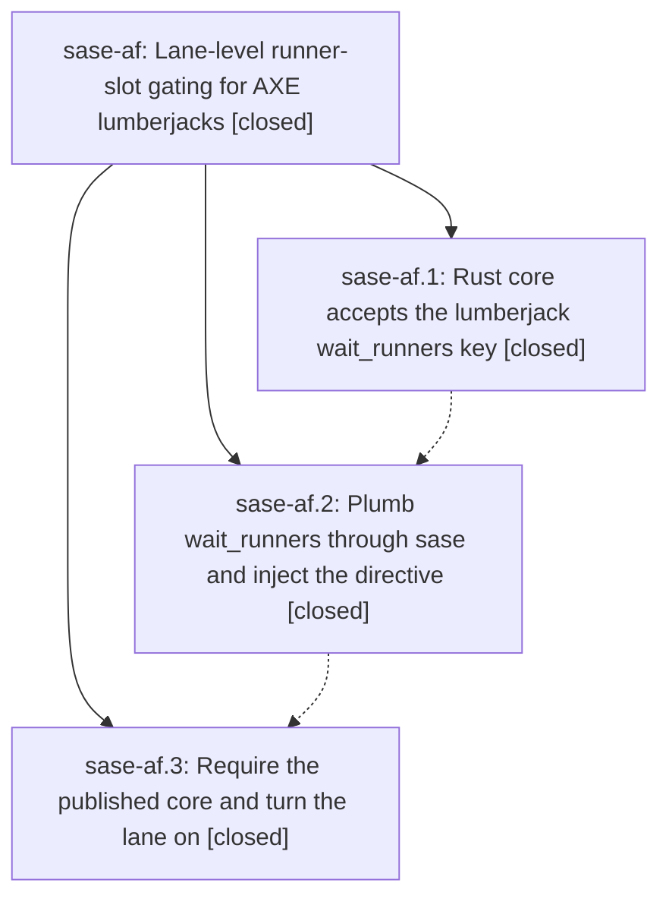

# Bead: sase-af — Lane-level runner-slot gating for AXE lumberjacks

[Bead Pages](../README.md) / sase-af

**Status:** ✓ closed · **Resolution:** done · **Type:** plan · **Tier:** epic
**Owner:** `bryanbugyi34@gmail.com` · **Assignee:** `sase-af.land`
**Created:** 2026-07-28 12:54:03 UTC · **Closed:** 2026-07-28 15:48:39 UTC
**Plan:** [202607/lumberjack\_wait\_runners.md](https://github.com/sase-org/sase--plans/blob/main/202607/lumberjack_wait_runners.md)

## Description

Every agent an AXE lumberjack launches from a script chop proposal carries a `%wait(runners=N)` directive taken from a new `axe.lumberjacks.<name>.wait_runners` config key, so the `code_quality` lane can be configured to hold its audit agents until the machine is quiet instead of competing with ordinary work for the global runner pool.

## Phases

| Bead | Title | Status | Size | Agents | Commits |
|---|---|---|---|---:|---:|
| [sase-af.1](sase-af.1.md) | Rust core accepts the lumberjack wait\_runners key | ✓ closed | medium | 0 | 0 |
| [sase-af.2](sase-af.2.md) | Plumb wait\_runners through sase and inject the directive | ✓ closed | medium | 1 | 1 |
| [sase-af.3](sase-af.3.md) | Require the published core and turn the lane on | ✓ closed | small | 1 | 1 |

## Lineage

## Agents

| Agent | Bead | Commits |
|---|---|---:|
| [bbugyi200.athena.sase-af.2](https://github.com/sase-org/sase--agents/blob/main/agents/bbugyi200.athena.sase-af.2/README.md) | [sase-af.2](sase-af.2.md) | 1 |
| [bbugyi200.athena.sase-af.3](https://github.com/sase-org/sase--agents/blob/main/agents/bbugyi200.athena.sase-af.3/README.md) | [sase-af.3](sase-af.3.md) | 1 |
| [bbugyi200.athena.sase-af.land--code](https://github.com/sase-org/sase--agents/blob/main/families/bbugyi200.athena.sase-af.land.md#member-code) | [sase-af](README.md) | 1 |

## Commits

| Commit | Subject | Bead | Committed (UTC) |
|---|---|---|---|
| [`bd630ec`](https://github.com/sase-org/sase/commit/bd630ec7316770881d33fb16b8b822e9a2a25948) | feat(axe): gate lumberjack launches by runner capacity (sase-af.2) | [sase-af.2](sase-af.2.md) | 2026-07-28 13:36:16 |
| [`c9978ed`](https://github.com/sase-org/sase/commit/c9978edf4d866fedd32245112b133ac6ad36ef05) | build(deps): require sase-core-rs 0.12.2 (sase-af.3) | [sase-af.3](sase-af.3.md) | 2026-07-28 14:48:59 |
| [`a643a86`](https://github.com/sase-org/sase/commit/a643a864c33b1eb864f570c9e009ff89d313a69f) | fix(sdd): keep published core integration commit-safe (sase-af) | [sase-af](README.md) | 2026-07-28 16:18:15 |
