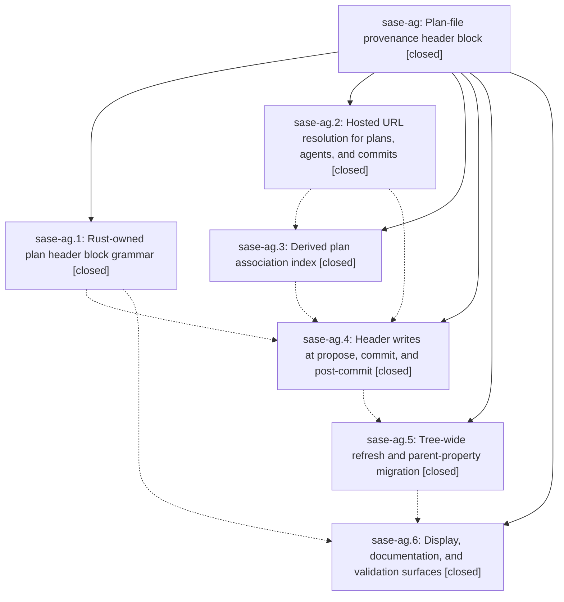

# Bead: sase-ag — Plan-file provenance header block

[Bead Pages](../README.md) / sase-ag

**Status:** ✓ closed · **Resolution:** done · **Type:** plan · **Tier:** epic
**Owner:** `bryanbugyi34@gmail.com` · **Assignee:** `sase-ag.land`
**Created:** 2026-07-28 13:48:55 UTC · **Closed:** 2026-07-28 17:42:48 UTC
**Plan:** [202607/plan\_header\_provenance.md](https://github.com/sase-org/sase--plans/blob/main/202607/plan_header_provenance.md)

## Description

Every committed plan file opens with one beautiful, self-healing header block whose bullets link the plan to its prompt, its parent plan, every agent that worked it, and every commit it produced, with GitHub URLs that render as hyperlinks on github.com.

## Notes

[2026-07-28T17:42:43Z · sase-ag.land] Published core floor proof: tools/smoke_sase_core_rs_plan_header fails against the published sase-core-rs 0.12.3 wheel because the fenced header example is parsed as a discontiguous live header; the same extended smoke passes against the published 0.12.4 wheel, including legacy top-level parent removal with nested frontmatter preserved.

## Phases

| Bead | Title | Status | Size | Agents | Commits |
|---|---|---|---|---:|---:|
| [sase-ag.1](sase-ag.1.md) | Rust-owned plan header block grammar | ✓ closed | medium | 1 | 1 |
| [sase-ag.2](sase-ag.2.md) | Hosted URL resolution for plans, agents, and commits | ✓ closed | small | 1 | 1 |
| [sase-ag.3](sase-ag.3.md) | Derived plan association index | ✓ closed | medium | 1 | 1 |
| [sase-ag.4](sase-ag.4.md) | Header writes at propose, commit, and post-commit | ✓ closed | medium | 1 | 1 |
| [sase-ag.5](sase-ag.5.md) | Tree-wide refresh and parent-property migration | ✓ closed | medium | 1 | 1 |
| [sase-ag.6](sase-ag.6.md) | Display, documentation, and validation surfaces | ✓ closed | small | 1 | 1 |

## Lineage

## Agents

| Agent | Bead | Commits |
|---|---|---:|
| [bbugyi200.athena.sase-ag.1](https://github.com/sase-org/sase--agents/blob/main/agents/bbugyi200.athena.sase-ag.1/README.md) | [sase-ag.1](sase-ag.1.md) | 1 |
| [bbugyi200.athena.sase-ag.2](https://github.com/sase-org/sase--agents/blob/main/agents/bbugyi200.athena.sase-ag.2/README.md) | [sase-ag.2](sase-ag.2.md) | 1 |
| [bbugyi200.athena.sase-ag.3](https://github.com/sase-org/sase--agents/blob/main/agents/bbugyi200.athena.sase-ag.3/README.md) | [sase-ag.3](sase-ag.3.md) | 1 |
| [bbugyi200.athena.sase-ag.4](https://github.com/sase-org/sase--agents/blob/main/agents/bbugyi200.athena.sase-ag.4/README.md) | [sase-ag.4](sase-ag.4.md) | 1 |
| [bbugyi200.athena.sase-ag.5](https://github.com/sase-org/sase--agents/blob/main/agents/bbugyi200.athena.sase-ag.5/README.md) | [sase-ag.5](sase-ag.5.md) | 1 |
| [bbugyi200.athena.sase-ag.6](https://github.com/sase-org/sase--agents/blob/main/agents/bbugyi200.athena.sase-ag.6/README.md) | [sase-ag.6](sase-ag.6.md) | 1 |
| [bbugyi200.athena.sase-ag.land--code](https://github.com/sase-org/sase--agents/blob/main/families/bbugyi200.athena.sase-ag.land.md#member-code) | [sase-ag](README.md) | 1 |

## Commits

| Commit | Subject | Bead | Committed (UTC) |
|---|---|---|---|
| [`563deaf`](https://github.com/sase-org/sase/commit/563deafc555973c025e1d99633e4dc770392cd4d) | feat(sdd): add hosted URL resolution for plans, agents, and commits (sase-ag.2) | [sase-ag.2](sase-ag.2.md) | 2026-07-28 14:07:10 |
| [`8b2baa8`](https://github.com/sase-org/sase/commit/8b2baa881e24ab30dadfe527da1bba514a99d817) | feat(sdd): add typed plan header block adapter (sase-ag.1) | [sase-ag.1](sase-ag.1.md) | 2026-07-28 14:33:32 |
| [`7270b98`](https://github.com/sase-org/sase/commit/7270b986bf6fbcd9055315469c631d2c586c2b5a) | feat(sdd): derive plan provenance associations (sase-ag.3) | [sase-ag.3](sase-ag.3.md) | 2026-07-28 14:42:04 |
| [`9701511`](https://github.com/sase-org/sase/commit/97015111b388e663506d996a2d9c6a7511af0eda) | feat(sdd)!: write plan provenance headers (sase-ag.4) | [sase-ag.4](sase-ag.4.md) | 2026-07-28 15:36:40 |
| [`ca29de3`](https://github.com/sase-org/sase/commit/ca29de3befeea34321826e749ffc1e689a8a8b5e) | feat(plan): add bulk provenance link refresh (sase-ag.5) | [sase-ag.5](sase-ag.5.md) | 2026-07-28 16:26:46 |
| [`5c74052`](https://github.com/sase-org/sase/commit/5c74052a6728503ee4bd1a42b8b4be58e72f5318) | feat(plan): surface plan header block in viewers and docs (sase-ag.6) | [sase-ag.6](sase-ag.6.md) | 2026-07-28 16:53:07 |
| [`702f1ae`](https://github.com/sase-org/sase/commit/702f1aece2375113427d437497924e960d5ca735) | build(deps): require sase-core-rs 0.12.4 (sase-ag) | [sase-ag](README.md) | 2026-07-28 18:03:38 |
