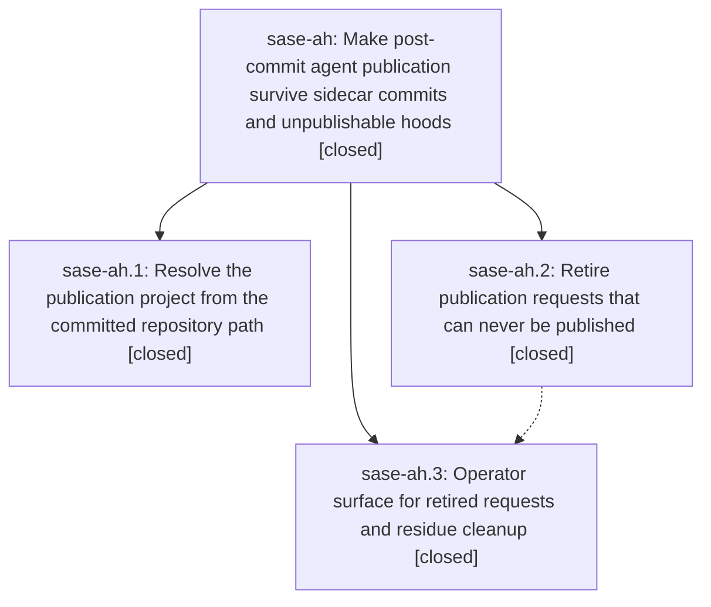

# Bead: sase-ah — Make post-commit agent publication survive sidecar commits and unpublishable hoods

[Bead Pages](../README.md) / sase-ah

**Status:** ✓ closed · **Resolution:** done · **Type:** plan · **Tier:** epic
**Owner:** `bryanbugyi34@gmail.com` · **Assignee:** `sase-ah.land`
**Created:** 2026-07-28 18:19:09 UTC · **Closed:** 2026-07-28 20:03:59 UTC
**Plan:** [202607/agent\_publication\_reliability.md](https://github.com/sase-org/sase--plans/blob/main/202607/agent_publication_reliability.md)

## Description

A `sase commit` inside an SDD sidecar checkout publishes to the sidecar's host project instead of failing after the commit already landed, and a publication request that can never be satisfied is retired with a recorded reason instead of cycling through quarantine forever.

## Phases

| Bead | Title | Status | Size | Agents | Commits |
|---|---|---|---|---:|---:|
| [sase-ah.1](sase-ah.1.md) | Resolve the publication project from the committed repository path | ✓ closed | medium | 0 | 0 |
| [sase-ah.2](sase-ah.2.md) | Retire publication requests that can never be published | ✓ closed | medium | 0 | 0 |
| [sase-ah.3](sase-ah.3.md) | Operator surface for retired requests and residue cleanup | ✓ closed | small | 0 | 0 |

## Lineage

## Agents

| Agent | Bead | Commits |
|---|---|---:|
| bbugyi200.athena.sase-ah.land--code | [sase-ah](README.md) | 1 |

## Commits

| Commit | Subject | Bead | Committed (UTC) |
|---|---|---|---|
| [`70c1bad`](https://github.com/sase-org/sase--plans/commit/70c1bad837ffe3793f1ac982d6d0a678b022a0a3) | docs(plans): restore prompt provenance links | [sase-ah](README.md) | 2026-07-28 20:04:22 |
