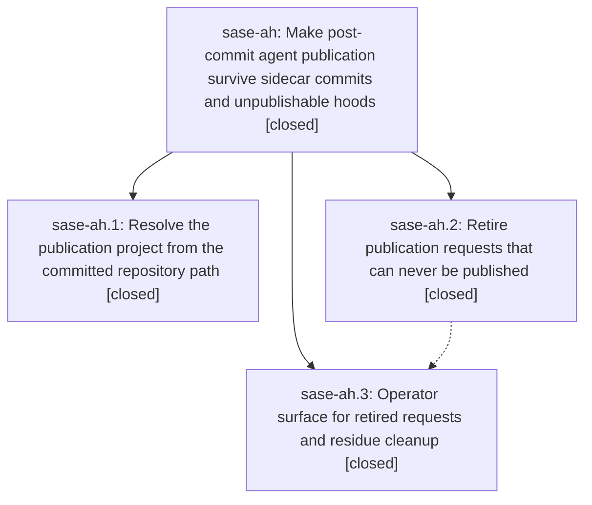

# Bead: sase-ah — Make post-commit agent publication survive sidecar commits and unpublishable hoods

[Bead Pages](../README.md) / sase-ah

**Status:** ✓ closed · **Resolution:** done · **Type:** plan · **Tier:** epic
**Owner:** `bryanbugyi34@gmail.com` · **Assignee:** `sase-ah.land--code`
**Created:** 2026-07-28 18:19:09 UTC · **Closed:** 2026-07-28 20:38:23 UTC
**Plan:** [202607/agent\_publication\_reliability.md](https://github.com/sase-org/sase--plans/blob/main/202607/agent_publication_reliability.md)

## Description

A `sase commit` inside an SDD sidecar checkout publishes to the sidecar's host project instead of failing after the commit already landed, and a publication request that can never be satisfied is retired with a recorded reason instead of cycling through quarantine forever.

## Notes

[2026-07-28T20:37:49Z · sase-ah.land] Landing audit confirmed all three phases closed and the publication outbox empty. Deployed and validated the five generated sase_chats provider copies with queued/quarantined/retired/mixed remediation, repaired the agent_publication_reliability and bead_pages prompt links, passed the 115 focused regressions, fixed the full-suite AF_UNIX scratch-path gate exposed during revalidation, and completed just check successfully with 0 queued, quarantined, retired, or stalled publication requests.

## Phases

| Bead | Title | Status | Size | Agents | Commits |
|---|---|---|---|---:|---:|
| [sase-ah.1](sase-ah.1.md) | Resolve the publication project from the committed repository path | ✓ closed | medium | 1 | 1 |
| [sase-ah.2](sase-ah.2.md) | Retire publication requests that can never be published | ✓ closed | medium | 1 | 1 |
| [sase-ah.3](sase-ah.3.md) | Operator surface for retired requests and residue cleanup | ✓ closed | small | 1 | 1 |

## Lineage

## Agents

| Agent | Bead | Commits |
|---|---|---:|
| [bbugyi200.athena.sase-ah.1](https://github.com/sase-org/sase--agents/blob/main/agents/bbugyi200.athena.sase-ah.1/README.md) | [sase-ah.1](sase-ah.1.md) | 1 |
| [bbugyi200.athena.sase-ah.2](https://github.com/sase-org/sase--agents/blob/main/agents/bbugyi200.athena.sase-ah.2/README.md) | [sase-ah.2](sase-ah.2.md) | 1 |
| [bbugyi200.athena.sase-ah.3](https://github.com/sase-org/sase--agents/blob/main/agents/bbugyi200.athena.sase-ah.3/README.md) | [sase-ah.3](sase-ah.3.md) | 1 |
| [bbugyi200.athena.sase-ah.land--code](https://github.com/sase-org/sase--agents/blob/main/families/bbugyi200.athena.sase-ah.land.md#member-code) | [sase-ah](README.md) | 2 |
| [bbugyi200.athena.sase-ah.land--plan](https://github.com/sase-org/sase--agents/blob/main/families/bbugyi200.athena.sase-ah.land.md#member-plan) | [sase-ah](README.md) | 0 |

## Commits

| Commit | Subject | Bead | Committed (UTC) |
|---|---|---|---|
| [`4fc555d`](https://github.com/sase-org/sase/commit/4fc555db0a6b86ccd1f5437c49fdfa668495e169) | fix(commit): resolve publication targets by repository path (sase-ah.1) | [sase-ah.1](sase-ah.1.md) | 2026-07-28 18:38:03 |
| [`d8afeb7`](https://github.com/sase-org/sase/commit/d8afeb7b0c0331c24d9bdcf7a4c78679020c9548) | fix(agents-sync): retire terminal publication requests (sase-ah.2) | [sase-ah.2](sase-ah.2.md) | 2026-07-28 18:47:14 |
| [`ee5938a`](https://github.com/sase-org/sase/commit/ee5938a20b9a42b247a73601c2accc3d5d984504) | feat(agents-sync): surface retired publication requests to operators (sase-ah.3) | [sase-ah.3](sase-ah.3.md) | 2026-07-28 19:22:12 |
| [`8d34bc9`](https://github.com/sase-org/sase/commit/8d34bc9ae0f093f4170229cf78a7dafe8007a26f) | test: keep suite gate socket paths below Linux limits | [sase-ah](README.md) | 2026-07-28 20:38:40 |
| [`7ba8b1c`](https://github.com/sase-org/sase/commit/7ba8b1ceab7d6652e011ac4461c1745e69f91997) | test: preserve suite-gate holder status at timeout | [sase-ah](README.md) | 2026-07-28 21:01:02 |
