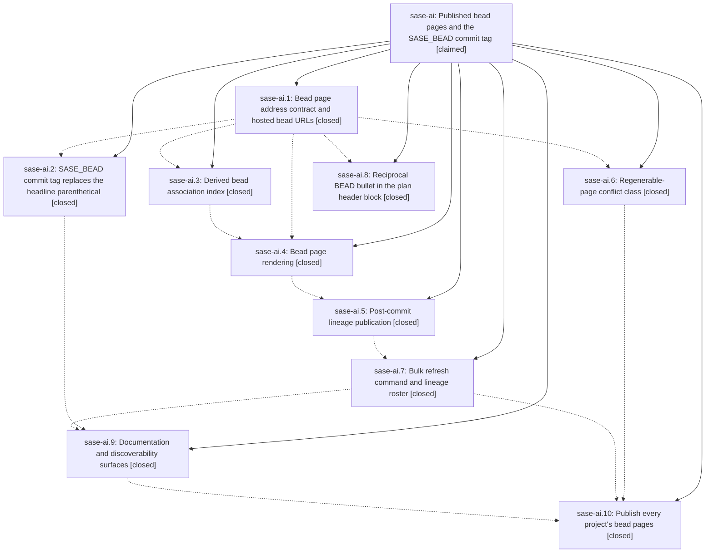

# Bead: sase-ai — Published bead pages and the SASE\_BEAD commit tag

[Bead Pages](../README.md) / sase-ai

**Status:** ◎ claimed · **Type:** plan · **Tier:** epic
**Owner:** `bryanbugyi34@gmail.com` · **Assignee:** `sase-ai.land`
**Created:** 2026-07-28 18:22:24 UTC
**Plan:** [202607/bead\_pages.md](https://github.com/sase-org/sase--plans/blob/main/202607/bead_pages.md)

## Description

Every bead that a SASE agent commits against has a beautiful, self-healing GitHub page in the project's `--beads` sidecar that links out to its plan, its agents, its commits, and its related beads, and every commit reaches it through a `SASE_BEAD` footer tag instead of a parenthetical bolted onto the headline.

## Phases

| Bead | Title | Status | Size | Agents | Commits |
|---|---|---|---|---:|---:|
| [sase-ai.1](sase-ai.1.md) | Bead page address contract and hosted bead URLs | ✓ closed | small | 1 | 1 |
| [sase-ai.10](sase-ai.10.md) | Publish every project's bead pages | ✓ closed | small | 1 | 1 |
| [sase-ai.2](sase-ai.2.md) | SASE\_BEAD commit tag replaces the headline parenthetical | ✓ closed | medium | 1 | 1 |
| [sase-ai.3](sase-ai.3.md) | Derived bead association index | ✓ closed | medium | 1 | 1 |
| [sase-ai.4](sase-ai.4.md) | Bead page rendering | ✓ closed | medium | 1 | 1 |
| [sase-ai.5](sase-ai.5.md) | Post-commit lineage publication | ✓ closed | medium | 1 | 1 |
| [sase-ai.6](sase-ai.6.md) | Regenerable-page conflict class | ✓ closed | small | 1 | 1 |
| [sase-ai.7](sase-ai.7.md) | Bulk refresh command and lineage roster | ✓ closed | medium | 1 | 1 |
| [sase-ai.8](sase-ai.8.md) | Reciprocal BEAD bullet in the plan header block | ✓ closed | medium | 1 | 1 |
| [sase-ai.9](sase-ai.9.md) | Documentation and discoverability surfaces | ✓ closed | small | 1 | 1 |

## Lineage

## Agents

| Agent | Bead | Commits |
|---|---|---:|
| [bbugyi200.athena.sase-ai.1](https://github.com/sase-org/sase--agents/blob/main/agents/bbugyi200.athena.sase-ai.1/README.md) | [sase-ai.1](sase-ai.1.md) | 1 |
| [bbugyi200.athena.sase-ai.10](https://github.com/sase-org/sase--agents/blob/main/agents/bbugyi200.athena.sase-ai.10/README.md) | [sase-ai.10](sase-ai.10.md) | 1 |
| [bbugyi200.athena.sase-ai.2](https://github.com/sase-org/sase--agents/blob/main/agents/bbugyi200.athena.sase-ai.2/README.md) | [sase-ai.2](sase-ai.2.md) | 1 |
| [bbugyi200.athena.sase-ai.3](https://github.com/sase-org/sase--agents/blob/main/agents/bbugyi200.athena.sase-ai.3/README.md) | [sase-ai.3](sase-ai.3.md) | 1 |
| [bbugyi200.athena.sase-ai.4](https://github.com/sase-org/sase--agents/blob/main/agents/bbugyi200.athena.sase-ai.4/README.md) | [sase-ai.4](sase-ai.4.md) | 1 |
| [bbugyi200.athena.sase-ai.5](https://github.com/sase-org/sase--agents/blob/main/agents/bbugyi200.athena.sase-ai.5/README.md) | [sase-ai.5](sase-ai.5.md) | 1 |
| [bbugyi200.athena.sase-ai.6](https://github.com/sase-org/sase--agents/blob/main/agents/bbugyi200.athena.sase-ai.6/README.md) | [sase-ai.6](sase-ai.6.md) | 1 |
| [bbugyi200.athena.sase-ai.7](https://github.com/sase-org/sase--agents/blob/main/agents/bbugyi200.athena.sase-ai.7/README.md) | [sase-ai.7](sase-ai.7.md) | 1 |
| [bbugyi200.athena.sase-ai.8](https://github.com/sase-org/sase--agents/blob/main/agents/bbugyi200.athena.sase-ai.8/README.md) | [sase-ai.8](sase-ai.8.md) | 1 |
| [bbugyi200.athena.sase-ai.9](https://github.com/sase-org/sase--agents/blob/main/agents/bbugyi200.athena.sase-ai.9/README.md) | [sase-ai.9](sase-ai.9.md) | 1 |
| [bbugyi200.athena.sase-ai.land](https://github.com/sase-org/sase--agents/blob/main/agents/bbugyi200.athena.sase-ai.land/README.md) | [sase-ai](README.md) | 0 |

## Commits

| Commit | Subject | Bead | Committed (UTC) |
|---|---|---|---|
| [`2a8d2eb`](https://github.com/sase-org/sase/commit/2a8d2eb6e42537b6eb56e935d1faf3cdce811d2d) | feat(sdd): add bead page addressing and hosted bead URLs (sase-ai.1) | [sase-ai.1](sase-ai.1.md) | 2026-07-28 18:38:10 |
| [`5043949`](https://github.com/sase-org/sase/commit/50439492a6551facacdf8e082c87f418c20db1a1) | fix(beads): resolve generated page conflicts (sase-ai.6) | [sase-ai.6](sase-ai.6.md) | 2026-07-28 18:57:29 |
| [`4f2694c`](https://github.com/sase-org/sase/commit/4f2694c9211b289b0dc8f48622fd3334975a2675) | feat: add linked bead commit footer tags (sase-ai.2) | [sase-ai.2](sase-ai.2.md) | 2026-07-28 19:03:58 |
| [`ab1c360`](https://github.com/sase-org/sase/commit/ab1c360404b7af12251a19716b0ed51b429cdbde) | feat(plan): project bead links into plan headers (sase-ai.8) | [sase-ai.8](sase-ai.8.md) | 2026-07-28 19:10:36 |
| [`9a9bec4`](https://github.com/sase-org/sase/commit/9a9bec4ad2673012a77c6e6fe96bce98d654cf01) | feat(sdd): index bead commit and agent associations (sase-ai.3) | [sase-ai.3](sase-ai.3.md) | 2026-07-28 19:11:50 |
| [`6e15f0d`](https://github.com/sase-org/sase/commit/6e15f0dc06c87b9f09241f675f81057d4975a70b) | feat(bead-pages): render deterministic bead pages (sase-ai.4) | [sase-ai.4](sase-ai.4.md) | 2026-07-28 19:32:06 |
| [`b645718`](https://github.com/sase-org/sase/commit/b6457189ccceea2aa2c2df2b78362fabe307ca51) | feat: publish bead lineage after commits (sase-ai.5) | [sase-ai.5](sase-ai.5.md) | 2026-07-28 19:50:42 |
| [`4b9e313`](https://github.com/sase-org/sase/commit/4b9e3131ae6f5c5f219e7a471fa80d8dd194d2fd) | feat(beads): add bead page refresh commands | [sase-ai.7](sase-ai.7.md) | 2026-07-28 20:22:39 |
| [`88a317a`](https://github.com/sase-org/sase/commit/88a317a87684772c5c9384ee6f8a8f9a53ad21ae) | feat(bead): show hosted page URLs in bead detail | [sase-ai.9](sase-ai.9.md) | 2026-07-28 21:06:02 |
| [`ee2bb5e`](https://github.com/sase-org/sase/commit/ee2bb5eee4d0ca76c5cd1d5087abae5269a0b3e3) | perf(bead-pages): precompute refresh relationship details | [sase-ai.10](sase-ai.10.md) | 2026-07-28 21:41:49 |
