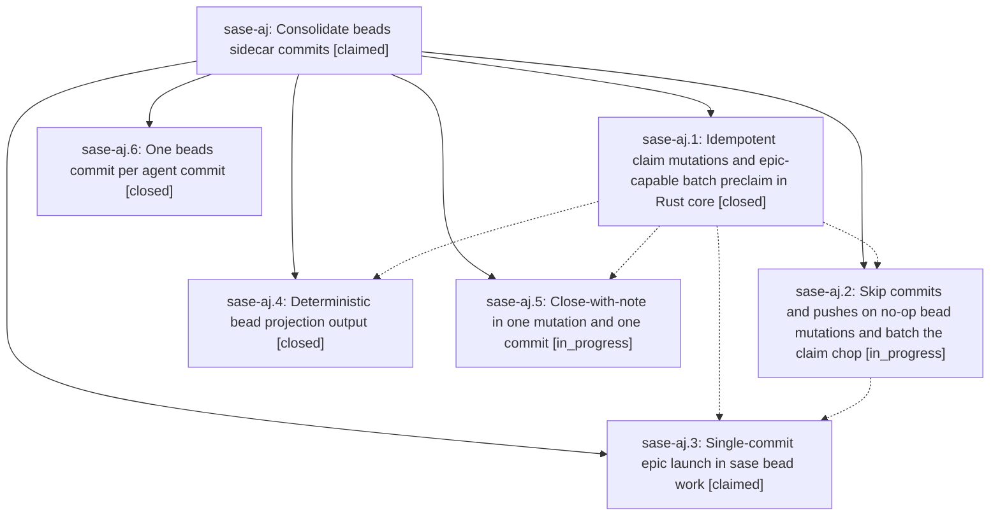

# Bead: sase-aj — Consolidate beads sidecar commits

[Bead Pages](../README.md) / sase-aj

**Status:** ◎ claimed · **Type:** plan · **Tier:** epic
**Owner:** `bryanbugyi34@gmail.com` · **Assignee:** `sase-aj.land`
**Created:** 2026-07-28 20:21:28 UTC
**Plan:** [202607/beads\_commit\_consolidation.md](https://github.com/sase-org/sase--plans/blob/main/202607/beads_commit_consolidation.md)

## Description

Cut routine beads-sidecar commit volume by making one logical operation produce one commit and one push: `sase bead work` batch-marks every launched bead in-progress in a single pre-spawn commit, runtime claim transitions become quiet no-ops, close-with-note lands in one command, projections serialize deterministically so clones stop committing pure-reorder echoes, and each agent `sase commit` writes at most one beads commit. Every `sase bead` subcommand keeps committing and pushing by default.

## Phases

| Bead | Title | Status | Size | Agents | Commits |
|---|---|---|---|---:|---:|
| [sase-aj.1](sase-aj.1.md) | Idempotent claim mutations and epic-capable batch preclaim in Rust core | ✓ closed | medium | 1 | 0 |
| [sase-aj.2](sase-aj.2.md) | Skip commits and pushes on no-op bead mutations and batch the claim chop | ◐ in_progress | medium | 1 | 0 |
| [sase-aj.3](sase-aj.3.md) | Single-commit epic launch in sase bead work | ◎ claimed | large | 1 | 0 |
| [sase-aj.4](sase-aj.4.md) | Deterministic bead projection output | ✓ closed | medium | 1 | 0 |
| [sase-aj.5](sase-aj.5.md) | Close-with-note in one mutation and one commit | ◐ in_progress | medium | 1 | 0 |
| [sase-aj.6](sase-aj.6.md) | One beads commit per agent commit | ✓ closed | medium | 1 | 1 |

## Lineage

## Agents

| Agent | Bead | Commits |
|---|---|---:|
| [bbugyi200.athena.sase-aj.1](https://github.com/sase-org/sase--agents/blob/main/agents/bbugyi200.athena.sase-aj.1/README.md) | [sase-aj.1](sase-aj.1.md) | 0 |
| [bbugyi200.athena.sase-aj.2](https://github.com/sase-org/sase--agents/blob/main/agents/bbugyi200.athena.sase-aj.2/README.md) | [sase-aj.2](sase-aj.2.md) | 0 |
| [bbugyi200.athena.sase-aj.3](https://github.com/sase-org/sase--agents/blob/main/agents/bbugyi200.athena.sase-aj.3/README.md) | [sase-aj.3](sase-aj.3.md) | 0 |
| [bbugyi200.athena.sase-aj.4](https://github.com/sase-org/sase--agents/blob/main/agents/bbugyi200.athena.sase-aj.4/README.md) | [sase-aj.4](sase-aj.4.md) | 0 |
| [bbugyi200.athena.sase-aj.5](https://github.com/sase-org/sase--agents/blob/main/agents/bbugyi200.athena.sase-aj.5/README.md) | [sase-aj.5](sase-aj.5.md) | 0 |
| [bbugyi200.athena.sase-aj.6](https://github.com/sase-org/sase--agents/blob/main/agents/bbugyi200.athena.sase-aj.6/README.md) | [sase-aj.6](sase-aj.6.md) | 1 |
| [bbugyi200.athena.sase-aj.land](https://github.com/sase-org/sase--agents/blob/main/agents/bbugyi200.athena.sase-aj.land/README.md) | [sase-aj](README.md) | 0 |

## Commits

| Commit | Subject | Bead | Committed (UTC) |
|---|---|---|---|
| [`e1e86f2`](https://github.com/sase-org/sase/commit/e1e86f276f86192fe469c8a121054d1c4ce93546) | fix(beads): consolidate post-commit sidecar sync | [sase-aj.6](sase-aj.6.md) | 2026-07-28 20:52:43 |
