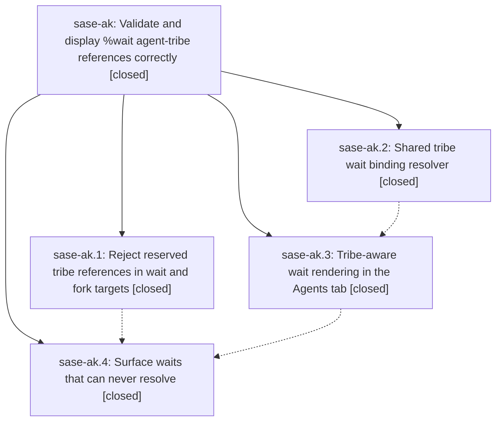

# Bead: sase-ak — Validate and display %wait agent-tribe references correctly

[Bead Pages](../README.md) / sase-ak

**Status:** ✓ closed · **Resolution:** done · **Type:** plan · **Tier:** epic
**Owner:** `bryanbugyi34@gmail.com` · **Assignee:** `sase-ak.land`
**Created:** 2026-07-28 21:04:51 UTC · **Closed:** 2026-07-28 22:32:47 UTC
**Plan:** [202607/tribe\_wait\_reference\_validation\_and\_display.md](https://github.com/sase-org/sase--plans/blob/main/202607/tribe_wait_reference_validation_and_display.md)

## Description

A `%wait(@<tribe>)` target is understood end to end: reserved pseudo-tribe references such as `@default` are rejected at launch instead of parking an agent forever, and the ACE Agents tab renders a real tribe wait as a pending-or-bound tribe target instead of a missing agent name.

## Notes

[2026-07-28T22:32:47Z · sase-ak.land] Land audit complete: reserved wait/fork/assignment guards, shared snapshot-driven tribe binding and index delegation, tribe-aware pending/bound detail rendering, and reserved-wait unresolvable row/detail surfaces all remain implemented. Integrated post-epic queued runner-slot rendering by passing tribe bindings while preserving the runner-only lane filter, and removed the temporary reserved-name bridge in favor of the canonical predicate. Verified 214 focused tests, 367 visual tests (1 skipped), and the full suite (23,291 passed, 7 skipped). Formatting, Ruff, mypy, pyscripts, Symvision, and toobig are green; just check stops only on unrelated global provider-skill drift and two unrelated plan-link pairs. Rechecked post-d67de4caf history; the only newer post-plan commit is CI-only.

[2026-07-28T22:35:33Z · sase-ak.land] Finalizer verification: bead already resolved done; focused, visual, and full suites passed, with repository-local gates green.

## Phases

| Bead | Title | Status | Size | Agents | Commits |
|---|---|---|---|---:|---:|
| [sase-ak.1](sase-ak.1.md) | Reject reserved tribe references in wait and fork targets | ✓ closed | small | 1 | 1 |
| [sase-ak.2](sase-ak.2.md) | Shared tribe wait binding resolver | ✓ closed | medium | 1 | 1 |
| [sase-ak.3](sase-ak.3.md) | Tribe-aware wait rendering in the Agents tab | ✓ closed | medium | 1 | 1 |
| [sase-ak.4](sase-ak.4.md) | Surface waits that can never resolve | ✓ closed | small | 1 | 1 |

## Lineage

## Agents

| Agent | Bead | Commits |
|---|---|---:|
| [bbugyi200.athena.sase-ak.1](https://github.com/sase-org/sase--agents/blob/main/agents/bbugyi200.athena.sase-ak.1/README.md) | [sase-ak.1](sase-ak.1.md) | 1 |
| [bbugyi200.athena.sase-ak.2](https://github.com/sase-org/sase--agents/blob/main/agents/bbugyi200.athena.sase-ak.2/README.md) | [sase-ak.2](sase-ak.2.md) | 1 |
| [bbugyi200.athena.sase-ak.3](https://github.com/sase-org/sase--agents/blob/main/agents/bbugyi200.athena.sase-ak.3/README.md) | [sase-ak.3](sase-ak.3.md) | 1 |
| [bbugyi200.athena.sase-ak.4](https://github.com/sase-org/sase--agents/blob/main/agents/bbugyi200.athena.sase-ak.4/README.md) | [sase-ak.4](sase-ak.4.md) | 1 |
| [bbugyi200.athena.sase-ak.land--code](https://github.com/sase-org/sase--agents/blob/main/families/bbugyi200.athena.sase-ak.land.md#member-code) | [sase-ak](README.md) | 2 |

## Commits

| Commit | Subject | Bead | Committed (UTC) |
|---|---|---|---|
| [`d67de4c`](https://github.com/sase-org/sase/commit/d67de4caf9530ff1a4912ffa4ecf2727a50d35df) | fix(tribes): reject reserved tribe references in wait and fork targets | [sase-ak.1](sase-ak.1.md) | 2026-07-28 21:17:58 |
| [`21e7527`](https://github.com/sase-org/sase/commit/21e75272f628e4ce84bfe55453f2cb5fe55950e4) | feat: add snapshot-driven tribe wait binding resolver | [sase-ak.2](sase-ak.2.md) | 2026-07-28 21:23:44 |
| [`ed04c42`](https://github.com/sase-org/sase/commit/ed04c42f239002a2f682ca9dc0761442a140cf4c) | feat(ace): display tribe wait bindings | [sase-ak.3](sase-ak.3.md) | 2026-07-28 21:48:54 |
| [`641229f`](https://github.com/sase-org/sase/commit/641229f896b6c59ecf1e1c596b2159e7ef7c6294) | fix(ace): surface unresolvable tribe waits | [sase-ak.4](sase-ak.4.md) | 2026-07-28 22:13:23 |
| [`0b3d16c`](https://github.com/sase-org/sase/commit/0b3d16ce40b7b0d20aa504d748c4147d3dfc9967) | fix(ace): finish tribe wait integration | [sase-ak](README.md) | 2026-07-28 22:36:19 |
| [`sase--plans@a9cbf16`](https://github.com/sase-org/sase--plans/commit/a9cbf16b70acc759c1ec2fd3b2a031ee64d3171b) | docs: mark tribe wait epic complete | [sase-ak](README.md) | 2026-07-28 22:37:17 |
