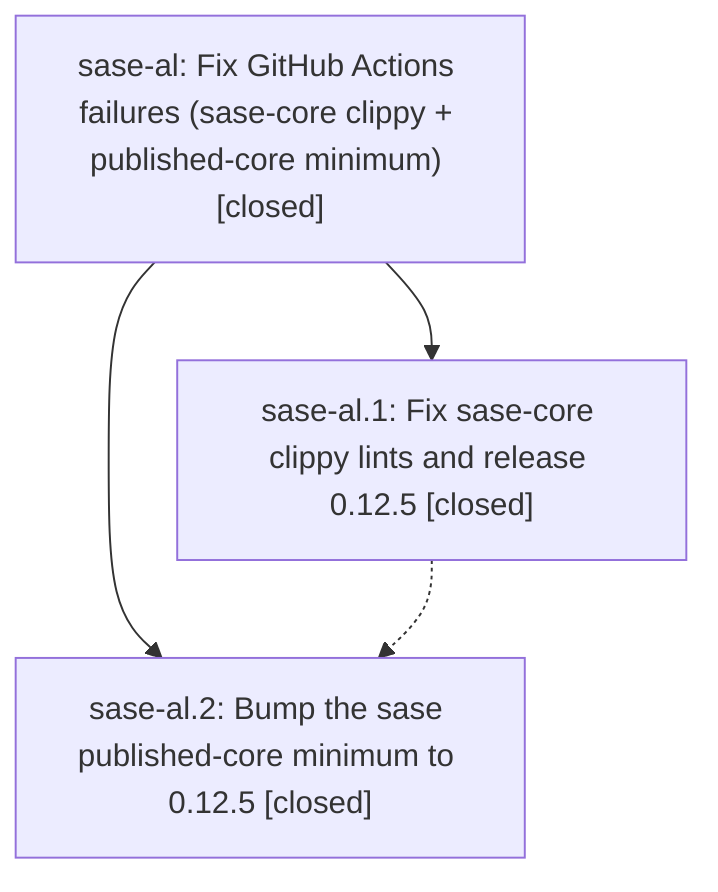

# Bead: sase-al — Fix GitHub Actions failures (sase-core clippy + published-core minimum)

[Bead Pages](../README.md) / sase-al

**Status:** ✓ closed · **Resolution:** done · **Type:** plan · **Tier:** epic
**Owner:** `bryanbugyi34@gmail.com` · **Assignee:** `sase-al.land--code`
**Created:** 2026-07-28 21:36:55 UTC · **Closed:** 2026-07-29 04:50:27 UTC
**Plan:** [202607/fix\_ci\_core\_clippy\_and\_minimum.md](https://github.com/sase-org/sase--plans/blob/main/202607/fix_ci_core_clippy_and_minimum.md)

## Description

sase-core master CI and sase master CI are both fully green: the clippy lints from the close-note change are fixed, sase-core-rs 0.12.5 (plan-header wire schema 2) is published to PyPI, and the sase repo requires it as its published-core minimum.

## Notes

[2026-07-29T04:50:27Z · sase-al.land] Completed the CI integration and land after the full dependency chain was verified: sase-core clippy fixes landed in 461c7f1, the 0.12.5 release landed in a7a3121 and published successfully, and an exact sase-core-rs==0.12.5 wheel smoke passed. The sase published-core floor landed in ab6f07a68. Split SDD bootstrap now emits schema-3 records and derives sidecars from sase.yml (41a01b397 and b5efaf7e), with CI isolation/version-neutral test stabilization in 887999fb5, 14b30c411, and 07aaac0d7. Final master CI run 30420587029 passed in full, including SASE validation, Validate committed plans, exact-wheel smoke, lint, visual, performance, and Python 3.12/3.13/3.14.

## Phases

| Bead | Title | Status | Size | Agents | Commits |
|---|---|---|---|---:|---:|
| [sase-al.1](sase-al.1.md) | Fix sase-core clippy lints and release 0.12.5 | ✓ closed | small | 1 | 1 |
| [sase-al.2](sase-al.2.md) | Bump the sase published-core minimum to 0.12.5 | ✓ closed | small | 1 | 1 |

## Lineage

## Agents

| Agent | Bead | Commits |
|---|---|---:|
| [bbugyi200.athena.sase-al.1](https://github.com/sase-org/sase--agents/blob/main/agents/bbugyi200.athena.sase-al.1/README.md) | [sase-al.1](sase-al.1.md) | 1 |
| [bbugyi200.athena.sase-al.2](https://github.com/sase-org/sase--agents/blob/main/agents/bbugyi200.athena.sase-al.2/README.md) | [sase-al.2](sase-al.2.md) | 1 |
| [bbugyi200.athena.sase-al.land--code](https://github.com/sase-org/sase--agents/blob/main/families/bbugyi200.athena.sase-al.land.md#member-code) | [sase-al](README.md) | 4 |

## Commits

| Commit | Subject | Bead | Committed (UTC) |
|---|---|---|---|
| [`sase-core@461c7f1`](https://github.com/sase-org/sase-core/commit/461c7f1b410c1c3a979ef7fbc21a64db30451a91) | fix(beads): resolve clippy lints in close-note support | [sase-al.1](sase-al.1.md) | 2026-07-28 21:46:19 |
| [`ab6f07a`](https://github.com/sase-org/sase/commit/ab6f07a68c63a7a8438942980ca20e133748dc90) | build(deps): bump published core minimum to 0.12.5 | [sase-al.2](sase-al.2.md) | 2026-07-28 22:45:24 |
| [`sase--plans@0266e43`](https://github.com/sase-org/sase--plans/commit/0266e43f8fd9a126b294ced1576c27f4eeb0f379) | docs: restore CI epic prompt links | [sase-al](README.md) | 2026-07-28 23:04:03 |
| [`41a01b3`](https://github.com/sase-org/sase/commit/41a01b397c79303acad241f2a44822193b3aeb32) | ci: emit valid split SDD store record | [sase-al](README.md) | 2026-07-28 23:12:14 |
| [`887999f`](https://github.com/sase-org/sase/commit/887999fb5d0c7acd0ca0a232e9a98f33d1fcc182) | fix(ci): stabilize full matrix isolation | [sase-al](README.md) | 2026-07-29 01:50:44 |
| [`14b30c4`](https://github.com/sase-org/sase/commit/14b30c411fe4ab371048b9b38d28dfad9bca3c06) | test: make task help aliases version-neutral | [sase-al](README.md) | 2026-07-29 02:53:58 |
