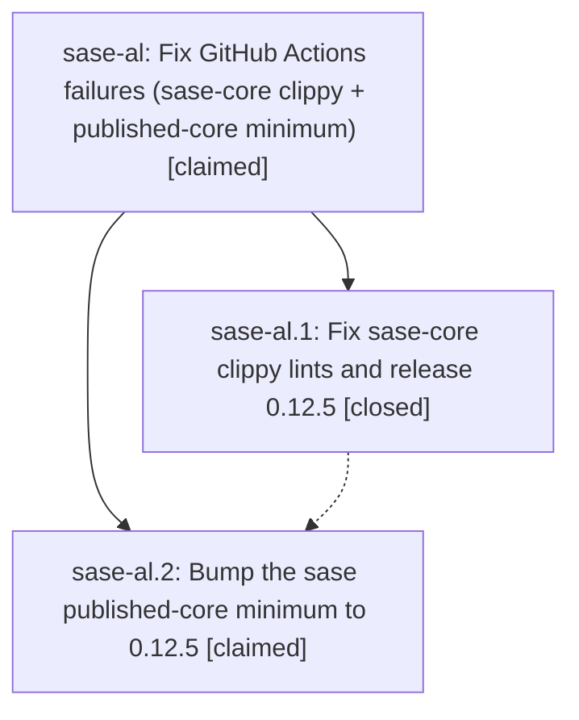

# Bead: sase-al — Fix GitHub Actions failures (sase-core clippy + published-core minimum)

[Bead Pages](../README.md) / sase-al

**Status:** ◎ claimed · **Type:** plan · **Tier:** epic
**Owner:** `bryanbugyi34@gmail.com` · **Assignee:** `sase-al.land`
**Created:** 2026-07-28 21:36:55 UTC
**Plan:** [202607/fix\_ci\_core\_clippy\_and\_minimum.md](https://github.com/sase-org/sase--plans/blob/main/202607/fix_ci_core_clippy_and_minimum.md)

## Description

sase-core master CI and sase master CI are both fully green: the clippy lints from the close-note change are fixed, sase-core-rs 0.12.5 (plan-header wire schema 2) is published to PyPI, and the sase repo requires it as its published-core minimum.

## Phases

| Bead | Title | Status | Size | Agents | Commits |
|---|---|---|---|---:|---:|
| [sase-al.1](sase-al.1.md) | Fix sase-core clippy lints and release 0.12.5 | ✓ closed | small | 1 | 1 |
| [sase-al.2](sase-al.2.md) | Bump the sase published-core minimum to 0.12.5 | ◎ claimed | small | 0 | 0 |

## Lineage

## Agents

| Agent | Bead | Commits |
|---|---|---:|
| bbugyi200.athena.sase-al.1 | [sase-al.1](sase-al.1.md) | 1 |

## Commits

| Commit | Subject | Bead | Committed (UTC) |
|---|---|---|---|
| [`461c7f1`](https://github.com/sase-org/sase-core/commit/461c7f1b410c1c3a979ef7fbc21a64db30451a91) | fix(beads): resolve clippy lints in close-note support | [sase-al.1](sase-al.1.md) | 2026-07-28 21:46:19 |
