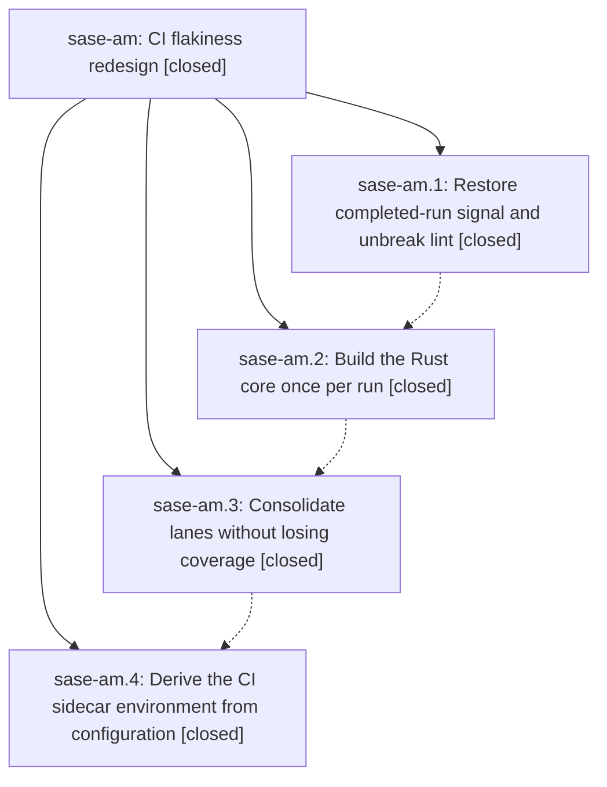

# Bead: sase-am — CI flakiness redesign

[Bead Pages](../README.md) / sase-am

**Status:** ✓ closed · **Resolution:** done · **Type:** plan · **Tier:** epic
**Owner:** `bryanbugyi34@gmail.com` · **Assignee:** `sase-am.land`
**Created:** 2026-07-28 22:05:46 UTC · **Closed:** 2026-07-28 23:43:48 UTC
**Plan:** [202607/ci\_flakiness\_redesign.md](https://github.com/sase-org/sase--plans/blob/main/202607/ci_flakiness_redesign.md)

## Description

Every started master CI run completes with trustworthy results: no starvation-by-cancellation, one Rust build per run, no duplicated or drift-prone lanes, and no loss of meaningful coverage.

## Notes

[2026-07-28T23:43:48Z · sase-am.land] Verified and integrated CI flakiness redesign commits 4d55dabc17152d033c195fcebdf21df4e16b2170, 61c812a7b7f1e04c44e50330f803868154500e3d, 29ca9ac511433323f872213603b1ead19db565c3, and b5efaf7e7929d41e94c53fc01d1e2e143cc011f9. Follow-up records are sase-an for the still-open full-xdist deep-archive typing-burst extra-fetch race and sase-9y.1 for the missing-bead JSON pytest-sandbox isolation failure; sase-9y.1 was discovered as an already-completed dedicated fix outside sase-am, so no duplicate tracker was created. Reviewed every non-epic master commit after the start commit: 48edca8c449d805ba9c1bc9f3df7f2301e8d4977, 1f20d4a48bd2f430d1a95cae80e6249c0ac6dc91, 1943e18a74f5f2ca3731dd051e68837574ea1c1e, 0b3d16ce40b7b0d20aa504d748c4147d3dfc9967, 212472e3acc6c84d639c269c8110000bf1cfa49a, ab6f07a68c63a7a8438942980ca20e133748dc90, eaa82d3dd4031096aa904383b4ba6f5db4785584, 41a01b397c79303acad241f2a44822193b3aeb32, 0c1e02c3bc14b4c7522bece1e62b0845ff0ee05c, and 4f08f4f1b1cbbc9221017ac14f67cad5bf938446. No integration edits were required: the schema-3 sidecar record is normalized by the config-driven bootstrap, the core 0.12.5 minimum remains compatible with the shared wheel path, and later bead/test-only changes introduce no workflow duplication. Verification: just install built and installed sase_core_rs 0.12.5; actionlint passed ci.yml and docs-deploy.yml; the focused workflow, Justfile, and sidecar-bootstrap suite passed 48 tests. Live master run 30403758666 reached job execution and completed with trustworthy failure signal despite later pushes, while newer no-job pending runs were replaced as expected; run 30405720692 likewise remained active through subsequent pushes. All four sase-am child phases were confirmed closed with done resolution.

[2026-07-28T23:46:01Z · sase-am.land] Reconfirmed all four child phases are closed with done resolution; actionlint passed both workflows, the focused CI/Justfile/sidecar suite passed 48 tests, the post-start integration audit found no reintroduced CI regressions, and Symvision is clean.

## Phases

| Bead | Title | Status | Size | Agents | Commits |
|---|---|---|---|---:|---:|
| [sase-am.1](sase-am.1.md) | Restore completed-run signal and unbreak lint | ✓ closed | small | 0 | 0 |
| [sase-am.2](sase-am.2.md) | Build the Rust core once per run | ✓ closed | medium | 0 | 0 |
| [sase-am.3](sase-am.3.md) | Consolidate lanes without losing coverage | ✓ closed | medium | 0 | 0 |
| [sase-am.4](sase-am.4.md) | Derive the CI sidecar environment from configuration | ✓ closed | small | 0 | 0 |

## Lineage

## Agents

| Agent | Bead | Commits |
|---|---|---:|
| bbugyi200.athena.sase-am.land--code | [sase-am](README.md) | 1 |

## Commits

| Commit | Subject | Bead | Committed (UTC) |
|---|---|---|---|
| [`fe4dc62`](https://github.com/sase-org/sase--plans/commit/fe4dc62512a971e2dc0f3a7e810bd606b80152c0) | docs: close CI redesign plan and track flaky fetch test | [sase-am](README.md) | 2026-07-28 23:46:30 |
