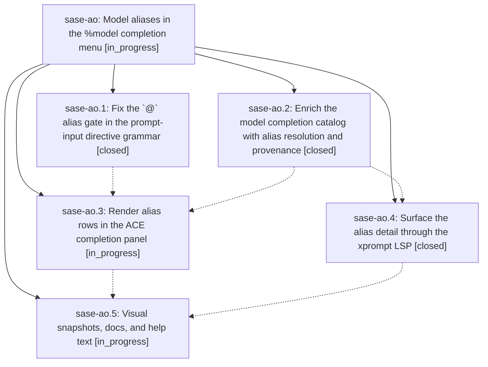

# Bead: sase-ao — Model aliases in the %model completion menu

[Bead Pages](../README.md) / sase-ao

**Status:** ◐ in_progress · **Type:** plan · **Tier:** epic
**Owner:** `bryanbugyi34@gmail.com` · **Assignee:** `sase-ao.land`
**Created:** 2026-07-29 11:46:18 UTC
**Plan:** [202607/model\_alias\_completion.md](https://github.com/sase-org/sase--plans/blob/main/202607/model_alias_completion.md)

## Description

Typing `%m:` / `%model:` shows model aliases as unmistakable, richly annotated rows beneath the concrete model names, each showing what it resolves to and how it was configured, and typing `@` after the colon narrows the menu to aliases only — in the ACE prompt input and in editors through the xprompt LSP.

## Phases

| Bead | Title | Status | Size | Agents | Commits |
|---|---|---|---|---:|---:|
| [sase-ao.1](sase-ao.1.md) | Fix the \`@\` alias gate in the prompt-input directive grammar | ✓ closed | small | 0 | 0 |
| [sase-ao.2](sase-ao.2.md) | Enrich the model completion catalog with alias resolution and provenance | ✓ closed | medium | 0 | 0 |
| [sase-ao.3](sase-ao.3.md) | Render alias rows in the ACE completion panel | ◐ in_progress | medium | 0 | 0 |
| [sase-ao.4](sase-ao.4.md) | Surface the alias detail through the xprompt LSP | ✓ closed | medium | 1 | 1 |
| [sase-ao.5](sase-ao.5.md) | Visual snapshots, docs, and help text | ◐ in_progress | small | 0 | 0 |

## Lineage

## Agents

| Agent | Bead | Commits |
|---|---|---:|
| bbugyi200.athena.sase-ao.4 | [sase-ao.4](sase-ao.4.md) | 1 |

## Commits

| Commit | Subject | Bead | Committed (UTC) |
|---|---|---|---|
| [`89420be`](https://github.com/sase-org/sase-core/commit/89420be1a3e2c02a68dbdc49d7384bf014ba8b3f) | feat(lsp): enrich model alias completions | [sase-ao.4](sase-ao.4.md) | 2026-07-29 12:22:29 |
