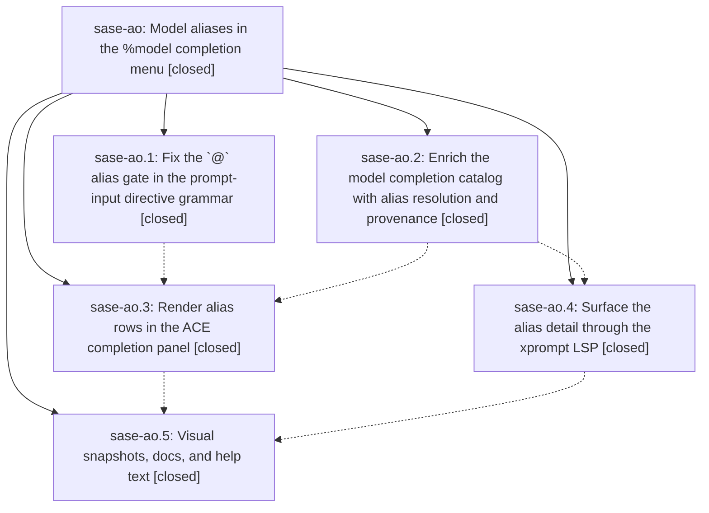

# Bead: sase-ao — Model aliases in the %model completion menu

[Bead Pages](../README.md) / sase-ao

**Status:** ✓ closed · **Resolution:** done · **Type:** plan · **Tier:** epic
**Owner:** `bryanbugyi34@gmail.com` · **Assignee:** `sase-ao.land`
**Created:** 2026-07-29 11:46:18 UTC · **Closed:** 2026-07-29 13:35:50 UTC
**Plan:** [202607/model\_alias\_completion.md](https://github.com/sase-org/sase--plans/blob/main/202607/model_alias_completion.md)

## Description

Typing `%m:` / `%model:` shows model aliases as unmistakable, richly annotated rows beneath the concrete model names, each showing what it resolves to and how it was configured, and typing `@` after the colon narrows the menu to aliases only — in the ACE prompt input and in editors through the xprompt LSP.

## Notes

[2026-07-29T13:35:50Z · sase-ao.land] Landed epic sase-ao after verifying all five phases against source, not just phase notes. gate: _directive_completion_tokens.py uses 'at_index > 0' so a leading @ stays in model context. catalog: _ModelCompletionEntry carries the 12 additive alias fields, _build_static_catalog memoizes on current_config_token(), _apply_alias_overlays overlay is pure, filter_model_completion_entries gates @ to alias kinds, and peek_active_alias_overrides() is lock-free/non-mutating with an (mtime_ns,size) memo. rows: new src/sase/ace/tui/model_alias_styles.py is consumed by BOTH models_panel_rendering.py and _prompt_input_bar_completion_rows.py (no duplicated badge logic; provider_model_text reuses provider_model_badge_markup), ModelCompletionMetadata reaches only %model rows plus the model_or_alias_key paren slot, panel title/subtitle switch on the @ partial, and the catalog warms in a mount-time worker. lsp: sase-core 89420be (released v0.12.6) adds the schema-v1 fields, detail/documentation, ENUM_MEMBER vs VALUE kinds, and '<group>:<index>' sort_text. polish: both PNG goldens, docs/xprompt.md + docs/llms.md, and the '%model:@ / Model aliases only' help row are present. Integration: the three non-epic commits that interleaved with the epic (4ee5cd092 history word default, f36f37d3c bead page links, a8132265b prompt bullet join) share no files or behavior with it, and sase-core master beyond v0.12.6 has no conflict; AliasOverridesIndicator intentionally keeps the self-cleaning get_active_alias_overrides read rather than the new peek. Fixed the epic's own missing SDD reciprocal prompt link via 'sase plan links repair --write'; 'sase plan links validate' now passes. Verified: just check green through fmt/keep-sorted/ruff/mypy/pyscripts/symvision/toobig and plan links validate (only the pre-existing chezmoi generated-skill drift remains; those templates last changed 2026-07-28, before the epic); just test 23,436 passed / 7 skipped; just test-visual 369 passed. One unrelated pre-existing visual flake found and attributed, not fixed here: agents_slow_tool_calls_level_1_120x40 (hollow vs filled tools marker) reproduces 3/3 at pre-epic commit 7e20cd22e and 6/9 with the epic's warm worker disabled, so it belongs to 202607/remove_pdf_row_suffix.md, not sase-ao.

## Phases

| Bead | Title | Status | Size | Agents | Commits |
|---|---|---|---|---:|---:|
| [sase-ao.1](sase-ao.1.md) | Fix the \`@\` alias gate in the prompt-input directive grammar | ✓ closed | small | 1 | 1 |
| [sase-ao.2](sase-ao.2.md) | Enrich the model completion catalog with alias resolution and provenance | ✓ closed | medium | 1 | 1 |
| [sase-ao.3](sase-ao.3.md) | Render alias rows in the ACE completion panel | ✓ closed | medium | 1 | 1 |
| [sase-ao.4](sase-ao.4.md) | Surface the alias detail through the xprompt LSP | ✓ closed | medium | 1 | 1 |
| [sase-ao.5](sase-ao.5.md) | Visual snapshots, docs, and help text | ✓ closed | small | 1 | 1 |

## Lineage

## Agents

| Agent | Bead | Commits |
|---|---|---:|
| [bbugyi200.athena.sase-ao.1](https://github.com/sase-org/sase--agents/blob/main/agents/bbugyi200.athena.sase-ao.1/README.md) | [sase-ao.1](sase-ao.1.md) | 1 |
| [bbugyi200.athena.sase-ao.2](https://github.com/sase-org/sase--agents/blob/main/agents/bbugyi200.athena.sase-ao.2/README.md) | [sase-ao.2](sase-ao.2.md) | 1 |
| [bbugyi200.athena.sase-ao.3](https://github.com/sase-org/sase--agents/blob/main/agents/bbugyi200.athena.sase-ao.3/README.md) | [sase-ao.3](sase-ao.3.md) | 1 |
| [bbugyi200.athena.sase-ao.4](https://github.com/sase-org/sase--agents/blob/main/agents/bbugyi200.athena.sase-ao.4/README.md) | [sase-ao.4](sase-ao.4.md) | 1 |
| [bbugyi200.athena.sase-ao.5](https://github.com/sase-org/sase--agents/blob/main/agents/bbugyi200.athena.sase-ao.5/README.md) | [sase-ao.5](sase-ao.5.md) | 1 |
| [bbugyi200.athena.sase-ao.land](https://github.com/sase-org/sase--agents/blob/main/agents/bbugyi200.athena.sase-ao.land/README.md) | [sase-ao](README.md) | 1 |

## Commits

| Commit | Subject | Bead | Committed (UTC) |
|---|---|---|---|
| [`6405e40`](https://github.com/sase-org/sase/commit/6405e40eeb57d97909c601d5bc4764b61dae5f8b) | fix: keep leading model aliases in completion context | [sase-ao.1](sase-ao.1.md) | 2026-07-29 11:56:14 |
| [`e55e18b`](https://github.com/sase-org/sase/commit/e55e18b94f132b52eb0badf6440d49a849ad717d) | feat: enrich model completion alias metadata | [sase-ao.2](sase-ao.2.md) | 2026-07-29 12:06:41 |
| [`sase-core@89420be`](https://github.com/sase-org/sase-core/commit/89420be1a3e2c02a68dbdc49d7384bf014ba8b3f) | feat(lsp): enrich model alias completions | [sase-ao.4](sase-ao.4.md) | 2026-07-29 12:22:29 |
| [`c5d2e1a`](https://github.com/sase-org/sase/commit/c5d2e1a2cbec42eb6903c2ae4069a8cda792692d) | feat(tui): enrich model completion rows | [sase-ao.3](sase-ao.3.md) | 2026-07-29 12:34:07 |
| [`fe53df8`](https://github.com/sase-org/sase/commit/fe53df885faf473a7ec5e459258e35764e6f8049) | docs(ace): document the %model alias completion rows | [sase-ao.5](sase-ao.5.md) | 2026-07-29 12:48:59 |
| [`sase--plans@0d7b399`](https://github.com/sase-org/sase--plans/commit/0d7b3997320fb1561cab571948f87669889be1f7) | Complete SDD plan for model\_alias\_completion | [sase-ao](README.md) | 2026-07-29 13:39:00 |
