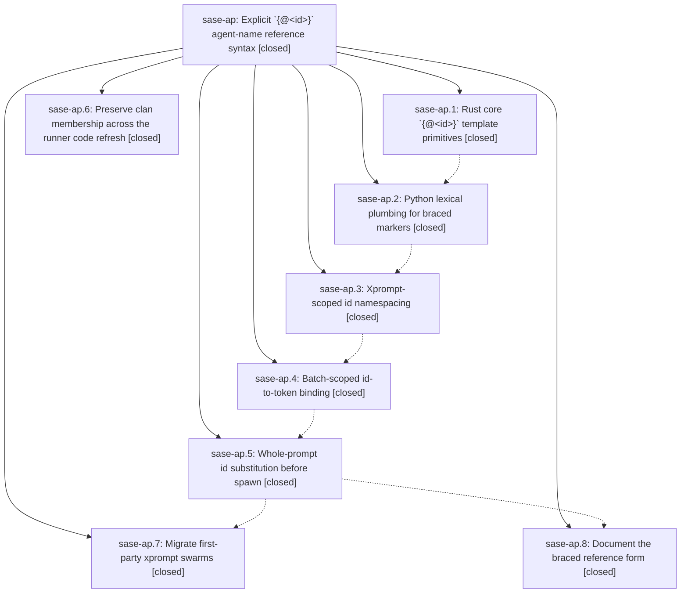

# Bead: sase-ap — Explicit \`{@\<id\>}\` agent-name reference syntax

[Bead Pages](../README.md) / sase-ap

**Status:** ✓ closed · **Resolution:** canceled · **Type:** plan · **Tier:** epic
**Owner:** `bryanbugyi34@gmail.com` · **Assignee:** `sase-ap.land`
**Created:** 2026-07-29 12:25:31 UTC · **Closed:** 2026-07-29 12:35:28 UTC
**Plan:** [202607/agent\_id\_reference\_syntax.md](https://github.com/sase-org/sase--plans/blob/main/202607/agent_id_reference_syntax.md)

## Description

Every agent-name reference in one launch batch that shares an `{@<id>}` label resolves to exactly one concrete name, chosen once at launch-plan time and substituted into every segment's prompt text, so no agent can ever re-resolve a template later and drift onto a different clan or peer.

## Phases

| Bead | Title | Status | Size | Agents | Commits |
|---|---|---|---|---:|---:|
| [sase-ap.1](sase-ap.1.md) | Rust core \`{@\<id\>}\` template primitives | ✓ closed | small | 0 | 0 |
| [sase-ap.2](sase-ap.2.md) | Python lexical plumbing for braced markers | ✓ closed | medium | 1 | 0 |
| [sase-ap.3](sase-ap.3.md) | Xprompt-scoped id namespacing | ✓ closed | medium | 1 | 0 |
| [sase-ap.4](sase-ap.4.md) | Batch-scoped id-to-token binding | ✓ closed | medium | 1 | 0 |
| [sase-ap.5](sase-ap.5.md) | Whole-prompt id substitution before spawn | ✓ closed | medium | 1 | 0 |
| [sase-ap.6](sase-ap.6.md) | Preserve clan membership across the runner code refresh | ✓ closed | small | 0 | 0 |
| [sase-ap.7](sase-ap.7.md) | Migrate first-party xprompt swarms | ✓ closed | small | 1 | 0 |
| [sase-ap.8](sase-ap.8.md) | Document the braced reference form | ✓ closed | small | 0 | 0 |

## Lineage

## Agents

| Agent | Bead | Commits |
|---|---|---:|
| [bbugyi200.athena.sase-ap.2](https://github.com/sase-org/sase--agents/blob/main/agents/bbugyi200.athena.sase-ap.2/README.md) | [sase-ap.2](sase-ap.2.md) | 0 |
| [bbugyi200.athena.sase-ap.3](https://github.com/sase-org/sase--agents/blob/main/agents/bbugyi200.athena.sase-ap.3/README.md) | [sase-ap.3](sase-ap.3.md) | 0 |
| [bbugyi200.athena.sase-ap.4](https://github.com/sase-org/sase--agents/blob/main/agents/bbugyi200.athena.sase-ap.4/README.md) | [sase-ap.4](sase-ap.4.md) | 0 |
| [bbugyi200.athena.sase-ap.5](https://github.com/sase-org/sase--agents/blob/main/agents/bbugyi200.athena.sase-ap.5/README.md) | [sase-ap.5](sase-ap.5.md) | 0 |
| [bbugyi200.athena.sase-ap.7](https://github.com/sase-org/sase--agents/blob/main/agents/bbugyi200.athena.sase-ap.7/README.md) | [sase-ap.7](sase-ap.7.md) | 0 |
| [bbugyi200.athena.sase-ap.land](https://github.com/sase-org/sase--agents/blob/main/agents/bbugyi200.athena.sase-ap.land/README.md) | [sase-ap](README.md) | 0 |
