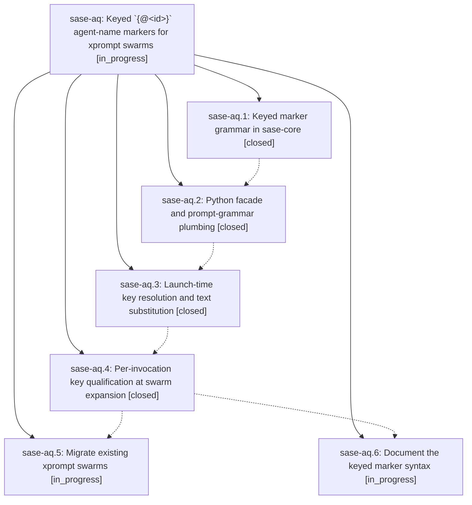

# Bead: sase-aq — Keyed \`{@\<id\>}\` agent-name markers for xprompt swarms

[Bead Pages](../README.md) / sase-aq

**Status:** ◐ in_progress · **Type:** plan · **Tier:** epic
**Owner:** `bryanbugyi34@gmail.com` · **Assignee:** `sase-aq.land`
**Created:** 2026-07-29 13:07:17 UTC
**Plan:** [202607/agent\_name\_key\_markers.md](https://github.com/sase-org/sase--plans/blob/main/202607/agent_name_key_markers.md)

## Description

Every `@` reference inside one xprompt swarm launch resolves to the same concrete agent-name token, chosen once per launch and substituted into the prompt text before any agent spawns, so a later swarm launch can never steal an earlier swarm's hood.

## Phases

| Bead | Title | Status | Size | Agents | Commits |
|---|---|---|---|---:|---:|
| [sase-aq.1](sase-aq.1.md) | Keyed marker grammar in sase-core | ✓ closed | medium | 1 | 0 |
| [sase-aq.2](sase-aq.2.md) | Python facade and prompt-grammar plumbing | ✓ closed | small | 1 | 1 |
| [sase-aq.3](sase-aq.3.md) | Launch-time key resolution and text substitution | ✓ closed | medium | 1 | 1 |
| [sase-aq.4](sase-aq.4.md) | Per-invocation key qualification at swarm expansion | ✓ closed | medium | 1 | 1 |
| [sase-aq.5](sase-aq.5.md) | Migrate existing xprompt swarms | ◐ in_progress | small | 1 | 0 |
| [sase-aq.6](sase-aq.6.md) | Document the keyed marker syntax | ◐ in_progress | small | 1 | 0 |

## Lineage

## Agents

| Agent | Bead | Commits |
|---|---|---:|
| [bbugyi200.athena.sase-aq.1](https://github.com/sase-org/sase--agents/blob/main/agents/bbugyi200.athena.sase-aq.1/README.md) | [sase-aq.1](sase-aq.1.md) | 0 |
| [bbugyi200.athena.sase-aq.2](https://github.com/sase-org/sase--agents/blob/main/agents/bbugyi200.athena.sase-aq.2/README.md) | [sase-aq.2](sase-aq.2.md) | 1 |
| [bbugyi200.athena.sase-aq.3](https://github.com/sase-org/sase--agents/blob/main/agents/bbugyi200.athena.sase-aq.3/README.md) | [sase-aq.3](sase-aq.3.md) | 1 |
| [bbugyi200.athena.sase-aq.4](https://github.com/sase-org/sase--agents/blob/main/agents/bbugyi200.athena.sase-aq.4/README.md) | [sase-aq.4](sase-aq.4.md) | 1 |
| [bbugyi200.athena.sase-aq.5](https://github.com/sase-org/sase--agents/blob/main/agents/bbugyi200.athena.sase-aq.5/README.md) | [sase-aq.5](sase-aq.5.md) | 0 |
| [bbugyi200.athena.sase-aq.6](https://github.com/sase-org/sase--agents/blob/main/agents/bbugyi200.athena.sase-aq.6/README.md) | [sase-aq.6](sase-aq.6.md) | 0 |
| [bbugyi200.athena.sase-aq.land](https://github.com/sase-org/sase--agents/blob/main/agents/bbugyi200.athena.sase-aq.land/README.md) | [sase-aq](README.md) | 0 |

## Commits

| Commit | Subject | Bead | Committed (UTC) |
|---|---|---|---|
| [`79be1d5`](https://github.com/sase-org/sase/commit/79be1d53a316d326790a9421435edf2942481fd9) | feat(agent): expose keyed agent-name markers in Python | [sase-aq.2](sase-aq.2.md) | 2026-07-29 13:45:56 |
| [`6209176`](https://github.com/sase-org/sase/commit/6209176ae2b38de2c5a4fd5bdf18909d647b2619) | feat(agent): resolve keyed name markers at launch | [sase-aq.3](sase-aq.3.md) | 2026-07-29 14:04:43 |
| [`62a6ba6`](https://github.com/sase-org/sase/commit/62a6ba6f7ad25c7e601ea94525b7cde3a9128e25) | feat: qualify keyed markers per xprompt invocation | [sase-aq.4](sase-aq.4.md) | 2026-07-29 14:22:42 |
