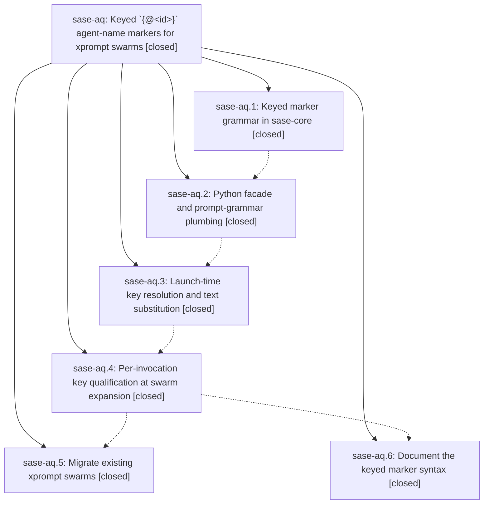

# Bead: sase-aq — Keyed \`{@\<id\>}\` agent-name markers for xprompt swarms

[Bead Pages](../README.md) / sase-aq

**Status:** ✓ closed · **Resolution:** done · **Type:** plan · **Tier:** epic
**Owner:** `bryanbugyi34@gmail.com` · **Assignee:** `sase-aq.land`
**Created:** 2026-07-29 13:07:17 UTC · **Closed:** 2026-07-29 15:51:41 UTC
**Plan:** [202607/agent\_name\_key\_markers.md](https://github.com/sase-org/sase--plans/blob/main/202607/agent_name_key_markers.md)

## Description

Every `@` reference inside one xprompt swarm launch resolves to the same concrete agent-name token, chosen once per launch and substituted into the prompt text before any agent spawns, so a later swarm launch can never steal an earlier swarm's hood.

## Notes

[2026-07-29T15:51:41Z · sase-aq.land] Landed after verifying all 6 phases against the source and the epic's 5 commits (79be1d53a, 6209176ae, 62a6ba6f7, 5d4716c35, 0272356a5) plus sase-core 8facc89.

VERIFIED (step 1):
- grammar (.1): sase-core 8facc89, released 0.12.8. Exercised the live bindings: AgentNameTemplateKey/marker/key on the parse payload, iter_agent_name_key_markers, agent_name_template_key. Jinja '{{ prompt }}', '{ @1 }', '{@}' and '{@-bad}' are correctly not markers; namespace_template re-emits the marker verbatim (research.{@1}.cdx -> research.{@1}); render/render_namespace and the bare-@ path are unchanged.
- facade (.2): dataclasses + wrappers exported from sase.agent.names, agent_name_template_base strips the parsed marker, KEY_MARKER_PATTERN admitted as an indivisible alternative in _DIRECTIVE_PATTERN/_XPROMPT_PATTERN, _reject_unresolved_key_marker guards claim time. Confirmed live that %id, %clan, %id(.., clan=), %wait and #fork all round-trip with the marker intact.
  The KNOWN BLOCKER recorded on .2 is now cleared: sase-core-rs 0.12.9/0.12.10 are published, and tools/validate_sase_core_rs_version --published-minimum exits 0 against the >=0.12.8,<0.13.0 window.
- resolve (.3): agent_name_keys.py resolves under one agent_name_allocation_lock snapshot and is wired into launch_cwd_agents (line 152, ahead of every validate_launch_name_requests call), launch_multi_prompt_agents (the funnel that launch_cwd_bead_work, _launch_multi_model and _launch_multi_prompt all reach), and both ACE _launch_body_impl branches. The mobile gateway reaches it through launch_agents_from_cwd. run_agent_directives.py fails loudly on any marker that survives.
- qualify (.4): _render_xprompt_swarm mints <xprompt>.<stamp>.<counter> with a qualification counter threaded independently of template_group through the nested/recursive call sites.
- migrate (.5): sase/xprompts/reads.md is keyed; the chezmoi research_swarm change was committed (48dc29b1) and ~/sase/xprompts/research_swarm.md is byte-identical to the source, so chezmoi apply did happen.
- docs (.6): docs/xprompt.md (20 references), docs/ace.md, docs/agent_families.md, and the ACE %id/%clan completion hints.

ACCEPTANCE CHECK (the plan's own criterion), run against the real migrated files: two #research_swarm references in one dispatch produce two distinct qualified keys and resolve to hoods research.q and research.r, with all four segments of each invocation -- including the deferred image segment that carries clan= -- sharing that invocation's hood. Same for #sase/reads (reads.1 / reads.2). tests/test_agent_name_key_markers.py also pins the reported failure: bare research.@ still resolves latest-wins to research.p while the keyed-resolved concrete target stays research.o. 213 epic-relevant tests pass.

INTEGRATED (step 2): the 6 commits that landed on master since 79be1d53a (artifact-file modal copy/text-dump, prompt bullet ctrl+j, chops typed report builder + axe report rendering, epic page labels) touch none of the xprompt-expansion, agent-name or launch-funnel surface -- no conflict and no duplication. Re-swept src/sase/xprompts, src/sase/default_xprompts, sase/xprompts, chezmoi home/sase/xprompts and both sase.yml files: no swarm body still uses a bare @ agent-name marker; the remaining @ hits are model aliases (including the newly added m_cheap), tribe refs and family markers, all correct as-is. sase-core advanced 0.12.8 -> 0.12.10 during the epic and stays inside the declared window.

PRE-EXISTING, NOT sase-aq: just check stops at SASE validation on init-skills drift (sase_agents_status/sase_beads/sase_run generated shims; the epic never touched src/sase/xprompts/skills/) and on missing prompt links for three other epics' plans. just test-visual has 5 stale axe chop goldens whose diff shows the RESULT/OUTPUT sections added by bc501e595; goldens were last regenerated at 65732cb3b, before that commit. Two prompt-bar selector tests failed only under the full parallel run and pass both alone and across the whole tests/ace/tui suite under xdist.

## Phases

| Bead | Title | Status | Size | Agents | Commits |
|---|---|---|---|---:|---:|
| [sase-aq.1](sase-aq.1.md) | Keyed marker grammar in sase-core | ✓ closed | medium | 1 | 1 |
| [sase-aq.2](sase-aq.2.md) | Python facade and prompt-grammar plumbing | ✓ closed | small | 1 | 1 |
| [sase-aq.3](sase-aq.3.md) | Launch-time key resolution and text substitution | ✓ closed | medium | 1 | 1 |
| [sase-aq.4](sase-aq.4.md) | Per-invocation key qualification at swarm expansion | ✓ closed | medium | 1 | 1 |
| [sase-aq.5](sase-aq.5.md) | Migrate existing xprompt swarms | ✓ closed | small | 1 | 1 |
| [sase-aq.6](sase-aq.6.md) | Document the keyed marker syntax | ✓ closed | small | 1 | 1 |

## Lineage

## Agents

| Agent | Bead | Commits |
|---|---|---:|
| [bbugyi200.athena.sase-aq.1](https://github.com/sase-org/sase--agents/blob/main/agents/bbugyi200.athena.sase-aq.1/README.md) | [sase-aq.1](sase-aq.1.md) | 1 |
| [bbugyi200.athena.sase-aq.2](https://github.com/sase-org/sase--agents/blob/main/agents/bbugyi200.athena.sase-aq.2/README.md) | [sase-aq.2](sase-aq.2.md) | 1 |
| [bbugyi200.athena.sase-aq.3](https://github.com/sase-org/sase--agents/blob/main/agents/bbugyi200.athena.sase-aq.3/README.md) | [sase-aq.3](sase-aq.3.md) | 1 |
| [bbugyi200.athena.sase-aq.4](https://github.com/sase-org/sase--agents/blob/main/agents/bbugyi200.athena.sase-aq.4/README.md) | [sase-aq.4](sase-aq.4.md) | 1 |
| [bbugyi200.athena.sase-aq.5](https://github.com/sase-org/sase--agents/blob/main/agents/bbugyi200.athena.sase-aq.5/README.md) | [sase-aq.5](sase-aq.5.md) | 1 |
| [bbugyi200.athena.sase-aq.6](https://github.com/sase-org/sase--agents/blob/main/agents/bbugyi200.athena.sase-aq.6/README.md) | [sase-aq.6](sase-aq.6.md) | 1 |
| [bbugyi200.athena.sase-aq.land](https://github.com/sase-org/sase--agents/blob/main/agents/bbugyi200.athena.sase-aq.land/README.md) | [sase-aq](README.md) | 1 |

## Commits

| Commit | Subject | Bead | Committed (UTC) |
|---|---|---|---|
| [`sase-core@8facc89`](https://github.com/sase-org/sase-core/commit/8facc89d62a65a932adaa9020749f2042f1b06b4) | feat: add keyed agent name template markers | [sase-aq.1](sase-aq.1.md) | 2026-07-29 13:18:36 |
| [`79be1d5`](https://github.com/sase-org/sase/commit/79be1d53a316d326790a9421435edf2942481fd9) | feat(agent): expose keyed agent-name markers in Python | [sase-aq.2](sase-aq.2.md) | 2026-07-29 13:45:56 |
| [`6209176`](https://github.com/sase-org/sase/commit/6209176ae2b38de2c5a4fd5bdf18909d647b2619) | feat(agent): resolve keyed name markers at launch | [sase-aq.3](sase-aq.3.md) | 2026-07-29 14:04:43 |
| [`62a6ba6`](https://github.com/sase-org/sase/commit/62a6ba6f7ad25c7e601ea94525b7cde3a9128e25) | feat: qualify keyed markers per xprompt invocation | [sase-aq.4](sase-aq.4.md) | 2026-07-29 14:22:42 |
| [`5d4716c`](https://github.com/sase-org/sase/commit/5d4716c3572ced4281cbf97b527cc9bdcdd0ed4b) | refactor: use keyed name markers in the reads swarm | [sase-aq.5](sase-aq.5.md) | 2026-07-29 14:40:08 |
| [`0272356`](https://github.com/sase-org/sase/commit/0272356a5df3070960e1634eae673524fe3d0bc0) | docs: document keyed xprompt markers | [sase-aq.6](sase-aq.6.md) | 2026-07-29 14:56:41 |
| [`sase--plans@41eff94`](https://github.com/sase-org/sase--plans/commit/41eff9436eebc7696a17fa6e9e124cce1e87206a) | Complete SDD plan for agent\_name\_key\_markers | [sase-aq](README.md) | 2026-07-29 15:53:22 |
