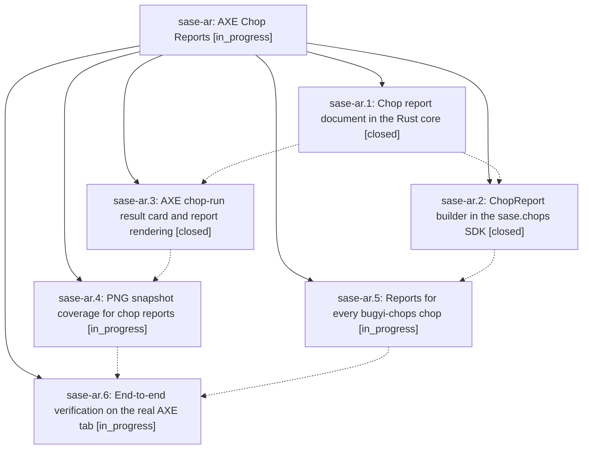

# Bead: sase-ar — AXE Chop Reports

[Bead Pages](../README.md) / sase-ar

**Status:** ◐ in_progress · **Type:** plan · **Tier:** epic
**Owner:** `bryanbugyi34@gmail.com` · **Assignee:** `sase-ar.land`
**Created:** 2026-07-29 13:49:51 UTC
**Plan:** [202607/axe\_chop\_reports.md](https://github.com/sase-org/sase--plans/blob/main/202607/axe_chop_reports.md)

## Description

Selecting a chop on the ACE AXE tab shows a beautiful, colored, width-responsive report of that run — a universal result card for every chop plus an optional chop-authored report document — and all four bugyi-chops scripts publish rich reports of their own.

## Phases

| Bead | Title | Status | Size | Agents | Commits |
|---|---|---|---|---:|---:|
| [sase-ar.1](sase-ar.1.md) | Chop report document in the Rust core | ✓ closed | medium | 1 | 0 |
| [sase-ar.2](sase-ar.2.md) | ChopReport builder in the sase.chops SDK | ✓ closed | medium | 1 | 1 |
| [sase-ar.3](sase-ar.3.md) | AXE chop-run result card and report rendering | ✓ closed | medium | 1 | 1 |
| [sase-ar.4](sase-ar.4.md) | PNG snapshot coverage for chop reports | ◐ in_progress | small | 1 | 0 |
| [sase-ar.5](sase-ar.5.md) | Reports for every bugyi-chops chop | ◐ in_progress | medium | 1 | 0 |
| [sase-ar.6](sase-ar.6.md) | End-to-end verification on the real AXE tab | ◐ in_progress | small | 1 | 0 |

## Lineage

## Agents

| Agent | Bead | Commits |
|---|---|---:|
| [bbugyi200.athena.sase-ar.1](https://github.com/sase-org/sase--agents/blob/main/agents/bbugyi200.athena.sase-ar.1/README.md) | [sase-ar.1](sase-ar.1.md) | 0 |
| [bbugyi200.athena.sase-ar.2](https://github.com/sase-org/sase--agents/blob/main/agents/bbugyi200.athena.sase-ar.2/README.md) | [sase-ar.2](sase-ar.2.md) | 1 |
| [bbugyi200.athena.sase-ar.3](https://github.com/sase-org/sase--agents/blob/main/agents/bbugyi200.athena.sase-ar.3/README.md) | [sase-ar.3](sase-ar.3.md) | 1 |
| [bbugyi200.athena.sase-ar.4](https://github.com/sase-org/sase--agents/blob/main/agents/bbugyi200.athena.sase-ar.4/README.md) | [sase-ar.4](sase-ar.4.md) | 0 |
| [bbugyi200.athena.sase-ar.5](https://github.com/sase-org/sase--agents/blob/main/agents/bbugyi200.athena.sase-ar.5/README.md) | [sase-ar.5](sase-ar.5.md) | 0 |
| [bbugyi200.athena.sase-ar.6](https://github.com/sase-org/sase--agents/blob/main/agents/bbugyi200.athena.sase-ar.6/README.md) | [sase-ar.6](sase-ar.6.md) | 0 |
| [bbugyi200.athena.sase-ar.land](https://github.com/sase-org/sase--agents/blob/main/agents/bbugyi200.athena.sase-ar.land/README.md) | [sase-ar](README.md) | 0 |

## Commits

| Commit | Subject | Bead | Committed (UTC) |
|---|---|---|---|
| [`bc501e5`](https://github.com/sase-org/sase/commit/bc501e595b0ee0e09d915daf68b7528b1bc50a84) | feat(axe): render structured chop result reports | [sase-ar.3](sase-ar.3.md) | 2026-07-29 14:27:59 |
| [`5885890`](https://github.com/sase-org/sase/commit/58858901b857cfb9b3831cb61bb8c00e1bfbfd78) | feat(chops): add typed report builder | [sase-ar.2](sase-ar.2.md) | 2026-07-29 14:30:54 |
