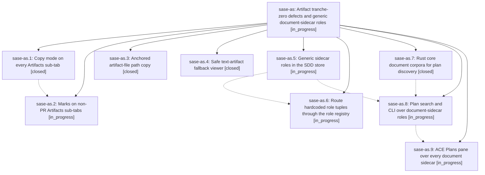

# Bead: sase-as — Artifact tranche-zero defects and generic document-sidecar roles

[Bead Pages](../README.md) / sase-as

**Status:** ◐ in_progress · **Type:** plan · **Tier:** epic
**Owner:** `bryanbugyi34@gmail.com` · **Assignee:** `sase-as.land`
**Created:** 2026-07-29 14:30:48 UTC
**Plan:** [202607/artifact\_tranche\_zero\_and\_generic\_sidecar\_roles.md](https://github.com/sase-org/sase--plans/blob/main/202607/artifact_tranche_zero_and_generic_sidecar_roles.md)

## Description

Copy mode and marks work on every Artifacts sub-tab, artifact-file path copies are unambiguous, the text-artifact fallback viewer is safe without `bat`, and no SASE code names the `research` sidecar: every user-defined document sidecar gets the behavior `research` has today.

## Phases

| Bead | Title | Status | Size | Agents | Commits |
|---|---|---|---|---:|---:|
| [sase-as.1](sase-as.1.md) | Copy mode on every Artifacts sub-tab | ✓ closed | medium | 1 | 1 |
| [sase-as.2](sase-as.2.md) | Marks on non-PR Artifacts sub-tabs | ◐ in_progress | medium | 1 | 0 |
| [sase-as.3](sase-as.3.md) | Anchored artifact-file path copy | ✓ closed | small | 1 | 1 |
| [sase-as.4](sase-as.4.md) | Safe text-artifact fallback viewer | ✓ closed | small | 1 | 1 |
| [sase-as.5](sase-as.5.md) | Generic sidecar roles in the SDD store | ◐ in_progress | medium | 1 | 0 |
| [sase-as.6](sase-as.6.md) | Route hardcoded role tuples through the role registry | ◐ in_progress | medium | 1 | 0 |
| [sase-as.7](sase-as.7.md) | Rust core document corpora for plan discovery | ✓ closed | medium | 1 | 0 |
| [sase-as.8](sase-as.8.md) | Plan search and CLI over document-sidecar roles | ◐ in_progress | medium | 1 | 0 |
| [sase-as.9](sase-as.9.md) | ACE Plans pane over every document sidecar | ◐ in_progress | medium | 1 | 0 |

## Lineage

## Agents

| Agent | Bead | Commits |
|---|---|---:|
| [bbugyi200.athena.sase-as.1](https://github.com/sase-org/sase--agents/blob/main/agents/bbugyi200.athena.sase-as.1/README.md) | [sase-as.1](sase-as.1.md) | 1 |
| [bbugyi200.athena.sase-as.2](https://github.com/sase-org/sase--agents/blob/main/agents/bbugyi200.athena.sase-as.2/README.md) | [sase-as.2](sase-as.2.md) | 0 |
| [bbugyi200.athena.sase-as.3](https://github.com/sase-org/sase--agents/blob/main/agents/bbugyi200.athena.sase-as.3/README.md) | [sase-as.3](sase-as.3.md) | 1 |
| [bbugyi200.athena.sase-as.4](https://github.com/sase-org/sase--agents/blob/main/agents/bbugyi200.athena.sase-as.4/README.md) | [sase-as.4](sase-as.4.md) | 1 |
| [bbugyi200.athena.sase-as.5](https://github.com/sase-org/sase--agents/blob/main/agents/bbugyi200.athena.sase-as.5/README.md) | [sase-as.5](sase-as.5.md) | 0 |
| [bbugyi200.athena.sase-as.6](https://github.com/sase-org/sase--agents/blob/main/agents/bbugyi200.athena.sase-as.6/README.md) | [sase-as.6](sase-as.6.md) | 0 |
| [bbugyi200.athena.sase-as.7](https://github.com/sase-org/sase--agents/blob/main/agents/bbugyi200.athena.sase-as.7/README.md) | [sase-as.7](sase-as.7.md) | 0 |
| [bbugyi200.athena.sase-as.8](https://github.com/sase-org/sase--agents/blob/main/agents/bbugyi200.athena.sase-as.8/README.md) | [sase-as.8](sase-as.8.md) | 0 |
| [bbugyi200.athena.sase-as.9](https://github.com/sase-org/sase--agents/blob/main/agents/bbugyi200.athena.sase-as.9/README.md) | [sase-as.9](sase-as.9.md) | 0 |
| [bbugyi200.athena.sase-as.land](https://github.com/sase-org/sase--agents/blob/main/agents/bbugyi200.athena.sase-as.land/README.md) | [sase-as](README.md) | 0 |

## Commits

| Commit | Subject | Bead | Committed (UTC) |
|---|---|---|---|
| [`02e8384`](https://github.com/sase-org/sase/commit/02e83845b1ef0fa7e173915a1a010fe27cfa047a) | fix(ace): safely dump text artifact fallback | [sase-as.4](sase-as.4.md) | 2026-07-29 14:56:58 |
| [`69d403c`](https://github.com/sase-org/sase/commit/69d403c4c7f17f665cccaffd52dc910be8177c99) | fix(ace): anchor artifact-file path copy | [sase-as.3](sase-as.3.md) | 2026-07-29 14:58:27 |
| [`7d41d17`](https://github.com/sase-org/sase/commit/7d41d17a02a44aea76dbe7f19d800bb24d0889c9) | feat(ace): add copy mode to artifact sub-tabs | [sase-as.1](sase-as.1.md) | 2026-07-29 15:03:16 |
