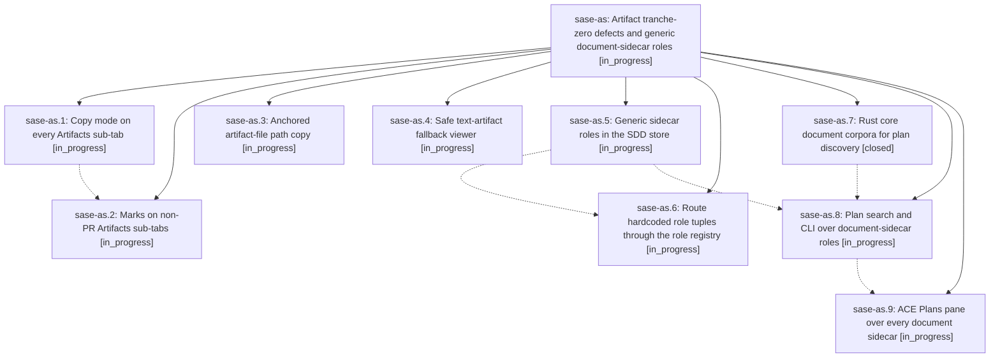

# Bead: sase-as — Artifact tranche-zero defects and generic document-sidecar roles

[Bead Pages](../README.md) / sase-as

**Status:** ◐ in_progress · **Type:** plan · **Tier:** epic
**Owner:** `bryanbugyi34@gmail.com` · **Assignee:** `sase-as.land`
**Created:** 2026-07-29 14:30:48 UTC
**Plan:** [202607/artifact\_tranche\_zero\_and\_generic\_sidecar\_roles.md](https://github.com/sase-org/sase--plans/blob/main/202607/artifact_tranche_zero_and_generic_sidecar_roles.md)

## Description

Copy mode and marks work on every Artifacts sub-tab, artifact-file path copies are unambiguous, the text-artifact fallback viewer is safe without `bat`, and no SASE code names the `research` sidecar: every user-defined document sidecar gets the behavior `research` has today.

## Phases

| Bead | Title | Status | Size | Agents | Commits |
|---|---|---|---|---:|---:|
| [sase-as.1](sase-as.1.md) | Copy mode on every Artifacts sub-tab | ◐ in_progress | medium | 0 | 0 |
| [sase-as.2](sase-as.2.md) | Marks on non-PR Artifacts sub-tabs | ◐ in_progress | medium | 0 | 0 |
| [sase-as.3](sase-as.3.md) | Anchored artifact-file path copy | ◐ in_progress | small | 0 | 0 |
| [sase-as.4](sase-as.4.md) | Safe text-artifact fallback viewer | ◐ in_progress | small | 0 | 0 |
| [sase-as.5](sase-as.5.md) | Generic sidecar roles in the SDD store | ◐ in_progress | medium | 0 | 0 |
| [sase-as.6](sase-as.6.md) | Route hardcoded role tuples through the role registry | ◐ in_progress | medium | 0 | 0 |
| [sase-as.7](sase-as.7.md) | Rust core document corpora for plan discovery | ✓ closed | medium | 1 | 1 |
| [sase-as.8](sase-as.8.md) | Plan search and CLI over document-sidecar roles | ◐ in_progress | medium | 0 | 0 |
| [sase-as.9](sase-as.9.md) | ACE Plans pane over every document sidecar | ◐ in_progress | medium | 0 | 0 |

## Lineage

## Agents

| Agent | Bead | Commits |
|---|---|---:|
| bbugyi200.athena.sase-as.7 | [sase-as.7](sase-as.7.md) | 1 |

## Commits

| Commit | Subject | Bead | Committed (UTC) |
|---|---|---|---|
| [`13cb8b7`](https://github.com/sase-org/sase-core/commit/13cb8b72e5bdae6ad3ebb7af0cee597cc79f4cd2) | feat(plan): support explicit document corpora | [sase-as.7](sase-as.7.md) | 2026-07-29 14:53:39 |
